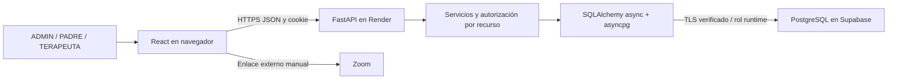
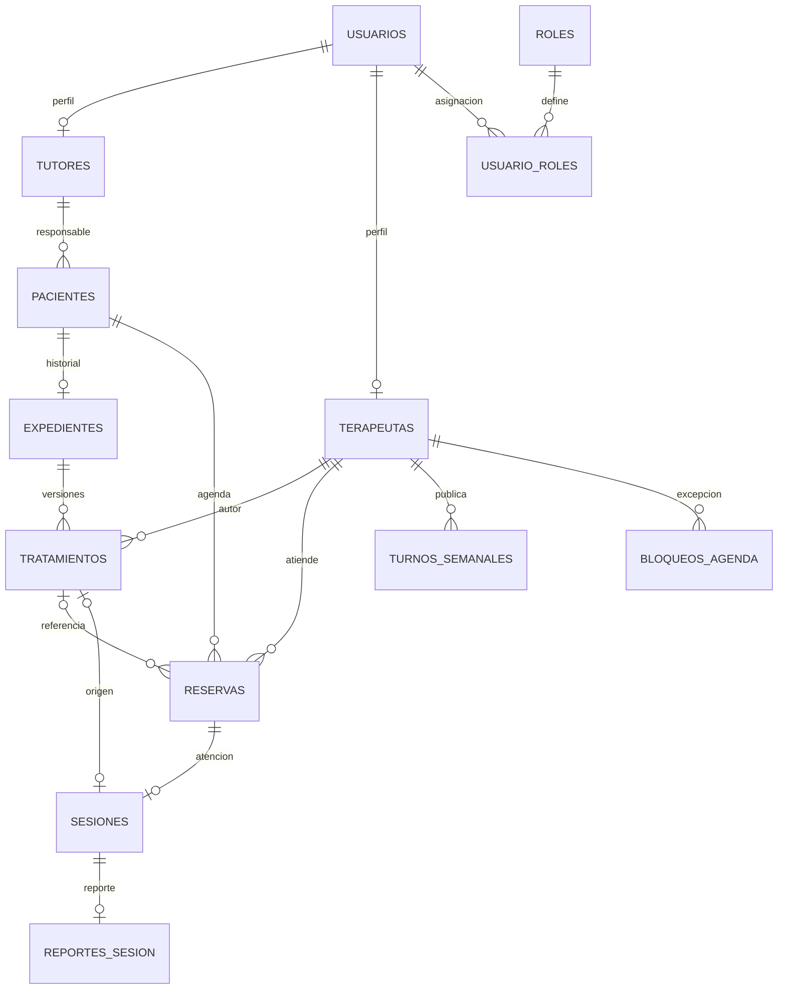

# ASHAKids — documentación maestra de la etapa funcional

**Corte documental V46 · 10 de octubre de 2026 · America/Lima.** Fuente para redactar el Avance del Proyecto Final 2 y para consultar el sistema; no es el informe académico entregable ni una auditoría técnica nueva.

Repositorio: https://github.com/sromansilva/ashakids-platform . Base funcional/documental examinada: `codex/2do-intento`, `62048038b70d2411234fb681284e327cf142d1b7` (V45), integrada en `dev`. El commit que contiene esta documentación se identifica en el historial como V46; no confundir V46 con la versión de la API, `0.1.0`.

Sitio: https://ashakids.onrender.com . Contrato público consultado: OpenAPI **3.1.0**, **69 operaciones**. Catálogo PostgreSQL consultado en transacción **READ ONLY**: **30 tablas, 207 columnas, 113 restricciones de pg_constraint, 87 índices y 70 políticas RLS**; **23 tablas mapeadas por SQLAlchemy**. Las restricciones NOT NULL de columnas no se suman en la cifra de pg_constraint. No comparar directamente ese conteo con informes anteriores que utilizaron otra definición de restricción.

Documentos relacionados: [guía operativa y pendientes](GUIA_FLUJO_ESTADO_Y_PENDIENTES.md), [arquitectura y decisiones](architecture.md), [continuidad](IMPLEMENTATION_PROGRESS.md), [evidencia de este corte](evidence/documentacion-etapa-2026-10-10/README.md). El diccionario completo está incluido en §8 y el inventario de endpoints en §6.

## 1. Cómo interpretar esta fuente

Se distinguen cuatro procedencias:

| Marca | Significado | Qué permite afirmar |
| --- | --- | --- |
| CÓDIGO | Lectura de los servicios, contratos y componentes actuales | La regla y el control existen; no equivale a ejecutar un caso real en Render |
| METADATOS ACTUALES | Lectura del catálogo compartido y OpenAPI público en este corte | Estructura física/contrato observado; sin leer filas clínicas ni cambiar datos |
| EVIDENCIA HEREDADA | Resultados y capturas identificados por V33–V45 | El caso se comprobó en ese entorno/corte; no se volvió a ejecutar aquí |
| CONFIRMACIÓN HUMANA | Recorrido comunicado por el usuario el 10/10/2026 | ADMIN creó padre y terapeuta; acceso por roles, publicación/consulta de disponibilidad, reserva, guardado del enlace Zoom y lectura familiar |

En este corte se revisaron los cinco folios del PDF aportado, código, documentación y metadatos. GET públicos `/openapi.json`, `/health` y `/health/ready` respondieron 200. No se crearon cuentas, citas, sesiones, reportes o planes para documentar; no se modificaron esquemas ni credenciales. Las pruebas funcionales y no funcionales citadas abajo son heredadas. El recorrido humano llega al enlace Zoom: cierre, reporte, plan y segunda reserva siguen pendientes de aceptación humana en Render.

Los datos JSON de ejemplo de §6 son **ilustrativos y ficticios**, ajustados a los contratos; no son respuestas extraídas de pacientes reales. Evitar capturas con nombres, DNI, correos, conversaciones, contraseñas, cookies o enlaces privados de reuniones.

## 2. Mapa de cobertura del PDF recibido

El archivo de referencia es `AVANCE DEL PROYECTO FINAL 2.pdf`, cinco páginas. Su numeración repite 1.4, omite 6.3 y sitúa modelo físico bajo el título Seguridad; se conserva su correspondencia sin inventar requisitos faltantes. Sus filas bcrypt/alumnos son ejemplos: ASHAKids usa Argon2id y pacientes/tutores.

| Punto solicitado / página | Fuente en este maestro | Qué debe aportar el equipo al informe |
| --- | --- | --- |
| 1.1 Nombre; 1.2 propósito, usuarios, funcionalidades / p1 | §3 producto y actores | Identidad del equipo y formulación final |
| 1.4 estado por Frontend, Backend, BD, Seguridad, Pruebas, Despliegue / p1 | §4 índices de avance y denominadores | Aprobar el alcance/ponderación; no presentar estimación como resultado de pruebas |
| 1.3 problema y 1.4 solución / p1 | §3 problema y solución implementada | Evidencia del contexto real investigado por el equipo |
| 1.5 cronograma / p1 | §5 evolución y plan restante | Fechas/personas de sprints oficiales; no están acreditadas por Git |
| 2 resumen del avance, contexto, problema, solución, Unidad II / p1–2 | §3 y §5 | Vincular commits al calendario de la asignatura |
| 3 levantamiento de observaciones APF1 / p2 | §5 matriz de observaciones | Feedback original y aceptación del profesor |
| 4.1 diagrama y 4.2 tecnologías / p2 | §7 arquitectura | Exportar diagrama y referenciar fuentes |
| 5.1 lenguaje, framework, estructura, servicios / p3 | §7 y §6 | Seleccionar componentes relevantes al Sprint 04 |
| 5.2 todas las funcionalidades, descripción y 0–100% / p3 | §4 y guía operativa §4 | Porcentajes con límites; incluir módulos parciales y ausentes |
| 5.3 endpoints, JSON y capturas / p3 | §6 y §12 evidencias | Elegir capturas sanitizadas, indicar corte/entorno |
| 6.1 modelo físico y relaciones / p3 | §8 y §9 | Modelo exportado de este catálogo, no esquema previo de 26 tablas |
| 6.2 tablas y descripción / p3 | §8 diccionario de las 30 tablas | Usar nombres reales y distinguir uso actual |
| 6.4 INSERT, UPDATE, DELETE y consultas / p4 | §10 operaciones | Caso/resultado de evidencia anterior o nueva prueba autorizada aislada |
| 7.1 activos, descripción, componente, importancia / p4 | §11 activos | Ajustar importancia al contexto del equipo |
| 7.2 rol, permisos y funcionalidad / p4 | §11 permisos y guía §4 | No equiparar ADMIN a autor de un plan profesional |
| 7.3 activo, riesgo, ataque, control / p4 | §11 matriz de riesgos | Indicar límites de controles y evidencia |
| 8 evidencias / p5 | §12 índice y protocolo | Anexos/capturas seleccionados con procedencia |
| 9 conclusiones / p5 | §13 hechos y límites para concluir | Redactar conclusiones propias, sin declarar toda la plataforma completa |
| 10 referencias / p5 | §14 fuentes | Formato bibliográfico solicitado por el profesor |

## 3. Producto, problema, solución y actores

**Nombre:** ASHAKids. Plataforma web de acompañamiento de terapia de lenguaje infantil, con gestión institucional, agenda profesional, reportes clínicos y práctica familiar asignada. La persistencia clínica está conectada; los juegos conservan progresión demostrativa en una pestaña. No hay diagnóstico automático validado ni certificación de eficacia terapéutica.

**Problema al que responde el diseño:** coordinar altas, disponibilidad, reservas y seguimiento entre familias y profesionales sin dispersar el historial de cada niño. La pregunta del usuario sobre qué hacer después de Zoom evidencia una necesidad de orientación entre estados. Esta descripción es la motivación del producto; no sustituye entrevistas, estadísticas o investigación de campo del APF1, que el equipo debe aportar.

**Solución implementada:** un ADMIN registra cuentas y niños, cada adulto activa su cuenta, el profesional publica turnos, la familia reserva una introducción, el profesional registra/inicia/cierra la sesión y guarda reporte. Desde la atención publica un plan con mundos y sesiones recomendadas. Con introducción atendida, reporte y plan vigente se permite reservar terapia con el mismo u otro profesional. Cada atención conserva su autor; una nueva versión de plan reemplaza al activo preservando el historial.

| Actor | Identidad y responsabilidad | Límite actual |
| --- | --- | --- |
| ADMIN / asesor | Cuenta institucional; altas, roles, mantenimiento y consultas administrativas | Asesor es ADMIN; no constituye un cuarto rol. Solo TERAPEUTA autor publica el plan del nuevo flujo |
| PADRE / tutor | Adulto responsable; acceso a sus hijos, reservas, reportes y práctica asignada | No accede a otra familia ni edita un reporte clínico |
| TERAPEUTA | Adulto con perfil profesional; su agenda, atención, reportes, planes y mensajes | Escribe las atenciones propias; puede leer contexto autorizado de colegas |
| Niño/paciente | Registro dependiente de un tutor; destinatario de atención y material | No es un usuario con login independiente en el modelo actual |

Alcance excluido por el profesor: pasarelas, cobros, suscripciones y facturación reales. Las pantallas de pago heredadas son simulaciones; no son condición de reserva. Anticipación obligatoria de una semana para cambiar disponibilidad: **descartada por el usuario**, no pendiente de implementación.

## 4. Estado y porcentajes con alcance explícito

El PDF solicita porcentajes pero no define denominadores. Para ofrecer una base reproducible, se propone un **índice documental de implementación**, con diez criterios iguales por componente: implementado = 1; parcial = 0.5; ausente = 0. Índice = suma / 10 × 100. Es una estimación de cobertura de este inventario, **no porcentaje de pruebas aprobadas, nota del profesor ni aceptación integral en producción**. El equipo puede cambiar criterios y pesos antes de usarlo; no trasladar cifras de otra auditoría.

| Componente | Índice propuesto | Criterios puntuados; I=1, P=0.5, A=0 |
| --- | --- | --- |
| Frontend | 90% (9/10) | Landing I; login I; activación I; cuentas ADMIN I; agenda familiar I; atención profesional I; reporte/plan I; chat/notificaciones I; educación persistente P (juegos locales); aceptación responsive P (revisión parcial heredada, prioridad web) |
| Backend | 80% (8/10) | Auth I; altas/familias I; pacientes I; agenda/reservas I; sesiones I; reportes/PDF I; planes I; mensajería/notificaciones I; integración automática Zoom/WhatsApp A; progresión educativa servidor A |
| Base de datos | 75% (7.5/10) | Tablas núcleo I; PK/FK/checks I; mapeo clínico I; migraciones adoptadas I; runtime/RLS I; persistencia clínica I; historial/versión I; respaldo P (listado validado, restauración no ensayada); progreso educativo A; diagnósticos múltiples normalizados A |
| Seguridad | 75% (7.5/10) | Hash I; cookies/sesiones I; roles I; autorización por recurso I; activación/revocación I; validación/origen I; TLS/rol SQL I; limitador P (un proceso); MFA A; recuperación autoservicio A |
| Pruebas | 75% (7.5/10) | Unidades backend I; componentes I; rutas I; SQL aislado I; conflictos/concurrencia I; denegaciones I; PDF I; aceptación Render P (hasta enlace); carga sostenida A; restauración/recuperación A |
| Despliegue | 80% (8/10) | Docker I; Render I; HTTPS I; esquema adoptado I; rol runtime I; acceso de roles I (confirmación humana); assets/API mismo origen I; reproducción por otro clon A; monitoreo P (health); recordatorios continuos P (proceso, instancia Free puede dormir) |

El **núcleo delimitado** de cuenta → agenda → atención → reporte → plan tiene implementación presente y pruebas locales heredadas. No llamarlo 100% aceptado en Render: falta el tramo posterior al Zoom del recorrido humano. El catálogo físico existe al 100% de las 30 tablas observadas; eso no implica que cada tabla tenga CRUD o UI. La guía compañera ofrece el inventario por función con 100%, parcial y 0% y evidencia diferenciada.

## 5. Evolución, observaciones y cronograma disponible

### 5.1 Evolución comprobable

| Corte | Cambio relevante | Qué sigue vigente |
| --- | --- | --- |
| V01–V32 / 8–9 oct. | Refactorización, núcleo FastAPI/SQL, permisos, pruebas y documentación por cortes | Es evidencia histórica; revisar el índice de auditorías antes de citar números |
| V33 / 10 oct. | Alta institucional de familias y activación obligatoria | Código automático y DNI inicial; adulto cambia a contraseña propia |
| V34 | Agenda publicada e introducción por niño | Nueva reserva confirmada al guardar, duración 45 min |
| V35 | Reporte y plan profesional versionado, contexto entre terapeutas | Autor/origen conservados, solo un plan activo por niño en el flujo |
| V36 | Recorrido familiar, enlace Zoom manual, mundos demo | Material asignado real; progreso de juegos local y rotulado |
| V37 | Bandeja y preferencias del terapeuta | Eventos persistidos y recordatorios con límites operativos |
| V38–V43 | Landing, login, ADMIN, PADRE y TERAPEUTA con diseño web de marca | Cambios visuales; responsive completo diferido |
| V44 | Adopción compartida de migraciones 002–006, corrección del login 503 | Código y BD alineados; TLS, ACL y respaldo documentados |
| V45 | Continuidad del despliegue y ubicación del alta de terapeuta | Ya existía en ADMIN → Cuentas; no era una nueva función pendiente |
| V46 | Fuente técnica y guía actualizadas con catálogo real y recorrido humano | Documentación; no implementación de integraciones o mejoras de UX |

El plazo del 09/10 a las 18:00 fue un hito anterior confirmado; no se presenta como plazo futuro. Git acredita cambios y fechas de commits; no acredita qué sprint oficial o integrante realizó cada actividad de la Unidad II.

### 5.2 Observaciones APF1: trazabilidad sin inventar feedback

| Observación | Evidencia disponible | Tratamiento en el informe |
| --- | --- | --- |
| Convención de commits con versión y objetivo, enlace del repo | Instrucción del profesor registrada en DELIVERY_CHECKLIST; historial VNN | Mostrar ejemplos reales y SHA; no renumerar commits publicados |
| Pagos fuera del proyecto | Instrucción explícita registrada | Declarar exclusión, no prometer pasarela ni dedicar un sprint a pagos |
| Arquitectura/requerimientos/prototipo/cronograma | El PDF los menciona como ejemplos de feedback | No afirmar que el profesor formuló esas cuatro observaciones sin el APF1/feedback original |
| Mejora funcional y visual desde el prototipo | Servicios actuales, ADR 0013–0018, capturas V33–V43 | Describir antes/después con código y evidencia, sin atribuir una evaluación inexistente |

### 5.3 Plan restante para el equipo

| Orden | Trabajo | Dependencia y criterio de salida | Responsable/fecha |
| --- | --- | --- | --- |
| 1 | Aceptar cierre → reporte → plan → segunda reserva en Render | Cuentas autorizadas; registrar resultados sanitizados | Por asignar |
| 2 | Orientación posterior a Zoom y visibilidad del plan | Mantener estados API; familia entiende la siguiente acción | Por asignar |
| 3 | Pulir formularios y disponibilidad web | Guardar/errores claros; preservar citas existentes y ausencia de regla semanal | Por asignar |
| 4 | Resolver reglas de material histórico/múltiples diagnósticos | Decisión de producto y modelo, antes de ampliar formularios | Por asignar |
| 5 | Integraciones Zoom/WhatsApp | Credenciales privadas, contratos, pruebas y permisos del proveedor | Por asignar |
| 6 | Progreso educativo persistente, recuperación y móvil completo | Alcance y aceptación independientes; no mezclar con cambios estéticos | Por asignar |

## 6. API, contratos y ejemplos para evidencias

Base `/api/v1`. OpenAPI público: https://ashakids.onrender.com/openapi.json . Autenticación mediante cookie; no hay JWT del frontend ni Supabase Auth. El inventario exacto de las 69 operaciones aparece al final de esta sección y en el JSON de evidencia. `/docs` puede estar condicionado por entorno; usar OpenAPI como fuente del contrato observado.

### 6.1 Contratos centrales

| Acción | Método y ruta | Entrada / salida / regla |
| --- | --- | --- |
| Login | POST `/auth/login` | codigo_usuario + password; 200 usuario seguro y cookie, 401 inválido, 429 límite |
| Identidad/logout | GET `/auth/me`; POST `/auth/logout` | Identidad vigente / revoca token y limpia cookie |
| Activación | POST `/auth/activate` | current_password + new_password; solo cuenta pendiente; rota sesiones |
| Alta familiar | POST `/admin/familias` | Datos adulto/hijos; operación transaccional con código generado |
| Alta terapeuta | POST `/admin/cuentas/terapeutas` | Perfil adulto/profesional; DNI inicial y activación obligatoria |
| Niños y recorrido | GET `/pacientes`; GET `/pacientes/{key}/recorrido` | Recursos visibles y banderas introducción/terapia por niño |
| Disponibilidad | GET/PUT `/terapeutas/{key}/disponibilidad` | turnos dia/hora y bloqueos inicio/fin; reemplazo completo propio |
| Turnos de una fecha | GET `/terapeutas/{key}/turnos?fecha=YYYY-MM-DD` | disponibles/motivos; ventana hoy a 90 días |
| Reserva | POST `/citas` | INTRODUCTORIA: niño/profesional sin plan; TERAPIA: plan activo de ese niño |
| Reprogramar/cancelar | PUT `/citas/{key}`; PATCH `/citas/{key}/estado` | Solo pendientes/confirmadas sin sesión registrada |
| Enlace Zoom | PUT `/citas/{key}/reunion` | zoom_join_url HTTPS zoom.us; no crea reunión |
| Sesión clínica | POST `/sesiones`; POST `/{key}/iniciar`; POST `/{key}/cerrar` dentro de `/sesiones` | PROGRAMADA → EN_CURSO → FINALIZADA; asistencia al cerrar |
| Reporte | PUT/GET `/sesiones/{key}/reporte`; GET `.../reporte/pdf` | Cuatro textos clínicos, PDF autorizado; reportes visibles a familia |
| Plan profesional | POST/GET `/sesiones/{key}/plan` | Nombre, área principal, 1–3 mundos, 1–31 sesiones recomendadas |
| Mensajes | `/conversaciones` y `/{key}/mensajes` | Conversación autorizada, texto persistente; no adjuntos funcionales |
| Avisos | `/notificaciones`, `/preferencias`, `/{key}/leida`, `/leidas` | Solo TERAPEUTA; cinco preferencias y lectura propia |

En listados clínicos hay limit/offset y X-Total-Count; mensajería utiliza sus páginas/cursor específicos. No asumir la misma forma de paginación en todos los routers. Las respuestas incorporan `puede_editar`, nombres representados y referencias necesarias sin exponer hashes.

### 6.2 Ejemplo de reserva introductoria (ilustrativo, no ejecutarlo en producción)

```json
{
  "tipo_cita": "INTRODUCTORIA",
  "id_paciente": 101,
  "id_terapeuta": 201,
  "fecha_hora_inicio": "2026-10-12T09:00:00-05:00",
  "modalidad": "VIRTUAL"
}
```

El servidor calcula el fin a los 45 minutos y confirma al guardar si el turno es válido y libre. Falta de disponibilidad o colisión devuelve 409; datos mal formados 422. `id_tratamiento` se omite para introducción. Ejemplo de **proyección parcial**, no respuesta completa: `{"id_reserva":301,"tipo_cita":"INTRODUCTORIA","estado_reserva":"CONFIRMADA","id_sesion":null}`. El código del niño no se envía como identidad: se usa su id autorizado.

### 6.3 Reporte y plan (ilustrativos)

```json
{
  "observaciones_iniciales": "Observación ficticia de la atención.",
  "objetivos_trabajados": "Objetivo ficticio acordado con la familia.",
  "nivel_ayuda": "Apoyo verbal descrito por el profesional.",
  "proximos_pasos": "Práctica orientada y próxima cita a coordinar."
}
```

```json
{
  "nombre_tratamiento": "Plan ficticio de acompañamiento",
  "descripcion": "Indicaciones ficticias para la familia.",
  "area": "LENGUAJE",
  "mundos_asignados": ["LENGUAJE", "HABLA"],
  "sesiones_recomendadas": 4
}
```

El plan requiere TERAPEUTA autor, paciente activo, atención EN_CURSO/FINALIZADA sin NO_ASISTIO y reporte con algún texto en observaciones, objetivos o próximos pasos. `nivel_ayuda` solo no habilita el plan. Cada sesión publica **una** versión. No es una prescripción automática, diagnóstico estructurado ni compra de sesiones. La recomendación no impone límite de reservas ni exige completar juegos.

### 6.4 Estados y errores esperados

| Estado HTTP | Uso actual | Evidencia que conviene mostrar |
| --- | --- | --- |
| 200/201/204 | Lectura, guardado/creación y ciertas acciones sin cuerpo | Ruta, rol, dato ficticio y lectura posterior |
| 401 | Falta de sesión, credencial inválida, sesión revocada | Login negativo/logout; ocultar cookies |
| 403 | Rol o autor no autorizado; cuenta sin activar; origen no permitido según control | Acceso administrativo o mutación ajena rechazada |
| 404 | Recurso ausente o ajeno para no revelar su existencia | Familia/profesional fuera de su contexto |
| 409 | Duplicado, estado inválido, horario ocupado o plan ya publicado | Borrador conservado y mensaje visible |
| 422 | Validación de contrato, fechas o URL Zoom | Campo específico y corrección posible |
| 429 | Ventana local de login agotada | Retry-After; no reintentar en bucle |
| 503 | BD/transporte no disponible o consulta incompatible | Error visible; health no acredita compatibilidad total del esquema |

### 6.5 Inventario completo de operaciones

| Método | Ruta pública | Resumen OpenAPI |
| --- | --- | --- |
| GET | `/api/v1/admin/cuentas` | Listar cuentas de usuarios |
| POST | `/api/v1/admin/cuentas/padres` | Crear cuenta de Padre/Tutor |
| POST | `/api/v1/admin/cuentas/terapeutas` | Crear cuenta de Terapeuta |
| GET | `/api/v1/admin/cuentas/{id_usuario}` | Obtener detalle de cuenta |
| PATCH | `/api/v1/admin/cuentas/{id_usuario}` | Editar cuenta de usuario |
| DELETE | `/api/v1/admin/cuentas/{id_usuario}` | Eliminar cuenta de usuario |
| PATCH | `/api/v1/admin/cuentas/{id_usuario}/activar` | Activar cuenta de usuario |
| GET | `/api/v1/admin/cuentas/{id_usuario}/hijos` | Listar hijos de una cuenta de padre (activos e inactivos) |
| PATCH | `/api/v1/admin/cuentas/{id_usuario}/suspender` | Suspender cuenta de usuario |
| POST | `/api/v1/admin/familias` | Registrar padre e hijos |
| GET | `/api/v1/admin/me` | Obtener perfil del administrador autenticado |
| PATCH | `/api/v1/admin/pacientes/{id_paciente}/reactivar` | Reactivar paciente infantil |
| POST | `/api/v1/auth/activate` | Cambiar contraseña inicial |
| POST | `/api/v1/auth/login` | Iniciar sesión |
| POST | `/api/v1/auth/logout` | Cerrar sesión |
| GET | `/api/v1/auth/me` | Obtener usuario actual |
| GET | `/api/v1/citas` | Listar |
| POST | `/api/v1/citas` | Crear |
| GET | `/api/v1/citas/{key}` | Detalle |
| PUT | `/api/v1/citas/{key}` | Reprogramar |
| PATCH | `/api/v1/citas/{key}/estado` | Estado |
| PUT | `/api/v1/citas/{key}/reunion` | Reunion |
| GET | `/api/v1/conversaciones` | Listar |
| POST | `/api/v1/conversaciones` | Abrir |
| GET | `/api/v1/conversaciones/contactos` | Contactos |
| GET | `/api/v1/conversaciones/{key}` | Detalle |
| GET | `/api/v1/conversaciones/{key}/mensajes` | Mensajes |
| POST | `/api/v1/conversaciones/{key}/mensajes` | Enviar |
| GET | `/api/v1/notificaciones` | Bandeja |
| POST | `/api/v1/notificaciones/leidas` | Leer Todas |
| GET | `/api/v1/notificaciones/preferencias` | Preferencias |
| PUT | `/api/v1/notificaciones/preferencias` | Guardar |
| PATCH | `/api/v1/notificaciones/{key}/leida` | Leer |
| GET | `/api/v1/pacientes` | Listar |
| POST | `/api/v1/pacientes` | Crear |
| GET | `/api/v1/pacientes/{key}` | Detalle |
| PUT | `/api/v1/pacientes/{key}` | Editar |
| DELETE | `/api/v1/pacientes/{key}` | Desactivar sin borrar historial |
| GET | `/api/v1/pacientes/{key}/recorrido` | Estado Recorrido |
| GET | `/api/v1/pacientes/{key}/tratamientos` | Tratamientos |
| GET | `/api/v1/padres/hijos` | Listar hijos activos del tutor autenticado |
| POST | `/api/v1/padres/hijos` | Crear un nuevo hijo |
| GET | `/api/v1/padres/hijos/{id_paciente}` | Consultar detalle de un hijo autorizado |
| PATCH | `/api/v1/padres/hijos/{id_paciente}` | Editar datos del hijo |
| DELETE | `/api/v1/padres/hijos/{id_paciente}` | Eliminar hijo físicamente (solo sin dependencias) |
| PATCH | `/api/v1/padres/hijos/{id_paciente}/inactivar` | Inactivar hijo lógicamente |
| GET | `/api/v1/padres/me` | Obtener perfil del padre autenticado |
| GET | `/api/v1/sesiones` | Listar |
| POST | `/api/v1/sesiones` | Crear |
| GET | `/api/v1/sesiones/{key}` | Detalle |
| POST | `/api/v1/sesiones/{key}/cerrar` | Cerrar |
| POST | `/api/v1/sesiones/{key}/iniciar` | Iniciar |
| GET | `/api/v1/sesiones/{key}/plan` | Plan |
| POST | `/api/v1/sesiones/{key}/plan` | Publicar Plan |
| GET | `/api/v1/sesiones/{key}/reporte` | Reporte |
| PUT | `/api/v1/sesiones/{key}/reporte` | Guardar Reporte |
| GET | `/api/v1/sesiones/{key}/reporte/pdf` | Descargar Reporte |
| GET | `/api/v1/terapeutas` | Directorio |
| GET | `/api/v1/terapeutas/me` | Obtener perfil del terapeuta autenticado |
| GET | `/api/v1/terapeutas/{key}/disponibilidad` | Disponibilidad |
| PUT | `/api/v1/terapeutas/{key}/disponibilidad` | Publicar |
| GET | `/api/v1/terapeutas/{key}/turnos` | Turnos |
| POST | `/api/v1/tratamientos` | Asignar Tratamiento |
| GET | `/api/v1/usuarios` | Listar |
| POST | `/api/v1/usuarios` | Crear |
| GET | `/api/v1/usuarios/{key}` | Detalle |
| PATCH | `/api/v1/usuarios/{key}` | Editar |
| GET | `/health` | Health Check |
| GET | `/health/ready` | Readiness |

## 7. Arquitectura, tecnologías y organización



Zoom es una navegación externa, no una integración que notifique el fin de la sesión. WhatsApp es un enlace de contacto manual. Graphify solo ayuda al desarrollo y no está en el runtime.

| Capa | Tecnología declarada | Responsabilidad |
| --- | --- | --- |
| Web | React/ReactDOM 18.3.1, TypeScript, React Router 7.18.4 | Rutas, formularios, guards, estado por identidad |
| Estilo/build | Vite 6.4.4, Tailwind 4.1.12, Lucide 0.487.0, Nunito | Diseño de marca y assets compilados |
| Estado remoto | TanStack React Query 5 (rango declarado ^5.104.1) | Lecturas, cache, refetch e invalidación; no sustituye autorización |
| Backend | Python 3.13 en Docker; FastAPI >=0.121,<1; Pydantic 2 | Contratos, roles, reglas y servicios |
| Datos | SQLAlchemy async 2 + asyncpg; PostgreSQL compartido | Transacciones y persistencia propia |
| Seguridad | argon2-cffi; sesiones opacas hash; TLS | Credenciales/sesiones/transporte |
| Documentos | ReportLab >=4.4.9,<5 | PDF clínico autorizado |
| Servidor/cloud | Docker multietapa Node 22/Python 3.13, Uvicorn, Render Free | Sirve web/API bajo el mismo origen HTTPS |
| Control de versiones | Git/GitHub, rama común dev | Commits VNN, publicación por avance sin reescribir historial |
| Verificación | pytest, Vitest, Testing Library, Node routing, Graphify AST | Tests independientes y mapa local |

Los rangos de requirements/package.json no certifican versiones exactas instaladas en Render. El frontend se instala con package-lock mediante npm ci; el backend mantiene rangos de requisitos. El catálogo de este corte no consulta versión del motor: PG17.6 corresponde al ensayo aislado heredado, no se infiere la versión exacta del servidor compartido.

### 7.1 Backend

`backend/app/main.py` registra routers, CORS/origen, ciclo de vida y servicios. `api/v1/` contiene auth, admin, padres, terapeutas, pacientes, citas, sesiones, mensajería, notificaciones y usuarios. `api/deps.py` y `contracts.py` verifican identidad/roles y proveen sesiones SQL. `schemas/` define entrada/salida; `services/` implementa negocio; `models/` mapea persistencia; `core/` contiene configuración, transporte, limitador y seguridad. `hosted_start.py` configura el arranque del hosting.

Servicios importantes: auth_service/activacion; familias y admin_cuentas_creacion; acceso; agenda/citas; sesiones/planes; presentacion; report_pdf; mensajeria; notificaciones/recordatorios. `get_db` confirma la transacción al finalizar correctamente y revierte ante error. Algunas rutas administrativas tienen commit explícito adicional; no asumir uniformidad absoluta sin revisar la ruta concreta. La API no ejecuta create_all ni adopta migraciones al arrancar.

### 7.2 Frontend

`frontend/src/app/` compone rutas declarativas, páginas lazy, providers, layouts y límites de error. `routeManifest.ts` registra destinos; `routeCapabilities.ts` informa demostraciones, con excepciones específicas por módulo. `routes/paths.ts` mantiene equivalencias y guards por rol. `auth/` y `hooks/useAuth` representan identidad, activación y salida. `api/client.ts` centraliza HTTP; `services/clinicalService.ts` expresa contratos clínicos; hooks remotos separan consulta/mutación. `pages/admin`, `pages/padre` y `pages/terapeuta` alojan vistas por rol; `components/common` comparte SessionActions, SessionPlan, ClinicalReportEditor, VirtualMeeting y ReportDownload.

Las claves de cache dependen de identidad/recurso; una tarjeta visual no concede permisos. Las mutaciones esperan al servidor y muestran rechazo sin convertirlo en éxito ficticio. Hay módulos heredados con estado local/mock: tener un componente o URL no prueba integración.

UI web actual: violeta/naranja/teal de marca, Nunito, superficies glass y luz estática en navegación/resúmenes, formularios/reportes clínicos opacos, foco visible y movimiento reducido. Desktop fue priorizado explícitamente; faltan armonización de detalles y aceptación responsive completa. El login no ofrece cuentas demo en build de producción; los juegos sí se identifican como demostración.

## 8. Modelo físico y diccionario completo

Este bloque procede del catálogo compartido actual, no solo del SQL inicial. `backend/scripts/db_creation.sql` es una base histórica; migraciones 001–006 y su adopción determinan el estado posterior. La 001 de avatar ya estaba; 002–006 se adoptaron en V44. Fuente reproducible: [catálogo sanitizado](evidence/documentacion-etapa-2026-10-10/catalogo-public-sanitizado.json).

**Uso no equivale a existencia:** 23 tablas están mapeadas; actividades, evaluaciones_ia, mensaje_adjuntos, mundos, niveles, objetivos y resultados_nivel no tienen modelo ORM actual. Perfiles/logros sí están mapeados, pero el jugador demo no escribe su progresión. No afirmar que sus columnas educativas ya estén alimentadas por juegos.

Interpretación: NN=NOT NULL; nullable permite ausencia; default se aplica al insertar cuando se omite la columna, no es validación de UX. PK identifica fila; UNIQUE previene duplicados; FK exige una referencia existente, pero la autorización por familia/profesional se verifica en servicios. Las tablas conservan mezclas históricas de timestamp con/sin zona; citas nuevas usan fechas aware y se muestran en America/Lima.

| Tabla | Descripción y uso actual | Mapeo ORM / RLS |
| --- | --- | --- |
| `actividades` | Actividades educativas heredadas. Sin modelo ORM ni circuito de asignación/progreso funcional actual. | No / activa |
| `administradores` | Perfil administrativo de un usuario; referencia de quien asigna roles. | Sí / activa |
| `auditoria_cambios` | Traza de cambios administrativos registrados por los servicios. No garantiza auditoría de cada escritura clínica. | Sí / activa |
| `bloqueos_agenda` | Intervalos concretos que excluyen disponibilidad del profesional. | Sí / activa |
| `conversaciones` | Relación privada entre tutor y terapeuta para mensajería. | Sí / activa |
| `evaluaciones_ia` | Evaluaciones de IA heredadas; no servicio clínico IA implementado. | No / activa |
| `expedientes` | Expediente único por niño; textos de historia/diagnóstico y agrupación de planes. | Sí / activa |
| `logros` | Catálogo heredado de logros; no alimentado por el jugador demo actual. | Sí / activa |
| `mensaje_adjuntos` | Metadatos heredados para archivos adjuntos; sin circuito funcional de subida/descarga. | No / activa |
| `mensajes` | Textos privados persistentes y vínculo con conversación/remitente. | Sí / activa |
| `mundos` | Catálogo educativo heredado; los tres mundos demo actuales provienen de código, no de esta tabla. | No / activa |
| `niveles` | Niveles de catálogo heredado; no persistencia de intentos del jugador actual. | No / activa |
| `notificaciones` | Bandeja interna profesional con evento único, recurso asociado y fecha de lectura. | Sí / activa |
| `objetivos` | Objetivos educativos heredados; controles demostrativos no conectados a esta tabla. | No / activa |
| `pacientes` | Niños a cargo de un tutor, datos básicos, avatar y estado activo. | Sí / activa |
| `perfil_logros` | Relación de perfil con logro; mapeada, no alimentada por demo nueva. | Sí / activa |
| `perfiles` | Perfil educativo agregado heredado (experiencia, progreso, racha); no prueba progreso clínico vigente. | Sí / activa |
| `preferencias_notificacion` | Cinco preferencias booleanas por usuario; las rutas actuales exigen TERAPEUTA. | Sí / activa |
| `reportes_sesion` | Un reporte por sesión con los cuatro textos clínicos compartidos. | Sí / activa |
| `reservas` | Citas con paciente/profesional, tipo, horario, estado, plan opcional y enlace externo. | Sí / activa |
| `resultados_nivel` | Resultados educativos heredados; sin endpoint de intentos conectado al demo. | No / activa |
| `roles` | Catálogo de roles semánticos propios ADMIN/PADRE/TERAPEUTA. | Sí / activa |
| `sesiones` | Atención clínica única de una reserva; estado, asistencia y horas reales. | Sí / activa |
| `sesiones_autenticacion` | Sesiones de acceso propias: hash del token, vigencia y revocación; diferente de sesión clínica. | Sí / activa |
| `terapeutas` | Perfil profesional del usuario. Sin avatar, calificacion_promedio ni columnas de conteos añadidas. | Sí / activa |
| `tratamientos` | Planes del expediente, autoría y estado; versiones nuevas ligadas a sesión y mundos JSONB. | Sí / activa |
| `turnos_semanales` | Disponibilidad recurrente publicada: día 0–5, hora 8–17, única por profesional/día/hora. | Sí / activa |
| `tutores` | Perfil responsable de familia asociado a usuario PADRE. | Sí / activa |
| `usuario_roles` | Asignaciones de roles a usuarios, con estado y administrador asignador. | Sí / activa |
| `usuarios` | Identidad adulta, código, hash de credencial, datos de contacto y activación/actividad. | Sí / activa |

### 8.1 Campos, claves, restricciones e índices por tabla

Definiciones literales observadas en pg_catalog. Las restricciones CHECK de estados/tipos están listadas en cada entidad; no se infieren desde botones. Los defaults y columnas no son datos de pacientes. Las políticas completas constan en el JSON, con roles/comandos/USING/WITH CHECK.

#### actividades

Actividades educativas heredadas. Sin modelo ORM ni circuito de asignación/progreso funcional actual.

| Campo | Tipo físico | Nulabilidad | Default / identidad |
| --- | --- | --- | --- |
| `id_actividad` | integer | NN | —; IDENTITY BY DEFAULT |
| `id_paciente` | integer | NN | — |
| `nombre_actividad` | character varying(100) | NN | — |
| `descripcion` | text | nullable | — |
| `fecha_asignacion` | timestamp with time zone | NN | now() |
| `estado_actividad` | character varying(20) | NN | — |

**Claves y restricciones:**

- `actividades_pkey`: `PRIMARY KEY (id_actividad)`.
- `fk_actividades_paciente`: `FOREIGN KEY (id_paciente) REFERENCES pacientes(id_paciente) ON UPDATE CASCADE ON DELETE CASCADE`.

**Índices:**

- `actividades_pkey`: `CREATE UNIQUE INDEX actividades_pkey ON public.actividades USING btree (id_actividad)`.
- `idx_actividades_paciente`: `CREATE INDEX idx_actividades_paciente ON public.actividades USING btree (id_paciente)`.

RLS: activa; 1 políticas observadas. Para su definición exacta consultar el catálogo JSON; no implica filtros por familia dentro de SQL.

#### administradores

Perfil administrativo de un usuario; referencia de quien asigna roles.

| Campo | Tipo físico | Nulabilidad | Default / identidad |
| --- | --- | --- | --- |
| `id_administrador` | integer | NN | —; IDENTITY BY DEFAULT |
| `id_usuario` | integer | NN | — |
| `fecha_creacion` | timestamp with time zone | NN | now() |

**Claves y restricciones:**

- `administradores_id_usuario_key`: `UNIQUE (id_usuario)`.
- `administradores_pkey`: `PRIMARY KEY (id_administrador)`.
- `fk_administradores_usuario`: `FOREIGN KEY (id_usuario) REFERENCES usuarios(id_usuario) ON UPDATE CASCADE ON DELETE CASCADE`.

**Índices:**

- `administradores_id_usuario_key`: `CREATE UNIQUE INDEX administradores_id_usuario_key ON public.administradores USING btree (id_usuario)`.
- `administradores_pkey`: `CREATE UNIQUE INDEX administradores_pkey ON public.administradores USING btree (id_administrador)`.

RLS: activa; 3 políticas observadas. Para su definición exacta consultar el catálogo JSON; no implica filtros por familia dentro de SQL.

#### auditoria_cambios

Traza de cambios administrativos registrados por los servicios. No garantiza auditoría de cada escritura clínica.

| Campo | Tipo físico | Nulabilidad | Default / identidad |
| --- | --- | --- | --- |
| `id_auditoria` | integer | NN | —; IDENTITY BY DEFAULT |
| `id_usuario_actor` | integer | nullable | — |
| `nombre_tabla` | character varying(50) | NN | — |
| `nombre_entidad` | character varying(50) | NN | — |
| `accion` | character varying(12) | NN | — |
| `datos_anteriores` | jsonb | nullable | — |
| `datos_nuevos` | jsonb | nullable | — |
| `fecha_evento` | timestamp with time zone | NN | now() |

**Claves y restricciones:**

- `auditoria_cambios_pkey`: `PRIMARY KEY (id_auditoria)`.
- `fk_auditoria_usuario_actor`: `FOREIGN KEY (id_usuario_actor) REFERENCES usuarios(id_usuario) ON UPDATE CASCADE ON DELETE SET NULL`.

**Índices:**

- `auditoria_cambios_pkey`: `CREATE UNIQUE INDEX auditoria_cambios_pkey ON public.auditoria_cambios USING btree (id_auditoria)`.
- `idx_auditoria_fecha_evento`: `CREATE INDEX idx_auditoria_fecha_evento ON public.auditoria_cambios USING btree (fecha_evento)`.
- `idx_auditoria_tabla_entidad`: `CREATE INDEX idx_auditoria_tabla_entidad ON public.auditoria_cambios USING btree (nombre_tabla, nombre_entidad)`.
- `idx_auditoria_usuario_actor`: `CREATE INDEX idx_auditoria_usuario_actor ON public.auditoria_cambios USING btree (id_usuario_actor)`.

RLS: activa; 2 políticas observadas. Para su definición exacta consultar el catálogo JSON; no implica filtros por familia dentro de SQL.

#### bloqueos_agenda

Intervalos concretos que excluyen disponibilidad del profesional.

| Campo | Tipo físico | Nulabilidad | Default / identidad |
| --- | --- | --- | --- |
| `id_bloqueo` | integer | NN | —; IDENTITY BY DEFAULT |
| `id_terapeuta` | integer | NN | — |
| `inicio` | timestamp with time zone | NN | — |
| `fin` | timestamp with time zone | NN | — |

**Claves y restricciones:**

- `bloqueos_agenda_check`: `CHECK ((fin > inicio))`.
- `bloqueos_agenda_id_terapeuta_fkey`: `FOREIGN KEY (id_terapeuta) REFERENCES terapeutas(id_terapeuta) ON DELETE CASCADE`.
- `bloqueos_agenda_pkey`: `PRIMARY KEY (id_bloqueo)`.

**Índices:**

- `bloqueos_agenda_pkey`: `CREATE UNIQUE INDEX bloqueos_agenda_pkey ON public.bloqueos_agenda USING btree (id_bloqueo)`.
- `bloqueos_terapeuta_inicio_idx`: `CREATE INDEX bloqueos_terapeuta_inicio_idx ON public.bloqueos_agenda USING btree (id_terapeuta, inicio)`.

RLS: activa; 3 políticas observadas. Para su definición exacta consultar el catálogo JSON; no implica filtros por familia dentro de SQL.

#### conversaciones

Relación privada entre tutor y terapeuta para mensajería.

| Campo | Tipo físico | Nulabilidad | Default / identidad |
| --- | --- | --- | --- |
| `id_conversacion` | integer | NN | —; IDENTITY BY DEFAULT |
| `id_tutor` | integer | NN | — |
| `id_terapeuta` | integer | nullable | — |
| `estado` | character varying(20) | NN | — |
| `fecha_creacion` | timestamp with time zone | NN | now() |
| `ultima_actividad` | timestamp with time zone | NN | now() |
| `fecha_archivado` | timestamp with time zone | nullable | — |

**Claves y restricciones:**

- `conversaciones_pkey`: `PRIMARY KEY (id_conversacion)`.
- `fk_conversaciones_terapeuta`: `FOREIGN KEY (id_terapeuta) REFERENCES terapeutas(id_terapeuta) ON UPDATE CASCADE ON DELETE SET NULL`.
- `fk_conversaciones_tutor`: `FOREIGN KEY (id_tutor) REFERENCES tutores(id_tutor) ON UPDATE CASCADE ON DELETE CASCADE`.

**Índices:**

- `conversaciones_pkey`: `CREATE UNIQUE INDEX conversaciones_pkey ON public.conversaciones USING btree (id_conversacion)`.
- `idx_conversaciones_terapeuta`: `CREATE INDEX idx_conversaciones_terapeuta ON public.conversaciones USING btree (id_terapeuta)`.
- `idx_conversaciones_tutor`: `CREATE INDEX idx_conversaciones_tutor ON public.conversaciones USING btree (id_tutor)`.

RLS: activa; 3 políticas observadas. Para su definición exacta consultar el catálogo JSON; no implica filtros por familia dentro de SQL.

#### evaluaciones_ia

Evaluaciones de IA heredadas; no servicio clínico IA implementado.

| Campo | Tipo físico | Nulabilidad | Default / identidad |
| --- | --- | --- | --- |
| `id_evaluacion_ia` | integer | NN | —; IDENTITY BY DEFAULT |
| `id_paciente` | integer | NN | — |
| `id_reporte_sesion` | integer | NN | — |
| `id_resultado_nivel` | integer | nullable | — |
| `resultado_json_ia` | jsonb | nullable | — |
| `recomendaciones` | text | nullable | — |
| `estado_revision` | character varying(20) | NN | — |
| `fecha_evaluacion` | timestamp with time zone | NN | now() |

**Claves y restricciones:**

- `evaluaciones_ia_pkey`: `PRIMARY KEY (id_evaluacion_ia)`.
- `fk_evaluaciones_ia_paciente`: `FOREIGN KEY (id_paciente) REFERENCES pacientes(id_paciente) ON UPDATE CASCADE ON DELETE CASCADE`.
- `fk_evaluaciones_ia_reporte`: `FOREIGN KEY (id_reporte_sesion) REFERENCES reportes_sesion(id_reporte_sesion) ON UPDATE CASCADE ON DELETE CASCADE`.
- `fk_evaluaciones_ia_resultado`: `FOREIGN KEY (id_resultado_nivel) REFERENCES resultados_nivel(id_resultado_nivel) ON UPDATE CASCADE ON DELETE SET NULL`.

**Índices:**

- `evaluaciones_ia_pkey`: `CREATE UNIQUE INDEX evaluaciones_ia_pkey ON public.evaluaciones_ia USING btree (id_evaluacion_ia)`.
- `idx_evaluaciones_ia_paciente`: `CREATE INDEX idx_evaluaciones_ia_paciente ON public.evaluaciones_ia USING btree (id_paciente)`.
- `idx_evaluaciones_ia_reporte`: `CREATE INDEX idx_evaluaciones_ia_reporte ON public.evaluaciones_ia USING btree (id_reporte_sesion)`.
- `idx_evaluaciones_ia_resultado`: `CREATE INDEX idx_evaluaciones_ia_resultado ON public.evaluaciones_ia USING btree (id_resultado_nivel)`.

RLS: activa; 1 políticas observadas. Para su definición exacta consultar el catálogo JSON; no implica filtros por familia dentro de SQL.

#### expedientes

Expediente único por niño; textos de historia/diagnóstico y agrupación de planes.

| Campo | Tipo físico | Nulabilidad | Default / identidad |
| --- | --- | --- | --- |
| `id_expediente` | integer | NN | —; IDENTITY BY DEFAULT |
| `id_paciente` | integer | NN | — |
| `historial_clinico` | text | nullable | — |
| `diagnostico_inicial` | text | nullable | — |
| `fecha_apertura` | timestamp with time zone | NN | now() |
| `fecha_actualizacion` | timestamp with time zone | NN | now() |

**Claves y restricciones:**

- `expedientes_id_paciente_key`: `UNIQUE (id_paciente)`.
- `expedientes_pkey`: `PRIMARY KEY (id_expediente)`.
- `fk_expedientes_paciente`: `FOREIGN KEY (id_paciente) REFERENCES pacientes(id_paciente) ON UPDATE CASCADE ON DELETE CASCADE`.

**Índices:**

- `expedientes_id_paciente_key`: `CREATE UNIQUE INDEX expedientes_id_paciente_key ON public.expedientes USING btree (id_paciente)`.
- `expedientes_pkey`: `CREATE UNIQUE INDEX expedientes_pkey ON public.expedientes USING btree (id_expediente)`.

RLS: activa; 3 políticas observadas. Para su definición exacta consultar el catálogo JSON; no implica filtros por familia dentro de SQL.

#### logros

Catálogo heredado de logros; no alimentado por el jugador demo actual.

| Campo | Tipo físico | Nulabilidad | Default / identidad |
| --- | --- | --- | --- |
| `id_logro` | integer | NN | —; IDENTITY BY DEFAULT |
| `nombre_logro` | character varying(100) | NN | — |
| `experiencia_logro` | integer | NN | 0 |
| `requisito_logro` | text | NN | — |
| `icono_logro` | character varying(255) | nullable | — |

**Claves y restricciones:**

- `chk_logros_experiencia`: `CHECK ((experiencia_logro >= 0))`.
- `logros_nombre_logro_key`: `UNIQUE (nombre_logro)`.
- `logros_pkey`: `PRIMARY KEY (id_logro)`.

**Índices:**

- `logros_nombre_logro_key`: `CREATE UNIQUE INDEX logros_nombre_logro_key ON public.logros USING btree (nombre_logro)`.
- `logros_pkey`: `CREATE UNIQUE INDEX logros_pkey ON public.logros USING btree (id_logro)`.

RLS: activa; 1 políticas observadas. Para su definición exacta consultar el catálogo JSON; no implica filtros por familia dentro de SQL.

#### mensaje_adjuntos

Metadatos heredados para archivos adjuntos; sin circuito funcional de subida/descarga.

| Campo | Tipo físico | Nulabilidad | Default / identidad |
| --- | --- | --- | --- |
| `id_adjunto` | integer | NN | —; IDENTITY BY DEFAULT |
| `id_mensaje` | integer | NN | — |
| `url_archivo` | character varying(255) | NN | — |
| `nombre_archivo` | character varying(255) | NN | — |
| `mime_type` | character varying(100) | NN | — |
| `tamano_bytes` | bigint | NN | — |
| `duracion_segundos` | integer | nullable | — |

**Claves y restricciones:**

- `chk_mensaje_adjuntos_duracion`: `CHECK (((duracion_segundos IS NULL) OR (duracion_segundos >= 0)))`.
- `chk_mensaje_adjuntos_tamano`: `CHECK ((tamano_bytes >= 0))`.
- `fk_mensaje_adjuntos_mensaje`: `FOREIGN KEY (id_mensaje) REFERENCES mensajes(id_mensaje) ON UPDATE CASCADE ON DELETE CASCADE`.
- `mensaje_adjuntos_pkey`: `PRIMARY KEY (id_adjunto)`.

**Índices:**

- `idx_mensaje_adjuntos_mensaje`: `CREATE INDEX idx_mensaje_adjuntos_mensaje ON public.mensaje_adjuntos USING btree (id_mensaje)`.
- `mensaje_adjuntos_pkey`: `CREATE UNIQUE INDEX mensaje_adjuntos_pkey ON public.mensaje_adjuntos USING btree (id_adjunto)`.

RLS: activa; 0 políticas observadas. Para su definición exacta consultar el catálogo JSON; no implica filtros por familia dentro de SQL.

#### mensajes

Textos privados persistentes y vínculo con conversación/remitente.

| Campo | Tipo físico | Nulabilidad | Default / identidad |
| --- | --- | --- | --- |
| `id_mensaje` | integer | NN | —; IDENTITY BY DEFAULT |
| `id_conversacion` | integer | NN | — |
| `id_usuario_emisor` | integer | nullable | — |
| `texto_mensaje` | text | nullable | — |
| `fecha_envio` | timestamp with time zone | NN | now() |
| `leido` | boolean | NN | false |

**Claves y restricciones:**

- `fk_mensajes_conversacion`: `FOREIGN KEY (id_conversacion) REFERENCES conversaciones(id_conversacion) ON UPDATE CASCADE ON DELETE CASCADE`.
- `fk_mensajes_usuario_emisor`: `FOREIGN KEY (id_usuario_emisor) REFERENCES usuarios(id_usuario) ON UPDATE CASCADE ON DELETE SET NULL`.
- `mensajes_pkey`: `PRIMARY KEY (id_mensaje)`.

**Índices:**

- `idx_mensajes_conversacion`: `CREATE INDEX idx_mensajes_conversacion ON public.mensajes USING btree (id_conversacion)`.
- `idx_mensajes_emisor`: `CREATE INDEX idx_mensajes_emisor ON public.mensajes USING btree (id_usuario_emisor)`.
- `mensajes_pkey`: `CREATE UNIQUE INDEX mensajes_pkey ON public.mensajes USING btree (id_mensaje)`.

RLS: activa; 2 políticas observadas. Para su definición exacta consultar el catálogo JSON; no implica filtros por familia dentro de SQL.

#### mundos

Catálogo educativo heredado; los tres mundos demo actuales provienen de código, no de esta tabla.

| Campo | Tipo físico | Nulabilidad | Default / identidad |
| --- | --- | --- | --- |
| `id_mundo` | integer | NN | —; IDENTITY BY DEFAULT |
| `id_actividad` | integer | NN | — |
| `nombre_mundo` | character varying(30) | NN | — |
| `descripcion` | text | nullable | — |
| `objetivo` | text | nullable | — |
| `activo` | boolean | NN | true |

**Claves y restricciones:**

- `fk_mundos_actividad`: `FOREIGN KEY (id_actividad) REFERENCES actividades(id_actividad) ON UPDATE CASCADE ON DELETE CASCADE`.
- `mundos_pkey`: `PRIMARY KEY (id_mundo)`.

**Índices:**

- `idx_mundos_actividad`: `CREATE INDEX idx_mundos_actividad ON public.mundos USING btree (id_actividad)`.
- `mundos_pkey`: `CREATE UNIQUE INDEX mundos_pkey ON public.mundos USING btree (id_mundo)`.

RLS: activa; 0 políticas observadas. Para su definición exacta consultar el catálogo JSON; no implica filtros por familia dentro de SQL.

#### niveles

Niveles de catálogo heredado; no persistencia de intentos del jugador actual.

| Campo | Tipo físico | Nulabilidad | Default / identidad |
| --- | --- | --- | --- |
| `id_nivel` | integer | NN | —; IDENTITY BY DEFAULT |
| `id_mundo` | integer | NN | — |
| `nombre_nivel` | character varying(100) | NN | — |
| `orden` | integer | NN | — |
| `objetivo` | text | nullable | — |
| `activo` | boolean | NN | true |

**Claves y restricciones:**

- `chk_niveles_orden`: `CHECK ((orden > 0))`.
- `fk_niveles_mundo`: `FOREIGN KEY (id_mundo) REFERENCES mundos(id_mundo) ON UPDATE CASCADE ON DELETE CASCADE`.
- `niveles_pkey`: `PRIMARY KEY (id_nivel)`.

**Índices:**

- `idx_niveles_mundo`: `CREATE INDEX idx_niveles_mundo ON public.niveles USING btree (id_mundo)`.
- `niveles_pkey`: `CREATE UNIQUE INDEX niveles_pkey ON public.niveles USING btree (id_nivel)`.

RLS: activa; 0 políticas observadas. Para su definición exacta consultar el catálogo JSON; no implica filtros por familia dentro de SQL.

#### notificaciones

Bandeja interna profesional con evento único, recurso asociado y fecha de lectura.

| Campo | Tipo físico | Nulabilidad | Default / identidad |
| --- | --- | --- | --- |
| `id_notificacion` | integer | NN | —; IDENTITY BY DEFAULT |
| `id_usuario` | integer | NN | — |
| `tipo` | character varying(30) | NN | — |
| `titulo` | character varying(120) | NN | — |
| `texto` | text | NN | — |
| `id_reserva` | integer | nullable | — |
| `id_conversacion` | integer | nullable | — |
| `clave_evento` | character varying(160) | NN | — |
| `fecha_creacion` | timestamp with time zone | NN | now() |
| `leida_en` | timestamp with time zone | nullable | — |

**Claves y restricciones:**

- `ck_notificacion_recurso`: `CHECK (((((tipo)::text = 'MENSAJE'::text) AND (id_conversacion IS NOT NULL) AND (id_reserva IS NULL)) OR (((tipo)::text <> 'MENSAJE'::text) AND (id_reserva IS NOT NULL) AND (id_conversacion IS NULL))))`.
- `notificaciones_id_conversacion_fkey`: `FOREIGN KEY (id_conversacion) REFERENCES conversaciones(id_conversacion) ON DELETE CASCADE`.
- `notificaciones_id_reserva_fkey`: `FOREIGN KEY (id_reserva) REFERENCES reservas(id_reserva) ON DELETE CASCADE`.
- `notificaciones_id_usuario_fkey`: `FOREIGN KEY (id_usuario) REFERENCES usuarios(id_usuario) ON DELETE CASCADE`.
- `notificaciones_pkey`: `PRIMARY KEY (id_notificacion)`.
- `notificaciones_tipo_check`: `CHECK (((tipo)::text = ANY ((ARRAY['NUEVA_CITA'::character varying, 'CANCELACION'::character varying, 'REPROGRAMACION'::character varying, 'RECORDATORIO'::character varying, 'MENSAJE'::character varying])::text[])))`.
- `uq_notificacion_evento`: `UNIQUE (id_usuario, clave_evento)`.

**Índices:**

- `notificaciones_conversacion_idx`: `CREATE INDEX notificaciones_conversacion_idx ON public.notificaciones USING btree (id_conversacion) WHERE (id_conversacion IS NOT NULL)`.
- `notificaciones_pkey`: `CREATE UNIQUE INDEX notificaciones_pkey ON public.notificaciones USING btree (id_notificacion)`.
- `notificaciones_reserva_idx`: `CREATE INDEX notificaciones_reserva_idx ON public.notificaciones USING btree (id_reserva) WHERE (id_reserva IS NOT NULL)`.
- `notificaciones_sin_leer_idx`: `CREATE INDEX notificaciones_sin_leer_idx ON public.notificaciones USING btree (id_usuario) WHERE (leida_en IS NULL)`.
- `notificaciones_usuario_fecha_idx`: `CREATE INDEX notificaciones_usuario_fecha_idx ON public.notificaciones USING btree (id_usuario, fecha_creacion DESC, id_notificacion DESC)`.
- `uq_notificacion_evento`: `CREATE UNIQUE INDEX uq_notificacion_evento ON public.notificaciones USING btree (id_usuario, clave_evento)`.

RLS: activa; 3 políticas observadas. Para su definición exacta consultar el catálogo JSON; no implica filtros por familia dentro de SQL.

#### objetivos

Objetivos educativos heredados; controles demostrativos no conectados a esta tabla.

| Campo | Tipo físico | Nulabilidad | Default / identidad |
| --- | --- | --- | --- |
| `id_objetivo` | integer | NN | —; IDENTITY BY DEFAULT |
| `id_actividad` | integer | NN | — |
| `titulo` | character varying(20) | NN | — |
| `descripcion` | text | nullable | — |
| `resultados_objetivo` | jsonb | nullable | — |

**Claves y restricciones:**

- `fk_objetivos_actividad`: `FOREIGN KEY (id_actividad) REFERENCES actividades(id_actividad) ON UPDATE CASCADE ON DELETE CASCADE`.
- `objetivos_pkey`: `PRIMARY KEY (id_objetivo)`.

**Índices:**

- `idx_objetivos_actividad`: `CREATE INDEX idx_objetivos_actividad ON public.objetivos USING btree (id_actividad)`.
- `objetivos_pkey`: `CREATE UNIQUE INDEX objetivos_pkey ON public.objetivos USING btree (id_objetivo)`.

RLS: activa; 0 políticas observadas. Para su definición exacta consultar el catálogo JSON; no implica filtros por familia dentro de SQL.

#### pacientes

Niños a cargo de un tutor, datos básicos, avatar y estado activo.

| Campo | Tipo físico | Nulabilidad | Default / identidad |
| --- | --- | --- | --- |
| `id_paciente` | integer | NN | —; IDENTITY BY DEFAULT |
| `id_tutor` | integer | NN | — |
| `nombres_paciente` | character varying(60) | NN | — |
| `apellidos_paciente` | character varying(80) | NN | — |
| `fecha_nacimiento` | date | NN | — |
| `sexo` | character varying(10) | NN | — |
| `activo` | boolean | NN | true |
| `fecha_registro` | timestamp with time zone | NN | now() |
| `avatar_nombre` | character varying(20) | NN | 'zorro'::character varying |

**Claves y restricciones:**

- `fk_pacientes_tutor`: `FOREIGN KEY (id_tutor) REFERENCES tutores(id_tutor) ON UPDATE CASCADE ON DELETE RESTRICT`.
- `pacientes_pkey`: `PRIMARY KEY (id_paciente)`.

**Índices:**

- `idx_pacientes_tutor`: `CREATE INDEX idx_pacientes_tutor ON public.pacientes USING btree (id_tutor)`.
- `pacientes_pkey`: `CREATE UNIQUE INDEX pacientes_pkey ON public.pacientes USING btree (id_paciente)`.

RLS: activa; 4 políticas observadas. Para su definición exacta consultar el catálogo JSON; no implica filtros por familia dentro de SQL.

#### perfil_logros

Relación de perfil con logro; mapeada, no alimentada por demo nueva.

| Campo | Tipo físico | Nulabilidad | Default / identidad |
| --- | --- | --- | --- |
| `id_perfil_logro` | integer | NN | —; IDENTITY BY DEFAULT |
| `id_perfil` | integer | NN | — |
| `id_logro` | integer | NN | — |
| `fecha_obtencion` | timestamp with time zone | NN | now() |

**Claves y restricciones:**

- `fk_perfil_logros_logro`: `FOREIGN KEY (id_logro) REFERENCES logros(id_logro) ON UPDATE CASCADE ON DELETE RESTRICT`.
- `fk_perfil_logros_perfil`: `FOREIGN KEY (id_perfil) REFERENCES perfiles(id_perfil) ON UPDATE CASCADE ON DELETE CASCADE`.
- `perfil_logros_pkey`: `PRIMARY KEY (id_perfil_logro)`.
- `uq_perfil_logro`: `UNIQUE (id_perfil, id_logro)`.

**Índices:**

- `idx_perfil_logros_logro`: `CREATE INDEX idx_perfil_logros_logro ON public.perfil_logros USING btree (id_logro)`.
- `idx_perfil_logros_perfil`: `CREATE INDEX idx_perfil_logros_perfil ON public.perfil_logros USING btree (id_perfil)`.
- `perfil_logros_pkey`: `CREATE UNIQUE INDEX perfil_logros_pkey ON public.perfil_logros USING btree (id_perfil_logro)`.
- `uq_perfil_logro`: `CREATE UNIQUE INDEX uq_perfil_logro ON public.perfil_logros USING btree (id_perfil, id_logro)`.

RLS: activa; 1 políticas observadas. Para su definición exacta consultar el catálogo JSON; no implica filtros por familia dentro de SQL.

#### perfiles

Perfil educativo agregado heredado (experiencia, progreso, racha); no prueba progreso clínico vigente.

| Campo | Tipo físico | Nulabilidad | Default / identidad |
| --- | --- | --- | --- |
| `id_perfil` | integer | NN | —; IDENTITY BY DEFAULT |
| `id_paciente` | integer | NN | — |
| `progreso` | numeric(5,2) | NN | 0 |
| `racha_dias` | integer | NN | 0 |
| `objetivos_totales` | integer | NN | 0 |
| `objetivos_completados` | integer | NN | 0 |
| `actividades_desarrolladas_total` | integer | NN | 0 |
| `sesiones_totales` | integer | NN | 0 |
| `fecha_ultima_sesion` | timestamp with time zone | nullable | — |
| `experiencia` | integer | NN | 0 |
| `nivel` | integer | NN | 1 |

**Claves y restricciones:**

- `chk_perfiles_actividades`: `CHECK ((actividades_desarrolladas_total >= 0))`.
- `chk_perfiles_experiencia`: `CHECK ((experiencia >= 0))`.
- `chk_perfiles_nivel`: `CHECK ((nivel >= 1))`.
- `chk_perfiles_objetivos_completados`: `CHECK ((objetivos_completados >= 0))`.
- `chk_perfiles_objetivos_totales`: `CHECK ((objetivos_totales >= 0))`.
- `chk_perfiles_progreso`: `CHECK (((progreso >= (0)::numeric) AND (progreso <= (100)::numeric)))`.
- `chk_perfiles_racha`: `CHECK ((racha_dias >= 0))`.
- `chk_perfiles_sesiones`: `CHECK ((sesiones_totales >= 0))`.
- `fk_perfiles_paciente`: `FOREIGN KEY (id_paciente) REFERENCES pacientes(id_paciente) ON UPDATE CASCADE ON DELETE CASCADE`.
- `perfiles_id_paciente_key`: `UNIQUE (id_paciente)`.
- `perfiles_pkey`: `PRIMARY KEY (id_perfil)`.

**Índices:**

- `idx_perfiles_paciente`: `CREATE INDEX idx_perfiles_paciente ON public.perfiles USING btree (id_paciente)`.
- `perfiles_id_paciente_key`: `CREATE UNIQUE INDEX perfiles_id_paciente_key ON public.perfiles USING btree (id_paciente)`.
- `perfiles_pkey`: `CREATE UNIQUE INDEX perfiles_pkey ON public.perfiles USING btree (id_perfil)`.

RLS: activa; 4 políticas observadas. Para su definición exacta consultar el catálogo JSON; no implica filtros por familia dentro de SQL.

#### preferencias_notificacion

Cinco preferencias booleanas por usuario; las rutas actuales exigen TERAPEUTA.

| Campo | Tipo físico | Nulabilidad | Default / identidad |
| --- | --- | --- | --- |
| `id_usuario` | integer | NN | — |
| `nueva_cita` | boolean | NN | true |
| `cancelacion` | boolean | NN | true |
| `reprogramacion` | boolean | NN | true |
| `recordatorio` | boolean | NN | true |
| `mensajes` | boolean | NN | true |

**Claves y restricciones:**

- `preferencias_notificacion_id_usuario_fkey`: `FOREIGN KEY (id_usuario) REFERENCES usuarios(id_usuario) ON DELETE CASCADE`.
- `preferencias_notificacion_pkey`: `PRIMARY KEY (id_usuario)`.

**Índices:**

- `preferencias_notificacion_pkey`: `CREATE UNIQUE INDEX preferencias_notificacion_pkey ON public.preferencias_notificacion USING btree (id_usuario)`.

RLS: activa; 3 políticas observadas. Para su definición exacta consultar el catálogo JSON; no implica filtros por familia dentro de SQL.

#### reportes_sesion

Un reporte por sesión con los cuatro textos clínicos compartidos.

| Campo | Tipo físico | Nulabilidad | Default / identidad |
| --- | --- | --- | --- |
| `id_reporte_sesion` | integer | NN | —; IDENTITY BY DEFAULT |
| `id_sesion` | integer | NN | — |
| `observaciones_iniciales` | text | nullable | — |
| `objetivos_trabajados` | text | nullable | — |
| `nivel_ayuda` | text | nullable | — |
| `proximos_pasos` | text | nullable | — |
| `fecha_creacion` | timestamp with time zone | NN | now() |

**Claves y restricciones:**

- `fk_reportes_sesion_sesion`: `FOREIGN KEY (id_sesion) REFERENCES sesiones(id_sesion) ON UPDATE CASCADE ON DELETE CASCADE`.
- `reportes_sesion_id_sesion_key`: `UNIQUE (id_sesion)`.
- `reportes_sesion_pkey`: `PRIMARY KEY (id_reporte_sesion)`.

**Índices:**

- `reportes_sesion_id_sesion_key`: `CREATE UNIQUE INDEX reportes_sesion_id_sesion_key ON public.reportes_sesion USING btree (id_sesion)`.
- `reportes_sesion_pkey`: `CREATE UNIQUE INDEX reportes_sesion_pkey ON public.reportes_sesion USING btree (id_reporte_sesion)`.

RLS: activa; 3 políticas observadas. Para su definición exacta consultar el catálogo JSON; no implica filtros por familia dentro de SQL.

#### reservas

Citas con paciente/profesional, tipo, horario, estado, plan opcional y enlace externo.

| Campo | Tipo físico | Nulabilidad | Default / identidad |
| --- | --- | --- | --- |
| `id_reserva` | integer | NN | —; IDENTITY BY DEFAULT |
| `id_paciente` | integer | NN | — |
| `id_terapeuta` | integer | NN | — |
| `id_tratamiento` | integer | nullable | — |
| `fecha_hora_inicio` | timestamp with time zone | NN | — |
| `fecha_hora_fin` | timestamp with time zone | NN | — |
| `modalidad` | character varying(10) | NN | — |
| `localizacion` | character varying(255) | nullable | — |
| `zoom_meeting_id` | character varying(8) | nullable | — |
| `zoom_join_url` | character varying(255) | nullable | — |
| `estado_reserva` | character varying(20) | NN | — |
| `fecha_creacion` | timestamp with time zone | NN | now() |
| `tipo_cita` | character varying(20) | NN | 'TERAPIA'::character varying |

**Claves y restricciones:**

- `chk_reservas_fechas`: `CHECK ((fecha_hora_fin > fecha_hora_inicio))`.
- `fk_reservas_paciente`: `FOREIGN KEY (id_paciente) REFERENCES pacientes(id_paciente) ON UPDATE CASCADE ON DELETE RESTRICT`.
- `fk_reservas_terapeuta`: `FOREIGN KEY (id_terapeuta) REFERENCES terapeutas(id_terapeuta) ON UPDATE CASCADE ON DELETE RESTRICT`.
- `fk_reservas_tratamiento`: `FOREIGN KEY (id_tratamiento) REFERENCES tratamientos(id_tratamiento) ON UPDATE CASCADE ON DELETE RESTRICT`.
- `reservas_pkey`: `PRIMARY KEY (id_reserva)`.
- `reservas_tipo_plan_ck`: `CHECK (((((tipo_cita)::text = 'INTRODUCTORIA'::text) AND (id_tratamiento IS NULL)) OR (((tipo_cita)::text = 'TERAPIA'::text) AND (id_tratamiento IS NOT NULL))))`.

**Índices:**

- `idx_reservas_fecha_inicio`: `CREATE INDEX idx_reservas_fecha_inicio ON public.reservas USING btree (fecha_hora_inicio)`.
- `idx_reservas_paciente`: `CREATE INDEX idx_reservas_paciente ON public.reservas USING btree (id_paciente)`.
- `idx_reservas_terapeuta`: `CREATE INDEX idx_reservas_terapeuta ON public.reservas USING btree (id_terapeuta)`.
- `idx_reservas_tratamiento`: `CREATE INDEX idx_reservas_tratamiento ON public.reservas USING btree (id_tratamiento)`.
- `reservas_intro_pendiente_uq`: `CREATE UNIQUE INDEX reservas_intro_pendiente_uq ON public.reservas USING btree (id_paciente) WHERE (((tipo_cita)::text = 'INTRODUCTORIA'::text) AND ((estado_reserva)::text = ANY ((ARRAY['PENDIENTE'::character varying, 'CONFIRMADA'::character varying])::text[])))`.
- `reservas_pkey`: `CREATE UNIQUE INDEX reservas_pkey ON public.reservas USING btree (id_reserva)`.
- `reservas_recordatorio_idx`: `CREATE INDEX reservas_recordatorio_idx ON public.reservas USING btree (fecha_hora_inicio) WHERE ((estado_reserva)::text = 'CONFIRMADA'::text)`.

RLS: activa; 3 políticas observadas. Para su definición exacta consultar el catálogo JSON; no implica filtros por familia dentro de SQL.

#### resultados_nivel

Resultados educativos heredados; sin endpoint de intentos conectado al demo.

| Campo | Tipo físico | Nulabilidad | Default / identidad |
| --- | --- | --- | --- |
| `id_resultado_nivel` | integer | NN | —; IDENTITY BY DEFAULT |
| `id_paciente` | integer | NN | — |
| `id_nivel` | integer | NN | — |
| `numero_intento` | integer | NN | — |
| `puntaje` | integer | nullable | — |
| `estrellas_obtenidas` | integer | nullable | — |
| `detalle_resultados` | jsonb | nullable | — |
| `fecha_realizacion` | timestamp with time zone | NN | now() |

**Claves y restricciones:**

- `chk_resultados_estrellas`: `CHECK (((estrellas_obtenidas IS NULL) OR (estrellas_obtenidas >= 0)))`.
- `chk_resultados_numero_intento`: `CHECK ((numero_intento > 0))`.
- `chk_resultados_puntaje`: `CHECK (((puntaje IS NULL) OR (puntaje >= 0)))`.
- `fk_resultados_nivel_nivel`: `FOREIGN KEY (id_nivel) REFERENCES niveles(id_nivel) ON UPDATE CASCADE ON DELETE CASCADE`.
- `fk_resultados_nivel_paciente`: `FOREIGN KEY (id_paciente) REFERENCES pacientes(id_paciente) ON UPDATE CASCADE ON DELETE CASCADE`.
- `resultados_nivel_pkey`: `PRIMARY KEY (id_resultado_nivel)`.

**Índices:**

- `idx_resultados_nivel_nivel`: `CREATE INDEX idx_resultados_nivel_nivel ON public.resultados_nivel USING btree (id_nivel)`.
- `idx_resultados_nivel_paciente`: `CREATE INDEX idx_resultados_nivel_paciente ON public.resultados_nivel USING btree (id_paciente)`.
- `resultados_nivel_pkey`: `CREATE UNIQUE INDEX resultados_nivel_pkey ON public.resultados_nivel USING btree (id_resultado_nivel)`.

RLS: activa; 1 políticas observadas. Para su definición exacta consultar el catálogo JSON; no implica filtros por familia dentro de SQL.

#### roles

Catálogo de roles semánticos propios ADMIN/PADRE/TERAPEUTA.

| Campo | Tipo físico | Nulabilidad | Default / identidad |
| --- | --- | --- | --- |
| `id_rol` | integer | NN | —; IDENTITY BY DEFAULT |
| `nombre_rol` | character varying(12) | NN | — |
| `descripcion` | character varying(150) | nullable | — |
| `fecha_creacion` | timestamp with time zone | NN | now() |

**Claves y restricciones:**

- `roles_nombre_rol_key`: `UNIQUE (nombre_rol)`.
- `roles_pkey`: `PRIMARY KEY (id_rol)`.

**Índices:**

- `roles_nombre_rol_key`: `CREATE UNIQUE INDEX roles_nombre_rol_key ON public.roles USING btree (nombre_rol)`.
- `roles_pkey`: `CREATE UNIQUE INDEX roles_pkey ON public.roles USING btree (id_rol)`.

RLS: activa; 1 políticas observadas. Para su definición exacta consultar el catálogo JSON; no implica filtros por familia dentro de SQL.

#### sesiones

Atención clínica única de una reserva; estado, asistencia y horas reales.

| Campo | Tipo físico | Nulabilidad | Default / identidad |
| --- | --- | --- | --- |
| `id_sesion` | integer | NN | —; IDENTITY BY DEFAULT |
| `id_reserva` | integer | NN | — |
| `fecha_hora_inicio_real` | timestamp with time zone | nullable | — |
| `fecha_hora_fin_real` | timestamp with time zone | nullable | — |
| `asistencia` | character varying(20) | nullable | — |
| `estado_sesion` | character varying(20) | NN | — |

**Claves y restricciones:**

- `chk_sesiones_fechas`: `CHECK (((fecha_hora_fin_real IS NULL) OR (fecha_hora_inicio_real IS NULL) OR (fecha_hora_fin_real > fecha_hora_inicio_real)))`.
- `fk_sesiones_reserva`: `FOREIGN KEY (id_reserva) REFERENCES reservas(id_reserva) ON UPDATE CASCADE ON DELETE RESTRICT`.
- `sesiones_id_reserva_key`: `UNIQUE (id_reserva)`.
- `sesiones_pkey`: `PRIMARY KEY (id_sesion)`.

**Índices:**

- `idx_sesiones_reserva`: `CREATE INDEX idx_sesiones_reserva ON public.sesiones USING btree (id_reserva)`.
- `sesiones_id_reserva_key`: `CREATE UNIQUE INDEX sesiones_id_reserva_key ON public.sesiones USING btree (id_reserva)`.
- `sesiones_pkey`: `CREATE UNIQUE INDEX sesiones_pkey ON public.sesiones USING btree (id_sesion)`.

RLS: activa; 3 políticas observadas. Para su definición exacta consultar el catálogo JSON; no implica filtros por familia dentro de SQL.

#### sesiones_autenticacion

Sesiones de acceso propias: hash del token, vigencia y revocación; diferente de sesión clínica.

| Campo | Tipo físico | Nulabilidad | Default / identidad |
| --- | --- | --- | --- |
| `id_sesion_auth` | integer | NN | —; IDENTITY BY DEFAULT |
| `id_usuario` | integer | NN | — |
| `token_hash` | character varying(255) | NN | — |
| `fecha_emision` | timestamp with time zone | NN | now() |
| `fecha_expiracion` | timestamp with time zone | NN | — |
| `ultima_actividad` | timestamp with time zone | NN | now() |
| `mfa_verificado` | boolean | NN | false |
| `revocado` | boolean | NN | false |
| `fecha_cierre` | timestamp with time zone | nullable | — |

**Claves y restricciones:**

- `fk_sesiones_auth_usuario`: `FOREIGN KEY (id_usuario) REFERENCES usuarios(id_usuario) ON UPDATE CASCADE ON DELETE CASCADE`.
- `sesiones_autenticacion_pkey`: `PRIMARY KEY (id_sesion_auth)`.

**Índices:**

- `idx_sesiones_auth_usuario`: `CREATE INDEX idx_sesiones_auth_usuario ON public.sesiones_autenticacion USING btree (id_usuario)`.
- `sesiones_autenticacion_pkey`: `CREATE UNIQUE INDEX sesiones_autenticacion_pkey ON public.sesiones_autenticacion USING btree (id_sesion_auth)`.

RLS: activa; 4 políticas observadas. Para su definición exacta consultar el catálogo JSON; no implica filtros por familia dentro de SQL.

#### terapeutas

Perfil profesional del usuario. Sin avatar, calificacion_promedio ni columnas de conteos añadidas.

| Campo | Tipo físico | Nulabilidad | Default / identidad |
| --- | --- | --- | --- |
| `id_terapeuta` | integer | NN | —; IDENTITY BY DEFAULT |
| `id_usuario` | integer | NN | — |
| `especialidad` | character varying(100) | nullable | — |
| `anios_experiencia` | integer | nullable | — |
| `idiomas` | character varying(50) | nullable | — |
| `descripcion_profesional` | text | nullable | — |

**Claves y restricciones:**

- `chk_terapeutas_experiencia`: `CHECK (((anios_experiencia IS NULL) OR (anios_experiencia >= 0)))`.
- `fk_terapeutas_usuario`: `FOREIGN KEY (id_usuario) REFERENCES usuarios(id_usuario) ON UPDATE CASCADE ON DELETE CASCADE`.
- `terapeutas_id_usuario_key`: `UNIQUE (id_usuario)`.
- `terapeutas_pkey`: `PRIMARY KEY (id_terapeuta)`.

**Índices:**

- `terapeutas_id_usuario_key`: `CREATE UNIQUE INDEX terapeutas_id_usuario_key ON public.terapeutas USING btree (id_usuario)`.
- `terapeutas_pkey`: `CREATE UNIQUE INDEX terapeutas_pkey ON public.terapeutas USING btree (id_terapeuta)`.

RLS: activa; 4 políticas observadas. Para su definición exacta consultar el catálogo JSON; no implica filtros por familia dentro de SQL.

#### tratamientos

Planes del expediente, autoría y estado; versiones nuevas ligadas a sesión y mundos JSONB.

| Campo | Tipo físico | Nulabilidad | Default / identidad |
| --- | --- | --- | --- |
| `id_tratamiento` | integer | NN | —; IDENTITY BY DEFAULT |
| `id_expediente` | integer | NN | — |
| `id_terapeuta` | integer | NN | — |
| `nombre_tratamiento` | character varying(100) | NN | — |
| `descripcion` | text | nullable | — |
| `sesiones_recomendadas` | integer | nullable | — |
| `estado_tratamiento` | character varying(20) | NN | — |
| `fecha_inicio` | date | nullable | — |
| `fecha_fin` | date | nullable | — |
| `observaciones_cierre` | text | nullable | — |
| `id_sesion_origen` | integer | nullable | — |
| `area` | character varying(20) | nullable | — |
| `mundos_asignados` | jsonb | NN | '[]'::jsonb |

**Claves y restricciones:**

- `chk_tratamientos_sesiones`: `CHECK (((sesiones_recomendadas IS NULL) OR (sesiones_recomendadas >= 0)))`.
- `ck_plan_profesional`: `CHECK (((id_sesion_origen IS NULL) OR ((area IS NOT NULL) AND ((area)::text = ANY ((ARRAY['FLUIDEZ'::character varying, 'HABLA'::character varying, 'LENGUAJE'::character varying])::text[])) AND (sesiones_recomendadas IS NOT NULL) AND ((sesiones_recomendadas >= 1) AND (sesiones_recomendadas <= 31)) AND (jsonb_typeof(mundos_asignados) = 'array'::text) AND ((jsonb_array_length(mundos_asignados) >= 1) AND (jsonb_array_length(mundos_asignados) <= 3)) AND (mundos_asignados <@ '["FLUIDEZ", "HABLA", "LENGUAJE"]'::jsonb))))`.
- `fk_tratamientos_expediente`: `FOREIGN KEY (id_expediente) REFERENCES expedientes(id_expediente) ON UPDATE CASCADE ON DELETE CASCADE`.
- `fk_tratamientos_terapeuta`: `FOREIGN KEY (id_terapeuta) REFERENCES terapeutas(id_terapeuta) ON UPDATE CASCADE ON DELETE RESTRICT`.
- `tratamientos_id_sesion_origen_fkey`: `FOREIGN KEY (id_sesion_origen) REFERENCES sesiones(id_sesion)`.
- `tratamientos_pkey`: `PRIMARY KEY (id_tratamiento)`.
- `uq_plan_sesion_origen`: `UNIQUE (id_sesion_origen)`.

**Índices:**

- `idx_tratamientos_expediente`: `CREATE INDEX idx_tratamientos_expediente ON public.tratamientos USING btree (id_expediente)`.
- `idx_tratamientos_terapeuta`: `CREATE INDEX idx_tratamientos_terapeuta ON public.tratamientos USING btree (id_terapeuta)`.
- `tratamientos_pkey`: `CREATE UNIQUE INDEX tratamientos_pkey ON public.tratamientos USING btree (id_tratamiento)`.
- `uq_plan_profesional_activo`: `CREATE UNIQUE INDEX uq_plan_profesional_activo ON public.tratamientos USING btree (id_expediente) WHERE (((estado_tratamiento)::text = 'ACTIVO'::text) AND (id_sesion_origen IS NOT NULL))`.
- `uq_plan_sesion_origen`: `CREATE UNIQUE INDEX uq_plan_sesion_origen ON public.tratamientos USING btree (id_sesion_origen)`.

RLS: activa; 3 políticas observadas. Para su definición exacta consultar el catálogo JSON; no implica filtros por familia dentro de SQL.

#### turnos_semanales

Disponibilidad recurrente publicada: día 0–5, hora 8–17, única por profesional/día/hora.

| Campo | Tipo físico | Nulabilidad | Default / identidad |
| --- | --- | --- | --- |
| `id_turno` | integer | NN | —; IDENTITY BY DEFAULT |
| `id_terapeuta` | integer | NN | — |
| `dia` | integer | NN | — |
| `hora` | integer | NN | — |

**Claves y restricciones:**

- `turnos_semanales_dia_check`: `CHECK (((dia >= 0) AND (dia <= 5)))`.
- `turnos_semanales_hora_check`: `CHECK (((hora >= 8) AND (hora <= 17)))`.
- `turnos_semanales_id_terapeuta_dia_hora_key`: `UNIQUE (id_terapeuta, dia, hora)`.
- `turnos_semanales_id_terapeuta_fkey`: `FOREIGN KEY (id_terapeuta) REFERENCES terapeutas(id_terapeuta) ON DELETE CASCADE`.
- `turnos_semanales_pkey`: `PRIMARY KEY (id_turno)`.

**Índices:**

- `turnos_semanales_id_terapeuta_dia_hora_key`: `CREATE UNIQUE INDEX turnos_semanales_id_terapeuta_dia_hora_key ON public.turnos_semanales USING btree (id_terapeuta, dia, hora)`.
- `turnos_semanales_pkey`: `CREATE UNIQUE INDEX turnos_semanales_pkey ON public.turnos_semanales USING btree (id_turno)`.

RLS: activa; 3 políticas observadas. Para su definición exacta consultar el catálogo JSON; no implica filtros por familia dentro de SQL.

#### tutores

Perfil responsable de familia asociado a usuario PADRE.

| Campo | Tipo físico | Nulabilidad | Default / identidad |
| --- | --- | --- | --- |
| `id_tutor` | integer | NN | —; IDENTITY BY DEFAULT |
| `id_usuario` | integer | NN | — |
| `parentesco` | character varying(30) | nullable | — |
| `telefono` | character varying(12) | nullable | — |
| `direccion` | character varying(200) | nullable | — |

**Claves y restricciones:**

- `fk_tutores_usuario`: `FOREIGN KEY (id_usuario) REFERENCES usuarios(id_usuario) ON UPDATE CASCADE ON DELETE CASCADE`.
- `tutores_id_usuario_key`: `UNIQUE (id_usuario)`.
- `tutores_pkey`: `PRIMARY KEY (id_tutor)`.

**Índices:**

- `tutores_id_usuario_key`: `CREATE UNIQUE INDEX tutores_id_usuario_key ON public.tutores USING btree (id_usuario)`.
- `tutores_pkey`: `CREATE UNIQUE INDEX tutores_pkey ON public.tutores USING btree (id_tutor)`.

RLS: activa; 4 políticas observadas. Para su definición exacta consultar el catálogo JSON; no implica filtros por familia dentro de SQL.

#### usuario_roles

Asignaciones de roles a usuarios, con estado y administrador asignador.

| Campo | Tipo físico | Nulabilidad | Default / identidad |
| --- | --- | --- | --- |
| `id_usuario_rol` | integer | NN | —; IDENTITY BY DEFAULT |
| `id_usuario` | integer | NN | — |
| `id_rol` | integer | NN | — |
| `asignado_por` | integer | nullable | — |
| `fecha_asignacion` | timestamp with time zone | NN | now() |
| `activo` | boolean | NN | true |

**Claves y restricciones:**

- `fk_usuario_roles_administrador`: `FOREIGN KEY (asignado_por) REFERENCES administradores(id_administrador) ON UPDATE CASCADE ON DELETE SET NULL`.
- `fk_usuario_roles_rol`: `FOREIGN KEY (id_rol) REFERENCES roles(id_rol) ON UPDATE CASCADE ON DELETE RESTRICT`.
- `fk_usuario_roles_usuario`: `FOREIGN KEY (id_usuario) REFERENCES usuarios(id_usuario) ON UPDATE CASCADE ON DELETE CASCADE`.
- `uq_usuario_rol`: `UNIQUE (id_usuario, id_rol)`.
- `usuario_roles_pkey`: `PRIMARY KEY (id_usuario_rol)`.

**Índices:**

- `idx_usuario_roles_asignado_por`: `CREATE INDEX idx_usuario_roles_asignado_por ON public.usuario_roles USING btree (asignado_por)`.
- `idx_usuario_roles_rol`: `CREATE INDEX idx_usuario_roles_rol ON public.usuario_roles USING btree (id_rol)`.
- `idx_usuario_roles_usuario`: `CREATE INDEX idx_usuario_roles_usuario ON public.usuario_roles USING btree (id_usuario)`.
- `uq_usuario_rol`: `CREATE UNIQUE INDEX uq_usuario_rol ON public.usuario_roles USING btree (id_usuario, id_rol)`.
- `usuario_roles_pkey`: `CREATE UNIQUE INDEX usuario_roles_pkey ON public.usuario_roles USING btree (id_usuario_rol)`.

RLS: activa; 3 políticas observadas. Para su definición exacta consultar el catálogo JSON; no implica filtros por familia dentro de SQL.

#### usuarios

Identidad adulta, código, hash de credencial, datos de contacto y activación/actividad.

| Campo | Tipo físico | Nulabilidad | Default / identidad |
| --- | --- | --- | --- |
| `id_usuario` | integer | NN | —; IDENTITY BY DEFAULT |
| `nombres` | character varying(60) | NN | — |
| `apellidos` | character varying(80) | NN | — |
| `codigo_usuario` | character varying(6) | NN | — |
| `email` | character varying(150) | NN | — |
| `password_hash` | character varying(255) | NN | — |
| `activo` | boolean | NN | true |
| `fecha_creacion` | timestamp with time zone | NN | now() |
| `password_change_required` | boolean | NN | false |

**Claves y restricciones:**

- `usuarios_codigo_usuario_key`: `UNIQUE (codigo_usuario)`.
- `usuarios_email_key`: `UNIQUE (email)`.
- `usuarios_pkey`: `PRIMARY KEY (id_usuario)`.

**Índices:**

- `usuarios_codigo_casefold_uq`: `CREATE UNIQUE INDEX usuarios_codigo_casefold_uq ON public.usuarios USING btree (upper((codigo_usuario)::text))`.
- `usuarios_codigo_usuario_key`: `CREATE UNIQUE INDEX usuarios_codigo_usuario_key ON public.usuarios USING btree (codigo_usuario)`.
- `usuarios_email_key`: `CREATE UNIQUE INDEX usuarios_email_key ON public.usuarios USING btree (email)`.
- `usuarios_pkey`: `CREATE UNIQUE INDEX usuarios_pkey ON public.usuarios USING btree (id_usuario)`.

RLS: activa; 4 políticas observadas. Para su definición exacta consultar el catálogo JSON; no implica filtros por familia dentro de SQL.

### 8.2 Relaciones físicas y cardinalidades

Todas las FK observadas. El máximo de filas hijas por padre se deduce de PK/UNIQUE de las columnas FK; si es N, una regla parcial de negocio puede restringir subconjuntos sin cambiar esa cardinalidad general.

| Tabla hija / campo | Tabla referida / campo | Por fila hija | Por fila padre |
| --- | --- | --- | --- |
| `actividades.id_paciente` | `pacientes.id_paciente` | 1 padre | 0..N hijas |
| `administradores.id_usuario` | `usuarios.id_usuario` | 1 padre | 0..1 hijas |
| `auditoria_cambios.id_usuario_actor` | `usuarios.id_usuario` | 0..1 padre | 0..N hijas |
| `bloqueos_agenda.id_terapeuta` | `terapeutas.id_terapeuta` | 1 padre | 0..N hijas |
| `conversaciones.id_terapeuta` | `terapeutas.id_terapeuta` | 0..1 padre | 0..N hijas |
| `conversaciones.id_tutor` | `tutores.id_tutor` | 1 padre | 0..N hijas |
| `evaluaciones_ia.id_paciente` | `pacientes.id_paciente` | 1 padre | 0..N hijas |
| `evaluaciones_ia.id_reporte_sesion` | `reportes_sesion.id_reporte_sesion` | 1 padre | 0..N hijas |
| `evaluaciones_ia.id_resultado_nivel` | `resultados_nivel.id_resultado_nivel` | 0..1 padre | 0..N hijas |
| `expedientes.id_paciente` | `pacientes.id_paciente` | 1 padre | 0..1 hijas |
| `mensaje_adjuntos.id_mensaje` | `mensajes.id_mensaje` | 1 padre | 0..N hijas |
| `mensajes.id_conversacion` | `conversaciones.id_conversacion` | 1 padre | 0..N hijas |
| `mensajes.id_usuario_emisor` | `usuarios.id_usuario` | 0..1 padre | 0..N hijas |
| `mundos.id_actividad` | `actividades.id_actividad` | 1 padre | 0..N hijas |
| `niveles.id_mundo` | `mundos.id_mundo` | 1 padre | 0..N hijas |
| `notificaciones.id_conversacion` | `conversaciones.id_conversacion` | 0..1 padre | 0..N hijas |
| `notificaciones.id_reserva` | `reservas.id_reserva` | 0..1 padre | 0..N hijas |
| `notificaciones.id_usuario` | `usuarios.id_usuario` | 1 padre | 0..N hijas |
| `objetivos.id_actividad` | `actividades.id_actividad` | 1 padre | 0..N hijas |
| `pacientes.id_tutor` | `tutores.id_tutor` | 1 padre | 0..N hijas |
| `perfil_logros.id_logro` | `logros.id_logro` | 1 padre | 0..N hijas |
| `perfil_logros.id_perfil` | `perfiles.id_perfil` | 1 padre | 0..N hijas |
| `perfiles.id_paciente` | `pacientes.id_paciente` | 1 padre | 0..1 hijas |
| `preferencias_notificacion.id_usuario` | `usuarios.id_usuario` | 1 padre | 0..1 hijas |
| `reportes_sesion.id_sesion` | `sesiones.id_sesion` | 1 padre | 0..1 hijas |
| `reservas.id_paciente` | `pacientes.id_paciente` | 1 padre | 0..N hijas |
| `reservas.id_terapeuta` | `terapeutas.id_terapeuta` | 1 padre | 0..N hijas |
| `reservas.id_tratamiento` | `tratamientos.id_tratamiento` | 0..1 padre | 0..N hijas |
| `resultados_nivel.id_nivel` | `niveles.id_nivel` | 1 padre | 0..N hijas |
| `resultados_nivel.id_paciente` | `pacientes.id_paciente` | 1 padre | 0..N hijas |
| `sesiones.id_reserva` | `reservas.id_reserva` | 1 padre | 0..1 hijas |
| `sesiones_autenticacion.id_usuario` | `usuarios.id_usuario` | 1 padre | 0..N hijas |
| `terapeutas.id_usuario` | `usuarios.id_usuario` | 1 padre | 0..1 hijas |
| `tratamientos.id_expediente` | `expedientes.id_expediente` | 1 padre | 0..N hijas |
| `tratamientos.id_terapeuta` | `terapeutas.id_terapeuta` | 1 padre | 0..N hijas |
| `tratamientos.id_sesion_origen` | `sesiones.id_sesion` | 0..1 padre | 0..1 hijas |
| `turnos_semanales.id_terapeuta` | `terapeutas.id_terapeuta` | 1 padre | 0..N hijas |
| `tutores.id_usuario` | `usuarios.id_usuario` | 1 padre | 0..1 hijas |
| `usuario_roles.asignado_por` | `administradores.id_administrador` | 0..1 padre | 0..N hijas |
| `usuario_roles.id_rol` | `roles.id_rol` | 1 padre | 0..N hijas |
| `usuario_roles.id_usuario` | `usuarios.id_usuario` | 1 padre | 0..N hijas |

## 9. Entidades, cardinalidades y decisiones del flujo



Es una vista del núcleo, no sustituye las FK completas de §8. `tratamientos.id_sesion_origen` nullable permite planes anteriores sin atención de origen; para planes nuevos se exige origen y versión única. Una sesión puede publicar como máximo un plan; no todo tratamiento histórico tiene sesión. La referencia de reserva a tratamiento es opcional: introducción sin tratamiento, terapia con tratamiento. El ciclo FK reservas → tratamientos → sesiones → reservas es válido; produce una advertencia de ordenación de metadatos cuando se intenta ordenar tablas, no una autorización para generar DDL al arrancar.

**Rastro por atención:** reserva determina niño y profesional; sesión conserva estado/asistencia/horas reales; reporte pertenece a esa sesión; plan conserva profesional y sesión de origen. La reserva futura puede tener un profesional distinto del autor del plan vigente. La lectura contextual permite consultar historia autorizada; el colega no puede reescribir la atención ajena.

**Versionado:** publicar un nuevo plan finaliza todos los tratamientos activos del expediente y crea el siguiente ACTIVO. La fecha_inicio se fija al primer día del mes actual en Lima; no hay vencimiento automático al cambiar de mes. El plan previo no se borra; la fecha_fin de reemplazo queda registrada. El formulario dice mensual, pero no hay cuota de compra ni agenda automática mensual.

**Material anterior:** se conserva la versión y la descripción del plan anterior. Mundo ASHA ofrece los mundos del plan ACTIVO con origen profesional. Por tanto, reservar con otro terapeuta **sin nuevo plan** conserva el acceso actual; **publicar otro plan** cambia la selección de mundos. No existe una biblioteca independiente que garantice jugar todo el material de todos los planes históricos.

**Trastornos/diagnósticos:** expediente tiene textos diagnostico_inicial/historial_clinico; tratamiento tiene nombre/descripcion, una área principal y varios mundos. Esto permite indicaciones en texto y combinación de mundos, pero no un catálogo normalizado de trastornos múltiples, relación paciente-diagnóstico, severidad/evolución ni planes simultáneos por trastorno. No confundir seleccionar HABLA+LENGUAJE con registrar dos diagnósticos clínicos.

## 10. Operaciones reales y transacciones para el informe

| Operación SQL | Caso implementado | Fuente / alcance de evidencia |
| --- | --- | --- |
| INSERT | Usuario + rol + tutor/terapeuta; familia e hijos | familias/admin_cuentas_creacion; V33 aislado y confirmación humana Render actual |
| INSERT | Reserva confirmada, sesión, reporte inicial y plan | citas/sesiones/planes; evidencia local V34–V36; humano actual hasta reserva/enlace |
| INSERT | Mensaje y notificación del evento | mensajeria/notificaciones; cortes mensajes y V37 aislado |
| UPDATE | Activar contraseña, revocar sesiones, editar paciente, cancelar/reprogramar | activacion, pacientes, citas; evidencia por corte |
| UPDATE | Estado sesión/asistencia; reporte existente; reemplazo del plan; lectura notificación | sesiones/planes/notificaciones; V35–V37 aislado |
| DELETE físico | Reemplazo de turnos/bloqueos propios al publicar disponibilidad | agenda.guardar: DELETE de configuración e INSERT nueva, misma transacción; humano confirma publicar, sin traza SQL individual nueva |
| DELETE físico condicionado | Eliminar hijo/cuenta solo cuando reglas y dependencias lo permiten | padres/admin y servicios de eliminación; distinguir existencia de ruta de caso positivo ensayado |
| DELETE HTTP lógico | DELETE `/pacientes/{key}` desactiva, no borra historia | pacientes API; no presentarlo como DELETE SQL |
| SELECT | Hijos propios, profesional activado, turnos libres, citas/reportes/planes visibles | acceso/agenda/presentacion; las vistas web consultan estos datos |
| SELECT catálogo | Columnas/constraints/índices/políticas | Nueva lectura READ ONLY V46, sin filas clínicas |

Para acreditar DELETE ante el profesor no basta una captura de “inactivar”. El reemplazo de disponibilidad contiene DELETE real; una eliminación física positiva de niño/cuenta exige entidad ficticia sin dependencias y autorización en base aislada. No borrar pacientes compartidos para fabricar evidencia. Los informes anteriores indican sus propios límites y casos negativos.

Reservas concurrentes bloquean filas estables de paciente y terapeuta antes de validar solapamiento; el reemplazo de disponibilidad usa el mismo lock de terapeuta. Los checks/índices únicos refuerzan invariantes, como introducción pendiente única y plan activo profesional único. El SQL de colisiones considera reservas no CANCELADA; no hay exclusion constraint de rangos que sustituya esas reglas de aplicación.

Notificaciones se insertan en la transacción de reserva/mensaje; un evento rechazado no debe dejar un aviso suelto. `clave_evento` única evita duplicación al repetir recordatorios. Disponibilidad PUT sustituye la configuración completa de ese profesional; no elimina ni cancela automáticamente reservas ya guardadas. Cambiar un turno puede esconderlo para nuevas reservas sin alterar la cita existente: conviene advertirlo en UX.

## 11. Activos, permisos y matriz de seguridad

### 11.1 Activos del proyecto

| Activo | Descripción | Componente | Importancia |
| --- | --- | --- | --- |
| Credenciales | Hash de contraseña, DNI inicial temporal, código de acceso | Auth / usuarios | Alta |
| Sesiones | Token opaco en cookie y hash/expiración/revocación SQL | Auth / sesiones_autenticacion | Alta |
| Datos familiares y de niños | Identificación, contacto, nacimiento, sexo, tutor | Pacientes/perfiles | Alta |
| Historia clínica | Expediente, atención, asistencia, reporte y plan | Clínica | Alta |
| Agenda/enlace de reunión | Turnos, bloqueos, reservas, URL de Zoom | Agenda | Alta |
| Mensajes y notificaciones | Contenido privado y avisos de eventos | Comunicación | Alta |
| Cuenta runtime y CA | Credencial SQL mínima y certificado de confianza | Render/Supabase | Alta |
| Respaldo | Copia recuperable de public; contiene datos sensibles | Operación privada | Alta |
| Código y evidencia | Git, migraciones, capturas sanitizadas y documentación | Desarrollo | Media/alta |
| Progreso demo | Estado educativo local sin valor clínico | sessionStorage | Media; no registro terapéutico |

### 11.2 Control de acceso existente

| Función | ADMIN | PADRE | TERAPEUTA | Alcance implementado |
| --- | --- | --- | --- | --- |
| Alta institucional de cuentas/familias | Sí | No | No | 100% de la operación delimitada, alta humana confirmada |
| Gestionar niños | Gestión administrativa | Propios | Lectura en contexto autorizado | 100% núcleo; eliminar está condicionado por dependencias |
| Disponibilidad | API admite ADMIN | Consulta | Publicación propia | 100% configuración actual, sin anticipación semanal |
| Reservas | Gestión autorizada | De hijos propios | Operación propia | 100% reglas actuales, no pago |
| Sesión/reporte | API admite operaciones clínicas ADMIN | Lectura familiar | Escritura de atención propia | 100% mecanismo; aceptación humana posterior a enlace pendiente |
| Publicar plan nuevo | No | No | Solo autor TERAPEUTA | 100% de versionado delimitado; no multidagnóstico normalizado |
| Historial de colega | Administración | Historia de su hijo | Lectura si tiene contexto del niño | No concede edición de sesión ajena |
| Chat clínico | No por ese rol | Relación autorizada | Relación autorizada | 100% texto; adjuntos/entrega externa no incluidos |
| Notificaciones/preferencias | No por ese rol | No por ese rol | Solo propias | 100% bandeja interna; continuidad del worker parcial |
| Juegos | Informativo | Asignados, demo local | Asigna mundos desde plan | Parcial: sin persistencia educativa |

Los permisos de API son la autoridad; los guards y botones solo adaptan UX. ADMIN no dispone de todas las funciones indistintamente: chat y avisos profesionales exigen su rol, y planes exigen autor TERAPEUTA. Probar una ruta administrativa no prueba aislamiento familiar.

### 11.3 Controles y límites

| Activo / riesgo | Ataque o fallo posible | Control implementado | Límite y evidencia |
| --- | --- | --- | --- |
| Credencial robada | Exposición de contraseñas | Argon2id, no hash en respuesta; nueva cuenta cambia credencial | DNI inicial sigue siendo dato predecible hasta activar; no compartir en informes |
| Intentos de acceso | Fuerza bruta / enumeración | Limitador local por IP y pareja IP/código; errores de login | Un proceso; reinicio no conserva ventana, no MFA |
| Sesión robada | Lectura de cookie por JS / reutilización | HttpOnly, Secure en prod, SameSite=Lax; hash token y expiración/revocación | No previene todo XSS; activar/inactivar revoca, no implica pentest completo |
| Datos de otra familia | IDOR / cambio de id | Filtros SQL por tutor y contexto profesional, 404 ajeno | Historial contextual intencional entre profesionales vinculados; revisar política al ampliar |
| Edición clínica ajena | Rol TERAPEUTA sin ser autor | exigir_profesional y autor de plan | ADMIN tiene facultades clínicas específicas; no confundir con autor del plan |
| Solicitudes externas | CSRF / origen ajeno | CORS explícito y control Origin en mutaciones con cookie | CORS solo no es autorización; conservar middleware y mismo origen |
| Inyección | SQL injection y contenido en PDF | SQLAlchemy parametrizado; escape en PDF; validación Pydantic | No autoriza interpolar SQL ni renderizar HTML clínico crudo |
| Datos inconsistentes | Duplicados/solapamientos | FK/checks/UNIQUE, bloqueos y transacciones | No hay motor de conflicto distribuido fuera del flujo API |
| BD expuesta | Credencial SQL privilegiada / acceso Data API | Runtime sin privilegios admin, TLS validado, RLS; nuevas tablas sin acceso anon/authenticated/service_role | Runtime comparte filas: aislamiento de pacientes sigue en FastAPI; RLS no es por auth.uid() |
| Enlace externo | URL maliciosa / reunión equivocada | URL HTTPS solo zoom.us/subdominio, sin userinfo y puerto inesperado | No verifica propiedad/existencia de reunión ni usa OAuth/webhooks |
| Pérdida/indisponibilidad | Instancia dormida / esquema atrasado / pérdida SQL | Health, errores 503, backup previo, migraciones explícitas | Falta restauración ensayada y SLO/carga; readiness SELECT 1 no valida todas las columnas |
| Privacidad educativa | Audio/diagnóstico no validado | Demo rotulada y separación del registro clínico | No servicio IA validado ni política jurídica completa certificada |

Credencial propia definitiva: **12–128 caracteres**, no “12 dígitos”; inicial institucional: DNI de **8 dígitos**. Reducirla a PIN de cuatro dígitos requiere rediseñar autenticación, límites/recuperación y evaluar amenaza; es un cambio de seguridad, no únicamente un teclado visual. Ninguno de esos cambios está implementado en este corte.

RLS está activa en las 30 tablas observadas. La matriz de políticas dirige el runtime a las operaciones permitidas, pero no separa familias con identidades SQL distintas. No afirmar que Supabase Auth protege por paciente: no se utiliza. La verificación operativa V44 comprobó las ACL de los nuevos objetos y preservación de los anteriores; este corte vuelve a leer catálogo de políticas, no repite todas las denegaciones SQL.

## 12. Evidencias, pruebas y reproducción

### 12.1 Índice de evidencias con procedencia

| Evidencia | Resultado que acredita | Entorno y limitación |
| --- | --- | --- |
| [V33](evidence/flow-v33/README.md) | Alta institucional y activación | Local aislado; no nueva prueba V46 |
| [V34](evidence/flow-v34/README.md) | Turnos, intro, confirmación y reprogramación | Local sintético, capturas/requests del corte |
| [V35](evidence/flow-v35/README.md) | Reporte, plan, autor y versiones | 199 backend/25 omitidas/19 avisos; local; cierre UI no demostrado allí |
| [V36](evidence/flow-v36/README.md) | Cierre, continuidad con otro profesional, reportes, PDF y demo | 201 backend; 278 componentes+25 rutas; Zoom real no ensayado |
| [V37](evidence/notifications-v37/README.md) | Avisos/preferencias, persistencia, concurrencia | 207 backend/25 omitidas/19 avisos; 281 componentes+25 rutas; ensayo SQL local |
| [V43](design/THERAPIST_SYSTEM_CHECK.md) | Diseño web terapeuta, reporte legible y revisión acotada | 281 componentes+25 rutas, tipos/build; no cobertura clínica total por build |
| [V44–V45](evidence/deploy-v44/verification.md) | Adopción BD, 23 modelos sin diferencias, login ADMIN HTTPS, logout | 157 backend/75 omitidas/19 avisos; 12 respuestas ADMIN; sin recorrido nuevo de terapia |
| [V46](evidence/documentacion-etapa-2026-10-10/README.md) | 30 tablas/207 columnas, contrato 69 operaciones, health/ready200 | Metadatos y consultas públicas actuales; sin escrituras funcionales |
| Confirmación humana 10/10 | Altas de padre/terapeuta, disponibilidad, reserva, enlace visible | Relato del usuario; sin capturas/IDs de su clínica en este repositorio |

Los 207 y 157 resultados backend corresponden a configuraciones distintas (SQL aislado frente a omisiones de integración). No sumarlos como una corrida nueva ni llamar fallos a las omitidas. Las advertencias deprecadas heredadas y las incidencias de cada corte están en sus READMEs. Las referencias históricas a migraciones solo locales en V33–V37 fueron superadas por V44, no se reescriben como pruebas compartidas.

Auditorías previas: [índice](audits/README.md). Conservar corte, rama, SHA, entorno, resultados y omisiones al citar. Este documento incorpora evidencia anterior y no crea una valoración oficial. Capturas útiles: flow-v34 introducción/turnos; flow-v36 sesiones/reportes/mundos; notifications-v37 bandeja/preferencias; deploy-v44 admin-live y formulario vacío terapeuta; directorios de diseño login/admin/family/therapist para apariencia web.

### 12.2 Protocolo para nuevas evidencias del equipo

1. Fijar rama/SHA y entorno. Usar datos ficticios y una base descartable para operaciones nuevas. No ejecutar fixtures de tests sobre QA persistente o Supabase compartido.
2. Registrar método/ruta, rol, preparación, resultado esperado/real y lectura posterior. Para cada denegación identificar si es 401,403,404 o409 por diseño.
3. Mostrar SQL/metadatos o lectura autorizada para persistencia; UI local de un prototipo no basta. Para DELETE distinguir baja lógica y eliminación física.
4. Capturar escritorio y pasos posteriores a Zoom con datos sanitizados. Conservar campos del reporte/PDF legibles; no incluir secretos ni URL privada de reunión.
5. Marcar cada caso aprobado/fallido/omitido, no sumar corridas distintas. Incluir advertencias y límites (carga, DR, Zoom/webhooks y educación aún sin certificar).
6. Si se realiza una **nueva auditoría técnica**, seguir audits/README y plantilla con fuente editable, PDF renderizado e índice actualizado. Una actualización documental no se presenta como auditoría.

Comandos habituales: `npm --prefix frontend run test`, `npm --prefix frontend run typecheck`, `npm --prefix frontend run check:frontend`, `npm --prefix frontend run build`. Backend pytest requiere configuración aislada y guarda de BD; sin ella omite integraciones por diseño. Graphify: `python tools/knowledge/manage.py check`; después de modificar fuentes, `refresh` y `check`. No incluye dependencias de Graphify en requirements del runtime.

### 12.3 Despliegue y diagnóstico actual

Docker compila la SPA y FastAPI sirve assets/API bajo HTTPS en Render. La publicación en dev activa Auto-Deploy observado en V44/V45; render.yaml o documentos antiguos que digan manual pueden estar desactualizados respecto al panel real. No cambiarlo por inferencia.

El error “Base de datos temporalmente no disponible” con código V42 procedía de esquema anterior, incluida ausencia de usuarios.password_change_required. V44 adoptó 002–006 con respaldo y permisos mínimos. Un commit nuevo no actualiza tablas por sí solo. El health/readiness200 actual acredita proceso/conexión básica; debe acompañarse de compatibilidad de modelos y una operación autenticada si se reclama flujo completo.

Backup V44: dump custom del esquema public, 134561 bytes, listado validado con pg_restore; no restauración real. Se conserva por canal privado porque contiene datos. TLS1.3/validación de certificado y hostname fue comprobado en V44. El modo compatible del certificado CA antiguo conserva verificación, no autoriza desactivar TLS. No incluir DATABASE_URL ni CA privada en anexos.

Recordatorios: flag NOTIFICATION_REMINDERS_ENABLED=true observado y guardado; worker aproximadamente cada 60s para citas dentro de los siguientes 30 min. Una instancia Free dormida puede perder oportunidad de emisión. No se envían correo, SMS, WhatsApp ni push. Preferencias actúan sobre generación futura de avisos; no borran la bandeja ni reconstruyen eventos antiguos.

## 13. Hechos para conclusiones y límites de interpretación

El sistema evolucionó de páginas/prototipos a un núcleo clínico persistente con arquitectura por capas, cuentas institucionales, agenda validada, sesiones y reporte/plan por autor. El esquema compartido está alineado con el flujo nuevo; el usuario confirmó el recorrido desplegado hasta el enlace de atención. La UI web de los roles está renovada y conserva rutas/contratos. Estos son hechos defendibles con procedencia indicada.

Quedan aceptar en Render el tramo reporte/plan/continuidad, aclarar su orientación de UX, integrar Zoom/WhatsApp, decidir múltiples diagnósticos/material histórico, persistir educación y ensayar recuperación/carga. Hay diferencias concretas por subsanar: configuración del terapeuta anuncia mínimo8 aunque la API exige12; su PATCH de contraseña propia no recibe/verifica la actual (la activación sí la verifica). UI bloquea reporte en NO_ASISTIO, pero el servicio de guardado no lo excluye explícitamente. La existencia de tablas educativas no acredita su funcionamiento; completar juegos no acredita mejoría clínica. No afirmar disponibilidad continua de recordatorios, cumplimiento jurídico, pentest o eficacia de terapia que no se han verificado.

Usar esta fuente para redactar las conclusiones propias; no copiar estas limitaciones como errores que ya se corrigieron ni declarar pendiente una función que sí está implementada, como el alta ADMIN de terapeuta.

## 14. Fuentes de consulta y mantenimiento

Fuentes primarias locales: PDF recibido de cinco páginas; código en backend/app y frontend/src; catálogo READ ONLY y OpenAPI de §1; Dockerfile, package.json/package-lock, requirements; migraciones001–006. Decisiones: docs/decisions/ ADR0013 cuentas,0014 agenda,0015 planes,0016 enlace/mundos,0017 notificaciones y0018 adopción compartida (consultar nombres exactos en el directorio).

Fuentes de resultados: READMEs y manifiestos por corte de §12, audits/README y DELIVERY_CHECKLIST. El texto del PDF propone bcrypt como ejemplo: la implementación comprobada es Argon2id, por eso no se atribuye bcrypt al sistema.

Referencia obligatoria para el informe: https://github.com/sromansilva/ashakids-platform , rama y SHA del corte realmente utilizado. Enlaces técnicos generales para ampliar conceptos, sin atribuirles resultados del proyecto: https://fastapi.tiangolo.com/ ; https://docs.sqlalchemy.org/en/20/ ; https://www.postgresql.org/docs/ ; https://react.dev/ ; https://supabase.com/docs . Las versiones exactas del proyecto proceden de su contrato/archivos, no de esas páginas.

Actualizar este maestro y la guía al cambiar una regla, tabla, endpoint, pendiente o prueba. Identificar nuevo SHA/corte y conservar evidencias anteriores. No convertir una propuesta de UX en comportamiento presente mediante una edición documental.

## 15. Inconsistencias y criterios para estandarizar

[Registro detallado](REGISTRO_INCONSISTENCIAS_Y_CRITERIOS.md): doce fichas con comportamiento
visible/contrato, archivos y líneas del SHA examinado, prioridad, decisión y aceptación propuesta.
No son correcciones ni casos recién ejecutados en Render. Contradicciones entre capas y
decisiones pendientes de producto están identificadas, para evitar cambios arbitrarios de UX.

| ID | Inconsistencia o criterio | Estado / siguiente decisión |
| --- | --- | --- |
| INC-01 | UI contraseña8 / API12–128 | Unificar al contrato; PIN4 es nueva decisión |
| INC-02 | Actual no enviada/verificada al cambiar contraseña propia | Decidir reautenticación; activación sí verifica inicial |
| INC-03 | Perfil dice solicitud enviada sin HTTP | Resultado local; envío/persistencia pendiente |
| INC-04 | 2FA dice activado/correo sin servicio | Prototipo; sin segundo factor real |
| INC-05 | Solicitud de eliminación recibida sin registro | Local; no baja ni solicitud real |
| INC-06 | Reporte NO_ASISTIO: UI bloquea, servicio no excluye | Unificar política clínica |
| INC-07 | Reporte vacío muestra plan, API rechaza | Aclarar contenido mínimo |
| INC-08 | Alias recompensas niega avance por niño local | Aviso acorde a jugador, sin afirmar servidor |
| INC-09 | Bloqueos borrador descritos como publicados | Separar edición/publicación |
| CRI-10 | Formulario DNI8 / contrato administrativo ampliado | Definir compatibilidad |
| CRI-11 | Mundos antes de cierre / siguiente terapia después | Definir ambas puertas |
| CRI-12 | Plan mensual sin vencimiento automático | Definir término/vigencia |

Cerrar una ficha requiere decisión, cambio concreto, pruebas reales, SHA y aceptación;
no se resuelve por editar documentación o compilar la web.
