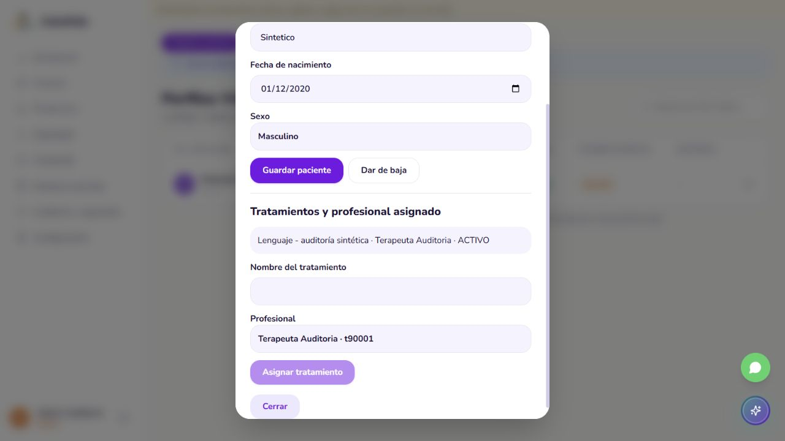
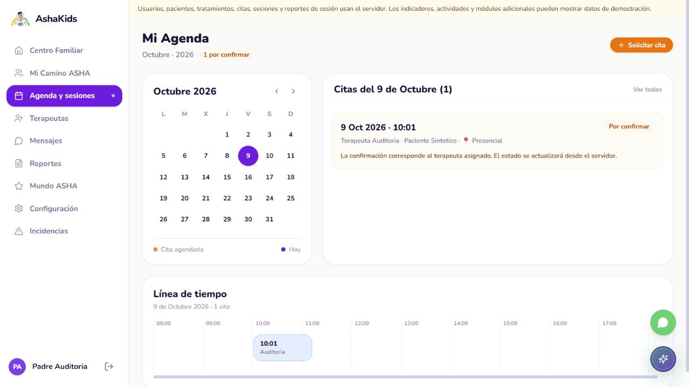
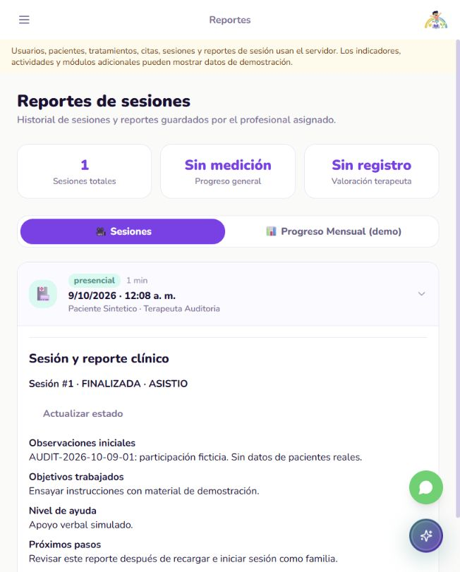

# ASHAKids | Auditoría de fase 2

**Corte:** AUDIT-2026-10-09-01. Fecha: 9 de octubre de 2026, America/Lima. Revisión técnica asistida por Codex. Entrega académica: hoy, 18:00 Lima.

**Repositorio:** https://github.com/sromansilva/ashakids-platform . Rama local: piero-dev, basada en dev. HEAD: 82f868fd4a1b7e7d40a636651c13d9add472c71f. Se audita HEAD más modificaciones locales sin commit; el manifiesto de evidencia registra sus hashes. No hay push ni despliegue de este corte.

## 01. Dictamen ejecutivo

**Núcleo de fase 2 verificado localmente, con incidencia de aislamiento pendiente de revisión del equipo.** El recorrido ADMIN -> paciente/tratamiento -> PADRE/cita -> TERAPEUTA/sesión/reporte -> PADRE/lectura funciona contra PostgreSQL descartable. Se corrigieron bloqueos del esquema y acciones que fingían confirmación. Este resultado certifica el recorrido ensayado, no toda la web ni un entorno de producción.

| Indicador | Resultado del corte | Evidencia |
| --- | --- | --- |
| Backend | 72 aprobadas, 25 omitidas; 19 advertencias | backend-tests.xml; PostgreSQL local real y pruebas unitarias |
| Frontend | 153 componentes y 25 rutas aprobadas; tipos/check/build correctos | Componentes con HTTP simulado; separado del recorrido real |
| Navegador | Paciente, tratamiento, reserva, confirmación, inicio, reporte y cierre | Capturas 01 a 06; API aislada en 8001 |
| Persistencia | Reporte conservado tras logout/login y recarga; sesión FINALIZADA y cita COMPLETADA | Captura 06 y 27 casos HTTP adicionales |
| Aislamiento por recurso | Otra familia y otro terapeuta reciben 404 y listas vacías; familia no edita reporte: 403 | http-persistence-permissions.json |

**Incidencia durante la primera ejecución:** suites heredadas apuntaban a localhost:8000 aunque se había configurado la BD descartable. Alcanzaron la API habitual vinculada a la base compartida; se observaron altas y eliminaciones de cuentas de prueba. Se detuvo esa ejecución y se añadieron guardas. No se restauró ni se volvió a modificar la base compartida. No corresponde afirmar que toda la auditoría estuvo aislada. Ver sección 06.

**Siguiente prioridad:** el equipo revisa esta incidencia, comparte las correcciones y reproduce el guion. Después continúa fase 3, retirando indicadores y recorridos demo del núcleo. Pagos quedan fuera del desarrollo.

<!-- pagebreak -->

## 02. Arquitectura y cambios realizados

React 18.3.1/TypeScript -> HTTP/JSON con cookies -> FastAPI -> servicios -> SQLAlchemy asíncrono/asyncpg -> PostgreSQL. Supabase aporta la infraestructura habitual; no se introduce Supabase Auth. Los consumidores usan clinicalService.ts, hooks y api/client.ts. La API valida rol, propietario, profesional asignado, estados y transacciones.

**Entorno ejecutado:** Windows, Python 3.13.7 en backend/.venv313, SQLAlchemy 2.1.4 sin extensión binaria, asyncpg 0.32.0; Node 26, Vite 6.4.4. PostgreSQL 18.0 local, puerto 6543, base ashakids_test_phase2; API 127.0.0.1:8001 y frontend 127.0.0.1:5174. Las variables de los procesos aislados sustituyen DATABASE_URL y VITE_API_BASE_URL; no se reescribe el .env habitual.

**Modelo físico inspeccionado:** 26 tablas, 26 claves primarias, 34 claves foráneas, 12 restricciones únicas y 10 CHECK; PostgreSQL 18 también enumera 130 restricciones NOT NULL. Definiciones completas en database-model.json. La existencia de tablas de mensajes/actividades no demuestra que sus pantallas tengan API operativa.

| Relación del núcleo | Correspondencia | Regla observada |
| --- | --- | --- |
| usuarios -> roles/perfiles | usuario_roles, tutores, terapeutas, administradores | Autenticación propia y acceso por rol |
| tutor -> paciente -> expediente | pacientes.id_tutor; expediente del paciente | La familia ajena no accede al recurso |
| expediente -> tratamiento -> terapeuta | tratamientos | ADMIN asigna; profesional ajeno no recibe acceso |
| tratamiento -> reserva -> sesión -> reporte | reservas, sesiones, reportes_sesion | Citas es el nombre HTTP de reservas; reporte persistente |

**Correcciones nuevas:** avatar_nombre faltaba en db_creation.sql aunque el modelo lo exigía: las operaciones de pacientes fallaban con 503. Se incorporó el campo y una migración idempotente 001_paciente_avatar.sql, aplicada exclusivamente a la base descartable. No hay DDL automático al iniciar la API.

Se protegieron tres suites HTTP heredadas y su ejecutor; se añadieron siete pruebas de guardas. Los tests de configuración dejaron de depender de la marca y secretos del .env. La familia ya no simula una confirmación. El aviso general distingue operaciones persistentes de demo; reportes ya no muestran 78% ni 4.9 como métricas reales.

No se reescribió la arquitectura ni se declara una decisión histórica nueva. El generador PDF admite fuente, salida, fecha e imágenes por argumentos y conserva el informe anterior.

También se importó el SQL corregido en una segunda base vacía, ashakids_test_schema: avatar_nombre existe con VARCHAR(20), NOT NULL y default zorro, sin necesitar la migración de reparación. Evidencia: fresh-schema.txt.

<!-- pagebreak -->

## 03. APIs funcionando: identidad y pacientes

La suite usa ASGITransport con PostgreSQL real; el navegador y la comprobación posterior usan HTTP real por loopback. Se distinguen ambos tipos de evidencia. Las identidades de aceptación son a90001, p90001/p90002 y t90001/t90002, con nombres y correos sintéticos.

| Método y ruta | Estado | Caso y evidencia |
| --- | --- | --- |
| POST /api/v1/auth/login | 200/401 | Tres roles válidos; contraseña/código inválidos en test_auth_api.py |
| GET /api/v1/auth/me; POST /auth/logout | 200/401 | Sesión válida, cierre e invalidación; reinicio de sesión familiar en navegador |
| GET /api/v1/admin/me | 200/403 | ADMIN permitido; otros roles rechazados |
| POST/PATCH /api/v1/usuarios | 201/200 | Alta/cambio de cuenta, perfiles y revocación de sesiones, en test_admin_users_create_update_revoke |
| GET /api/v1/usuarios | 200/403 | Administración; PADRE sin permiso |
| POST /api/v1/pacientes | 201 | Paciente Sintetico creado en navegador por ADMIN para p90001 |
| GET/PUT/DELETE /api/v1/pacientes/{id} | 200 | Lectura, edición y baja lógica persistente en test_patient_persistence_and_ownership |
| GET /api/v1/pacientes/{id} | 404 | Familia/profesional ajenos: test y comprobación HTTP posterior |
| POST /api/v1/tratamientos | 201 | ADMIN asignó Lenguaje - auditoría sintética a t90001 en navegador |

**Validación funcional:** fecha de nacimiento futura y campos vacíos/extra -> 422; tutor ajeno en alta -> 403; cuenta duplicada -> 409. Las contraseñas mantienen sus espacios; cambiar contraseña/inactivar una cuenta revoca sesiones en las pruebas. El login no deduce el rol por el prefijo del código.

**Lectura posterior:** la fixture del navegador contiene un paciente y un tratamiento. Cinco cuentas se prepararon mediante script para controlar los roles; el recorrido UI no pretende haber creado esas cinco cuentas desde sus formularios. La gestión de cuentas se ensayó por API en la suite, y su listado también se observó en UI.

Una respuesta 404 para un recurso ajeno es una denegación prevista; no es una API rota. Las pruebas no autorizan acceso a expedientes compartidos reales.

<!-- pagebreak -->

## 04. APIs funcionando: citas, sesiones y sistema

| Método y ruta | Estado | Transición y evidencia |
| --- | --- | --- |
| POST /api/v1/citas | 201 | Familia reserva tratamiento autorizado, mediante BookingDialog real |
| PATCH /api/v1/citas/{id}/estado | 200 | Terapeuta asignado acepta: PENDIENTE -> CONFIRMADA; ver registro HTTP UI |
| POST /api/v1/sesiones | 201/409 | Registrar desde cita confirmada; duplicado rechazado por suite |
| POST /api/v1/sesiones/{id}/iniciar | 200/409 | PROGRAMADA -> EN_CURSO; inicio anticipado/repetido rechazado |
| PUT /api/v1/sesiones/{id}/reporte | 200/403 | Profesional guarda cuatro campos; familia no puede escribir |
| POST /api/v1/sesiones/{id}/cerrar | 200/409 | EN_CURSO -> FINALIZADA, ASISTIO; cita -> COMPLETADA |
| GET /api/v1/sesiones/{id}/reporte | 200/404 | Familia/profesional autorizado lee; ajenos no acceden |
| GET /health y /health/ready | 200 | Salud y disponibilidad SQL comprobadas; no sustituyen aceptación |

Consultar backend-api-evidence.json para las rutas exactas deduplicadas de la suite y ui-http-log.txt para las peticiones del recorrido en 8001.

**Recorrido del navegador:** ADMIN registra paciente y asigna tratamiento; PADRE reserva presencial; TERAPEUTA acepta, registra sesión, inicia, guarda observaciones/objetivos/ayuda/próximos pasos y finaliza. PADRE vuelve a iniciar sesión, abre el reporte y lo recupera tras recarga. Texto marcador: AUDIT-2026-10-09-01. No se requirió pago.

**Control temporal:** la cita se creó inicialmente para el 9 de octubre a las 10:01 Lima. Tras confirmarla, phase2_sandbox due movió exclusivamente su inicio a cinco minutos antes del momento de prueba y su fin a cuarenta minutos después. No se cambió el reloj ni se debilitó la validación de la aplicación. La vista Día permite encontrar la cita a las 00:08; la cuadrícula semanal solo muestra 08:00-17:00.

**Casos negativos/concurrencia:** cruce de horario, dos reservas simultáneas con una sola persistida, sesión duplicada, inicio/cierre incompatibles, inasistencia fuera de horario, cancelación/reprogramación y paginación validada: suite clínica. Sesión expirada y DB indisponible -> 401/503: suite de autenticación. Son casos acotados, no una prueba de carga.

**Persistencia final:** 5 usuarios, 1 paciente, 1 tratamiento, 1 reserva, 1 sesión y 1 reporte. Verificación HTTP independiente: 27 casos, incluyendo acceso por los tres roles, listas vacías de ajenos y edición del reporte rechazada. Todas estas lecturas posteriores pertenecen al entorno descartable.

<!-- pagebreak -->

## 05. APIs no operativas y capacidades faltantes

| Capacidad | Estado del corte | Acción dentro del alcance |
| --- | --- | --- |
| Indicadores de paneles | Dashboard familiar/terapeuta/admin conserva información ilustrativa | Fase 3: sustituir o rotular datos; no usarlos como evidencia clínica |
| Progreso mensual | Maqueta con informes estáticos, ahora pestaña marcada demo | Fase 3: definir contrato antes de conectar; cifras clínicas sin medición no se inventan |
| Seguimiento general | Sesiones y reportes individuales persistentes; indicadores globales incompletos | Continuar fase 3 después de compartir este corte |
| Exportación clínica | El reporte guardado ofrece TXT; PDF mensual existente es demo | Seleccionar PDF real en fase 5 si la rúbrica lo requiere |
| Videollamada/reunión | Recorrido de sesión clínica comprobado; audio/vídeo WebRTC no ensayados | Mantener separados sesión clínica y conexión audiovisual |
| Registro/recuperación/correo | No certificados por este recorrido | Acordar mínimo; no prometer envío real sin evidencia |
| Mensajes, actividades, ML/ASHI | No auditados funcionalmente en este corte | Seleccionar extensiones; la tabla o pantalla existente no prueba operación |
| Pagos | Fuera del desarrollo por observación del profesor | Sin pasarela, API, tablas nuevas ni commits de pagos; maqueta preexistente no bloquea el núcleo |

**Limitación de navegación:** /admin/pacientes y /admin/citas existen, pero el menú administrativo principal no ofrece enlaces directos al núcleo. El guion incluye acceso por URL; mejorar descubrimiento corresponde al siguiente ajuste de fase 3.

**Horario visible:** la agenda semanal limita la cuadrícula a 08:00-17:00; una cita fuera de esas horas se consulta desde Día. No se certifica que la cuadrícula abarque todas las citas o resuelva superposición de múltiples eventos en una misma celda.

Las 25 omisiones no se cuentan como éxito: 20 casos HTTP heredados se deshabilitan por defecto y 5 de integración compartida requieren autorización. La cobertura útil se aporta con la suite clínica aislada y el recorrido nuevo; no se reutiliza el resultado histórico de 63 aprobadas como ejecución actual.

No hubo pentest, prueba de carga, prueba en dispositivos físicos ni certificación de todas las pantallas. Las pruebas de componentes usan mocks; la compilación solo valida construcción. No se auditó la infraestructura Supabase ni se aplicó la migración allí.

<!-- pagebreak -->

## 06. Seguridad y riesgos priorizados

| Prioridad | Hallazgo confirmado | Estado y acción |
| --- | --- | --- |
| P0 | Primera suite heredada alcanzó API habitual en 8000 y efectuó operaciones sobre cuentas de prueba | Detenida; guardas nuevas probadas. Equipo debe revisar el impacto compartido; no se realizó reversión |
| P1 | Esquema inicial sin avatar_nombre bloqueaba pacientes y dependencias clínicas con 503 | Corregido en SQL inicial y migración explícita; aplicado/verificado solo en PostgreSQL descartable |
| P1 | Botón familiar simulaba confirmación sin servidor | Retirado; solo terapeuta confirma por API; prueba de regresión y captura 02 |
| P2 | Aviso global negaba persistencia real y reporte mostraba progreso/valoración inventados | Aviso corregido; métricas sin fuente eliminadas de reportes y mensual marcado demo |
| P2 | Tests de configuración dependían del .env; espera de carga diferida era 1 segundo | Configuración sintética y espera acotada a 5 segundos, conservando aserciones de error |
| P2 | Otros paneles y rutas avanzadas siguen usando mocks | Fase 3 con inventario; no presentar esos datos como resultados reales |

**Incidencia de aislamiento:** configurar DATABASE_URL no cambiaba los BASE_URL hardcodeados de unittest. Fue un error en el procedimiento de auditoría iniciar esa ejecución antes de revisar todos sus destinos. Los logs muestran altas y eliminaciones de cuentas de prueba, incluidas referencias a IDs 44/45; también hay respuestas históricas de cambios/activaciones/suspensiones. Como el archivo no tiene hora por petición, no se atribuyen todas las entradas ni un número exacto al incidente.

Evidencia resumida y sin credenciales: legacy-target-incident.json. No se leyó una lista de pacientes reales ni se exportó la base compartida. No se afirma que la base quedara intacta o restaurada. El equipo debe contrastar sus logs de auditoría y cuentas de prueba afectadas antes de cerrar esta incidencia; no se ejecuta limpieza automática adicional.

**Guardas nuevas:** suites HTTP exigen habilitación explícita, URL loopback:8001/api/v1, BD local ashakids_test_* y coincidencia con DATABASE_URL. Siete casos cubren deshabilitación, destinos remotos, puerto habitual y divergencia de base. Las variables del cliente no pueden demostrar por sí solas a qué BD conecta cualquier servidor externo; para reproducir, iniciar expresamente la API con la URL descartable indicada.

**Seguridad efectivamente ensayada:** permisos por recurso, 401 sin sesión/expirada, 403 por rol/origen de escritura y 404 ante propiedad ajena, hash/contraseña y revocación. Reportes no devuelven secretos de autenticación. Las 19 advertencias son de deprecación httpx/Starlette y cookies por petición.

Regresión final tras retirar los destinos habituales por defecto: guard-regression-tests.xml, 7 aprobadas y 20 omitidas; un aviso de permisos de caché pytest. Repite casos ya contados, no suma cobertura.

El cluster descartable usa trust solo en loopback para esta fixture sintética. No constituye configuración de producción ni modifica las protecciones del servidor compartido.

<!-- pagebreak -->

## 07. Evidencia de validación y límites

Todos los archivos siguientes están en docs/evidence/audit-2026-10-09-01/. El manifiesto de hashes permite reconocer el corte local y conservarlo en Git junto al PDF y su Markdown.

| Comando/caso | Resultado | Archivo |
| --- | --- | --- |
| backend/.venv313/Scripts/python -m pytest -q --junitxml=... | 72 aprobadas, 25 omitidas, 19 advertencias; 159.30 s | backend-tests.xml; backend-api-evidence.json |
| Primer ensayo aislado tras guardas | 17 fallos, 55 aprobadas, 25 omitidas; esquema/configuración pendientes | backend-tests-before-fix.xml; initial-failures.txt |
| npm run test:components | 153 aprobadas, 0 fallos; mocks HTTP; 9.17 s | frontend-tests.xml |
| npm run test:routing | 25 aprobadas | routing-tests.txt |
| npm run typecheck; check:frontend; build | Correctos; 302 archivos, máximo 495 líneas | frontend-typecheck.txt, frontend-check.txt, frontend-build.txt |
| python -m scripts.phase2_verify_http | 27 casos aprobados por HTTP real tras recorrido UI | http-persistence-permissions.json |
| python -m scripts.phase2_sandbox inspect | 26 tablas; PK/FK/UNIQUE/CHECK y conteos | database-model.json |
| Navegador de Codex | Recorrido real en 5174 -> 8001; fixture temporal documentada | Capturas 01-06, ui-report-reload.txt, ui-http-log.txt |
| Graphify refresh y check | AST local, sin LLM ni credenciales | knowledge-check.txt |

**Intentos y límites conservados:** falló un arranque frontend por EPERM al iniciar esbuild dentro del sandbox, resuelto ejecutando con permiso de proceso. Un ensayo de componentes agotó la espera de un segundo de carga diferida en /padre/camino; se conserva frontend-tests-cold-load.xml. La espera ahora es de cinco segundos, sin borrar las aserciones. Ninguno de esos intentos se presenta como aprobado.

| Rúbrica visible | Evidencia entregada | Límite |
| --- | --- | --- |
| Arquitectura/backend | Capas y contratos, código corregido, operación HTTP y recorrido | No evalúa despliegue ni todas las extensiones |
| BD/modelo físico/relaciones | 26 tablas y restricciones reales; altas/lecturas persistentes | PostgreSQL local 18; infraestructura compartida no certificada |
| Seguridad/validación | Propiedad/roles/origen, estados, concurrencia y errores controlados | Casos acotados; no pentest/carga. Incidencia inicial pendiente |

La captura de rúbrica es parcial: no se inventan ponderaciones ni una nota. El PDF del 8 de octubre permanece como referencia histórica, sin reemplazarlo.

<!-- pagebreak -->

**Evidencias visuales: paciente, tratamiento y cita**

<!-- pagebreak -->

**Evidencia visual: persistencia del reporte familiar**

Capturas adicionales 03-05 documentan edición profesional, cierre y consulta inicial. Son datos ficticios. La duración mostrada corresponde a una prueba breve, no a una sesión terapéutica real de cuarenta y cinco minutos.

<!-- pagebreak -->

## 08. Cierre y ruta de entrega

**Resultado:** recorrido central verificado en el árbol local corregido. La aceptación local no equivale a cerrar la incidencia inicial, publicar los cambios en dev ni concluir las fases 3/5/6. Ningún cambio de esta tarea fue enviado al repositorio remoto.

| Orden | Responsable | Criterio de cierre |
| --- | --- | --- |
| 1. Revisar incidencia inicial | Equipo/backend | Verificar cuentas de prueba y logs compartidos; registrar decisión y resultado, sin limpieza ciega |
| 2. Compartir este corte | Coordinación | Revisar diff; commit versionado con objetivo, por ejemplo V03_VerificacionFase2; integrar según acuerdo del equipo |
| 3. Reproducir núcleo | Otro integrante | BD descartable nueva, SQL inicial corregido, suite y guion de roles sin tocar Supabase |
| 4. Corregir seguimiento/demo | Frontend/backend | Fase 3: paneles y navegación consistentes; lista explícita de módulos ilustrativos |
| 5. Entrega 18:00 Lima | Equipo | Informe + repo + modelo físico + evidencia de seguridad y funcionamiento; alcance declarado |

**Guion repetible:** instalar según README; crear PostgreSQL loopback separado con base ashakids_test_phase2; importar backend/scripts/db_creation.sql corregido. Para una base antigua descartable usar explícitamente la migración 001_paciente_avatar.sql. Definir ASHAKIDS_TEST_DATABASE_URL y DATABASE_URL con la misma URL local antes de pytest. La suite trunca fixtures: no ejecutarla sobre los datos de la demostración que quieras conservar.

Después de la suite, ejecutar phase2_sandbox prepare; iniciar API 8001 con DATABASE_URL local, CORS para 127.0.0.1:5174 y cookie ashakids_audit_session; iniciar Vite 5174 con VITE_API_BASE_URL apuntando a 8001. Los cinco códigos sintéticos comparten la contraseña pública de fixture documentada en phase2_sandbox.py, nunca una credencial real.

ADMIN: /admin/cuentas y /admin/pacientes, crear paciente y asignar tratamiento. PADRE: /padre/agenda, reservar. TERAPEUTA: /terapeuta/agenda, Aceptar. Ejecutar phase2_sandbox due exclusivamente en esa fixture para avanzar la cita; seleccionar Día, Ver detalle, Registrar/Iniciar sesión clínica, Guardar reporte y Finalizar. PADRE: nuevo login, /padre/reportes, abrir sesión, recargar y comprobar texto. Ejecutar phase2_verify_http con variables explícitas del entorno descartable para repetir denegaciones.

El entorno de este corte conserva la fixture en 6543 y servicios de auditoría 8001/5174. El entorno habitual 8000/5173 permanece separado. No subir .env, cluster local, cookies ni logs sin sanitizar. Para detener PostgreSQL, usar pg_ctl con el directorio exacto tmp/phase2-postgres/data; no borrar otra instalación.

Fuente, índice, contexto maestro, arquitectura y relevo quedan actualizados. La siguiente persona empieza en docs/PROJECT_CONTEXT.md y sigue docs/IMPLEMENTATION_PROGRESS.md; no repite una auditoría compartida ni reconstruye el backend.
