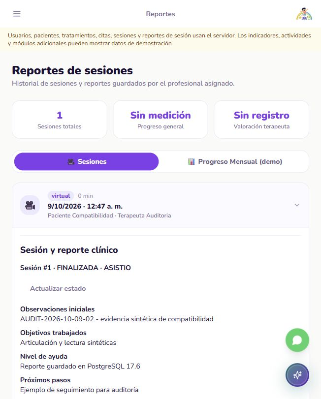

# ASHAKids | Auditoría de compatibilidad

**AUDIT-2026-10-09-02 | 09 octubre 2026 | America/Lima**

Repositorio: https://github.com/sromansilva/ashakids-platform . Rama: piero-dev, basada en dev.

HEAD: 82f868fd4a1b7e7d40a636651c13d9add472c71f. Incluye cambios locales sin commit/push; el SHA por sí solo no reproduce este corte. Entrega académica: 09/10/2026, 18:00 Lima.

## 01. Dictamen ejecutivo

**Compatibilidad del núcleo demostrada en una réplica local del esquema compartido.** Se inspeccionó Supabase mediante transacciones de solo lectura y se exportó únicamente su esquema público. La réplica ejecuta PostgreSQL 17.6, igual versión observada en el destino; no contiene registros reales. No hubo DML ni DDL compartidos en este corte.

| Indicador | Resultado nuevo | Evidencia |
| --- | --- | --- |
| Modelo vs columnas | 6 diferencias iniciales en 4 campos; 0 después de corregir | shared-before/after-model-fix.json |
| Estructura pública | 26 tablas, 178 columnas, 92 restricciones, 71 índices; coincidencia con réplica | schema-comparison.json |
| Suite backend | 79 aprobadas, 25 omitidas, 19 advertencias | backend-tests.xml |
| HTTP real | 48 respuestas con estado esperado; reporte persistente y permisos por recurso | real-http-journey.json |
| Navegador | Familia inicia sesión, consulta reporte y recarga; contenido conservado | family-report-reload.png |

**No es una certificación de estabilidad de toda la plataforma ni del despliegue.** Fase 3 sigue pendiente: el panel familiar muestra cifras y pasos de demostración junto a datos persistentes. Continúan abiertos el análisis completo de la incidencia del corte 01 y la reproducción por otro integrante.

Evidencias de este corte: docs/evidence/audit-2026-10-09-02/. La auditoría 01 permanece histórica; sus cifras de frontend no se cuentan como ejecución nueva.

<!-- pagebreak -->

## 02. Arquitectura y cambios realizados

Arquitectura conservada: React/Vite -> HTTP/JSON -> FastAPI -> SQLAlchemy/asyncpg -> PostgreSQL. Autenticación propia por cookie HttpOnly y autorización en FastAPI. Sin Supabase Auth ni conexión React a PostgreSQL.

Entorno: Python 3.13.7, FastAPI 0.143.0, SQLAlchemy 2.1.4, asyncpg 0.32.0, PostgreSQL 17.6. Versiones completas en backend-dependencies.txt. El frontend de auditoría sigue en 5174; API aislada 8001; BD descartable 6544, ashakids_test_compat17.

| Campo | Corrección en código | Esquema compartido observado |
| --- | --- | --- |
| sesiones_autenticacion.token_hash | String(64) -> String(255) | VARCHAR(255); hash SHA-256 sigue teniendo 64 caracteres |
| perfiles.progreso | Float -> Decimal/Numeric(5,2) | NUMERIC(5,2); presentación HTTP conserva número JSON |
| logros.requisito_logro | String(255) -> Text | TEXT |
| logros.icono_logro | String(100) obligatorio -> String(255) opcional | VARCHAR(255), admite NULL |

Archivos: backend/app/models/auth.py, perfiles.py y scripts/db_creation.sql. El SQL inicial ajusta requisito/icono; no se ejecutó contra Supabase. **avatar_nombre ya existe en la BD compartida**: VARCHAR(20), NOT NULL, valor inicial zorro. No corresponde aplicar allí la migración 001 por este hallazgo.

El inspector compara tipo, longitud, nulabilidad, precisión y escala de columnas en 17 tablas modeladas. No certifica que las otras 9 tablas públicas tengan API operativa. La comparación de metadatos entre origen y réplica incluye restricciones, índices y RLS; no sustituye una revisión completa de semántica de los modelos.

Las fixtures ahora separan conexión propietaria para TRUNCATE/RESTART IDENTITY y conexión de runtime para operaciones de la aplicación. Ambas deben apuntar a la misma BD loopback ashakids_test_*, sin parámetros de redirección. La API nunca recibe la identidad de limpieza.

<!-- pagebreak -->

## 03. APIs funcionando: identidad y pacientes

Este corte ensaya cinco identidades ficticias: ADMIN, familia propietaria, familia ajena, terapeuta asignado y terapeuta ajeno. Las contraseñas del guion son exclusivamente de fixtures locales. No se publican cookies, hashes de sesión o credenciales de infraestructura.

| Método y ruta | Estado | Resultado comprobado |
| --- | --- | --- |
| POST /auth/login | 200 | Acceso de cinco identidades sintéticas; sesión SQL propia |
| POST /pacientes | 201 | Familia crea paciente; persistencia en réplica real |
| POST /tratamientos | 201 | ADMIN asigna el paciente al terapeuta de la fixture |
| GET /pacientes/1 | 200 | ADMIN, familia propietaria y terapeuta asignado acceden |
| GET /pacientes/1 | 404 | Familia y profesional ajenos no acceden |
| GET /pacientes | 200 | Identidades ajenas reciben lista vacía |
| POST /auth/logout | 200 | Cierre de sesión; familia vuelve a iniciar y lee reporte |

Los estados corresponden a HTTP real en API loopback 8001. En la suite adicional, las solicitudes atraviesan FastAPI en proceso (ASGITransport) y usan PostgreSQL real con el rol de runtime. Distinguir estos ensayos de mocks y de pruebas sobre el servicio compartido.

La verificación SQL final contiene 5 usuarios sintéticos y un paciente. Las lecturas posteriores comprueban los recursos tras guardar y cerrar sesión; no se inspeccionaron datos clínicos reales.

La suite comprueba además desactivación sin borrar historial, acceso anónimo rechazado, validación de campos, conflicto de horario/concurrencia y contratos de presentación. Véase XML con nombres de casos; no extrapolar cobertura a módulos ausentes.

<!-- pagebreak -->

## 04. APIs funcionando: citas, sesiones y sistema

| Método y ruta | Estado | Persistencia o regla observada |
| --- | --- | --- |
| POST /citas | 201 | Familia reserva sobre tratamiento autorizado |
| PATCH /citas/1/estado | 200 | Profesional confirma la cita |
| POST /sesiones | 201 | Sesión registrada para esa reserva |
| POST /sesiones/1/iniciar | 409 / 200 | Rechazo antes del horario; inicio tras fixture temporal |
| PUT /sesiones/1/reporte | 200 | Cuatro campos del reporte guardados por profesional |
| POST /sesiones/1/cerrar | 200 | Sesión FINALIZADA, asistencia ASISTIO y cita COMPLETADA |
| GET /sesiones/1/reporte | 200 / 404 | Acceso propio permitido; recursos ajenos ocultos |
| PUT /sesiones/1/reporte | 403 | Familia no puede editar reporte profesional |

Se simula el paso del tiempo ajustando únicamente una cita local confirmada; no se cambia el reloj ni una reserva compartida. La ejecución rápida dura menos de un minuto y la pantalla muestra 0 min redondeados; no representa una sesión clínica real.

48 respuestas HTTP verificadas incluyen login/logout y lecturas negativas, no 48 funcionalidades distintas. Relecturas de ADMIN/familia/profesional coinciden en estados y marcador AUDIT-2026-10-09-02. Las identidades ajenas reciben listas vacías y 404 en detalles.

Inspección SQL final: 1 paciente, 1 tratamiento, 1 reserva, 1 sesión y 1 reporte. El navegador familiar consulta el mismo reporte y lo conserva al recargar. La creación del recorrido en este corte fue por HTTP; no se repitió el recorrido íntegro de formularios de la auditoría 01.

La prueba de /health/ready observa disponibilidad de conexión. Un 200 no acredita por sí mismo esquema completo, permisos ni recorrido: esa evidencia procede de los casos anteriores.

<!-- pagebreak -->

## 05. APIs no operativas y capacidades faltantes

| Capacidad | Estado actual y límite | Acción siguiente |
| --- | --- | --- |
| Panel familiar / Mi Camino ASHA | Mezcla datos reales con cifras fijas: 12 sesiones, 8/10 objetivos, pasos y actividades de demostración | Fase 3: reemplazar por datos verificables o estados explícitos sin medición |
| Seguimiento clínico agregado | Reporte persistente disponible; no medición validada de progreso global | Mostrar historial real sin inventar porcentajes de mejoría |
| Resto de módulos | Mensajes, actividades, documentos y extensiones no certificados por esta auditoría | Seleccionar mínimos académicos según plan y tiempo |
| Reproducción en otro equipo | Guiones y evidencia disponibles; no realizada todavía | Integrante repite sobre BD local descartable identificada |
| Incidencia previa | IDs 44/45 no existen en lectura actual; no determina todo el impacto anterior | Equipo revisa logs y cambios compartidos del corte 01 |
| Hosting gratuito | Comparación y selección pendientes de estabilidad del alcance | Orientar después; usuario decide; despliegue requiere petición posterior |
| Pagos | Fuera del desarrollo acordado con profesor | Sin pasarelas, cobros ni nuevos commits dedicados |

No se ha desplegado, no se ha ensayado un host Linux ni se han comprobado cookies/CORS en dominios HTTPS diferentes. El resultado actual reduce diferencias de esquema y versión; no promete ausencia de conflictos de infraestructura futura.

Las 9 tablas públicas adicionales no modeladas no equivalen a módulos implementados. No ampliar el backend por la mera presencia de esas tablas. Priorizar la experiencia del núcleo que evaluará el curso.

<!-- pagebreak -->

## 06. Seguridad y riesgos priorizados

| Prioridad | Hallazgo confirmado | Acción y alcance |
| --- | --- | --- |
| Alta | Rol compartido: no superusuario, BYPASSRLS, CREATEDB y CREATEROLE | Preparar rol de aplicación con mínimos privilegios antes de despliegue; no se alteró ese rol |
| Alta | 26 tablas tienen RLS habilitada; 0 políticas; conexión backend omite RLS | Mantener autorización por recurso en FastAPI; no tratar RLS como protección de este backend |
| Alta | Incidencia histórica: pruebas heredadas operaron cuentas compartidas en corte 01 | Revisar logs/impacto con equipo; ausencia actual de dos IDs no cierra incidencia |
| Media | Conexión remota SSL observada; réplica loopback sin TLS | Ensayar TLS y conexión/pooling apropiados cuando se elija host |
| Media | Dependencias por rangos; versiones ensayadas registradas | Reproducir versiones y comprobar runtime destino; no asumir igualdad por requirements.txt |
| Media | Datos demo todavía presentados junto a resultados persistentes | Fase 3 y guion de entrega honesto |

Rol local de runtime: NOSUPERUSER, BYPASSRLS, sin CREATEDB/CREATEROLE. Tiene permisos de operación en la réplica; no puede reiniciar secuencias que no posee. La conexión propietaria solo se utiliza en la preparación/limpieza de fixtures. Esto conserva un ensayo más representativo que ejecutar toda la API como superusuario.

Metadatos muestran concesiones SQL amplias para anon; con RLS habilitada y sin políticas, un rol no propietario/no BYPASSRLS no obtiene acceso por esas concesiones solamente. No se probó la Data API con clave anon ni se realizó pentest. No confundir metadatos con exposición demostrada de filas.

En este corte: cero escrituras compartidas y cero migraciones compartidas. Se consultó únicamente existencia de IDs sintéticos 44/45 y metadatos; no se copiaron registros reales. La exportación usa --schema-only, --no-owner, --no-privileges y --no-comments.

La autorización ajena HTTP, el bloqueo de edición familiar, CSRF y entradas inválidas tienen evidencia. No se certifican carga, disponibilidad, ataque distribuido ni todos los módulos.

<!-- pagebreak -->

## 07. Evidencia de validación y límites

| Comando o caso | Entorno / resultado nuevo | Archivo |
| --- | --- | --- |
| inspect_schema_compatibility --target shared | Solo lectura; 6 diferencias antes y 0 después | shared-before/after-model-fix.json |
| pg_dump --schema-only; restauración local | PG 17.6; estructura pública equivalente; sin filas | schema-export-provenance.json / schema-comparison.json |
| pytest -q -p no:cacheprovider --tb=short | PG local 6544: 79 pass, 25 skip, 19 warnings, 0 fail/error | backend-tests.xml |
| verify_compatibility_journey | API 8001: 48 respuestas verificadas; permisos/persistencia | real-http-journey.json |
| phase2_sandbox inspect | Conteos finales sintéticos y restricciones | local-final-inspection.json |
| Login familiar / reporte / recarga | Frontend 5174: marcador y estado conservados | family-report-reload.png |
| knowledge/manage.py refresh y check | Mapa AST local actualizado; advertencia extracción secuencial | knowledge-check.txt |

**Intentos fallidos conservados:** primera suite obtuvo 47 aprobadas, 25 omitidas, 25 errores de preparación y 19 advertencias por propietario de secuencia; corregida separación de limpieza. Dos intentos del guion HTTP recibieron 422 al enviar campos ajenos al contrato; corregido el guion, sin cambiar API. La primera restauración local encontró public ya existente y se repitió sobre esquema vacío del destino descartable. No se ocultan como ejecuciones aprobadas.

25 omisiones: 20 pruebas HTTP heredadas deshabilitadas por defecto y 5 ensayos compartidos sin habilitar. No se ejecutaron esas escrituras compartidas. 19 advertencias: 1 de integración Starlette/httpx y 18 de cookies por solicitud en TestClient; no hay errores finales.

| Rúbrica visible | Evidencia | Límite |
| --- | --- | --- |
| Arquitectura/backend | Capas y recorrido HTTP en proceso y servicio real | Sin ampliación de arquitectura |
| BD/modelo físico | Esquema 26/178/92/71; operaciones persistentes locales | Sin datos productivos ni DML compartido |
| Seguridad/validación | Acceso ajeno, CSRF, conflictos, concurrencia, sesión | Sin pentest ni ensayo de carga |

Pruebas frontend 153 componentes/25 rutas y recorrido completo UI del corte 01 son **evidencia histórica**, no reejecutada aquí. Linux, host gratuito, dominios externos y otras pantallas no verificados en este corte.

<!-- pagebreak -->

## 08. Cierre y ruta de entrega

**Siguiente implementación: fase 3, empezando por Centro Familiar y Mi Camino ASHA.** Usar sesiones/reportes y asignaciones reales; retirar contadores fijos y estados que aparentan completar pasos. Si falta una medición o módulo, mostrarlo con claridad y conservar la navegación útil del núcleo.

Antes de entrega: equipo revisa incidencia histórica, identifica un commit con versión y objetivo según AGENTS.md y comparte el corte en la base acordada dev. No hubo commit/push automático; otro integrante no obtiene estos cambios por leer el chat.

1. Preservar evidencia y documentación de este corte; consultar README del directorio de evidencia para comandos y límites.

2. Otro integrante prepara una BD local ashakids_test_* con el esquema exportado, instala versiones registradas, ejecuta las pruebas y el guion. Las fixtures hacen TRUNCATE: no apuntarlas a una BD con historial que se deba conservar.

3. Continuar fase 3 con revisión y pruebas de las vistas modificadas. Compartir contratos con quienes desarrollan backend; evitar inventar endpoints o progreso clínico.

4. Cuando el alcance tenga evidencia de estabilidad, comparar costes/límites vigentes de Vercel, Railway, Render y alternativas para React/Vite + FastAPI + Supabase. Dar información y recomendación para decisión del usuario. No publicar por esta instrucción.

La réplica valida esquema y versión del destino, autorización y persistencia con PostgreSQL real. La red, TLS, amplitud de privilegios, volumen de datos y plataforma de alojamiento difieren; su aceptación se hará por separado cuando corresponda.

Referencias técnicas consultadas: https://supabase.com/docs/guides/database/connecting-to-postgres y https://supabase.com/changelog/postgres-15-19-17-11-breaking-changes . No se realizó actualización de PostgreSQL compartido. Vigencia del hosting pendiente de consulta al decidir.

**Repositorio del informe:** https://github.com/sromansilva/ashakids-platform . PDF/fuente/evidencia nuevos; informe 01 conservado. Contexto, plan y relevo actualizados.

<!-- pagebreak -->

## Evidencia visual | Reporte tras recarga

El recorrido de creación fue HTTP real; la captura documenta login/consulta/recarga familiar en navegador. No contiene datos de pacientes reales. No representa cobertura completa de todas las pantallas.
