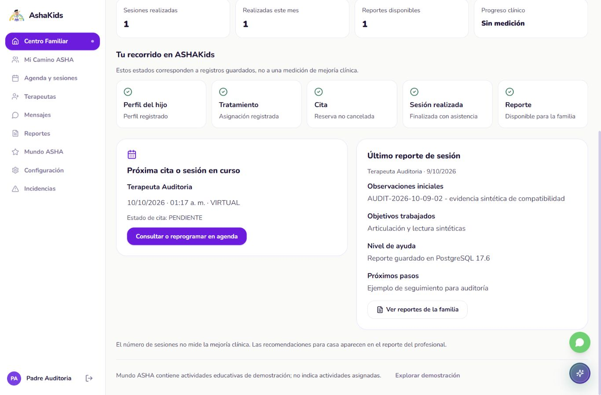
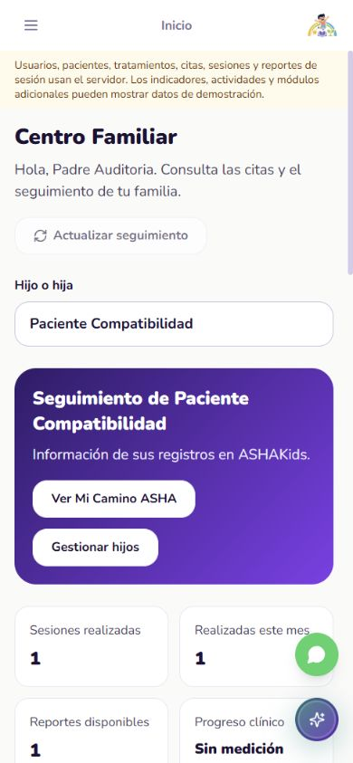

# ASHAKids | Auditoría de seguimiento familiar

**AUDIT-2026-10-09-03 | F3-01 | 09 octubre 2026 | America/Lima**

Repositorio: https://github.com/sromansilva/ashakids-platform . Rama piero-dev, basada en dev.

HEAD 82f868fd4a1b7e7d40a636651c13d9add472c71f más cambios locales sin commit/push. El SHA solo no reproduce este corte. Entrega académica: 09/10/2026, 18:00 Lima.

## 01. Dictamen ejecutivo

**Centro Familiar y Mi Camino ASHA muestran registros persistentes del núcleo.** Se retiraron de estas entradas los niños ficticios de respaldo, contadores fijos, hitos supuestos, informes/firma ficticios y recomendaciones clínicas inventadas. Selección por ID del hijo, también en móvil; una cita completada no aparece como próxima.

| Indicador nuevo | Resultado | Evidencia |
| --- | --- | --- |
| Componentes frontend | 165 aprobados, 0 fallos; incluye 12 casos nuevos | frontend-tests.xml |
| Rutas | 25 aprobadas, 0 fallos | routing-tests.txt |
| Tipos/check/build | Correctos en corte final | typecheck.txt / frontend-check.txt / build.txt |
| Navegador | Desktop 1366 y móvil 390; hermanos homónimos, recarga, familia vacía, reporte y navegación a agenda | browser-observations.json / capturas |
| Preparación SQL real | Segundo hijo sintético y cita futura añadidos sin reset; 7 respuestas HTTP verificadas | local-fixture.json |

**F3-01 aceptado en esas dos vistas; fase 3 completa y otras pantallas no certificadas.** Los datos de actividades, mensajes, evaluación/consentimiento y recuperación de cuenta requieren revisar alcance/contratos antes de prometer persistencia. No hay pagos nuevos ni elección/despliegue de hosting.

Entorno: frontend Vite 5174, API 8001, PostgreSQL 17.6 local 6544/ashakids_test_compat17. En este corte no se consultó ni escribió Supabase. Todo dato usado en navegador es sintético. Contexto, plan y relevo actualizados; señal de relevo incorporada a AGENTS.md.

<!-- pagebreak -->

## 02. Arquitectura y cambios realizados

Conserva React -> HTTP/JSON -> FastAPI -> SQLAlchemy -> PostgreSQL. Sin endpoints, migraciones ni autenticación nuevos. Las dos entradas usan FamilyTrackingPanel; useFamilyTracking consume clinicalService y readAllPages; summarizeFamily deriva registros por id_paciente.

| Cambio | Implementación | Regla |
| --- | --- | --- |
| Selección de hijo | Selector nativo accesible en ambos tamaños; sessionStorage por usuario | Guarda solo ID; valida contra pacientes activos permitidos |
| Datos y errores | React Query por identidad; paciente/sesión en claves concretas | Sin respaldo demo; fallo de lectura oculta resumen cacheado y ofrece reintento |
| Contadores | Sesiones FINALIZADA/ASISTIO y reportes disponibles | Mes/fechas America/Lima; no porcentajes de mejoría |
| Cita próxima | ID de paciente, estado y fecha; EN_CURSO tiene prioridad | Excluye canceladas, completadas y vencidas |
| Reportes | Último reporte real y SessionActions en historial | Cuatro campos guardados; descarga TXT existente, sin firma ficticia |
| Navegación | Agenda real, reportes familiares, configuración | Sin toast que finja reprogramación exitosa |

ADR 0004 documenta la decisión nueva del modelo de lectura. No inventa una decisión histórica. Las claves de selección no contienen reportes, credenciales ni datos de perfil.

Archivos principales: frontend/src/components/common/FamilyTrackingPanel.tsx, hooks/useFamilyTracking.ts, services/familyTracking.ts; entradas PadreHome.tsx/MiCaminoAsha.tsx; tests/family-tracking.test.tsx. Antiguos fragmentos demo permanecen en el repositorio sin importarse desde esas entradas; no se los presenta como funciones persistentes.

Se mantuvo identidad visual existente (Nunito, colores violetas, ilustración ASHI y componentes). Detector mecánico encontró dos advertencias sobre paleta violeta, conservada por pertenecer al diseño actual. No hubo rediseño general. Se ajustó legibilidad de la etiqueta Sin medición en móvil.

<!-- pagebreak -->

## 03. APIs funcionando: identidad y pacientes

No se reconstruyó backend. El frontend consume los contratos ya disponibles y evita asociar pacientes por nombre. Se amplió la fixture local del corte 02 con un hermano del mismo nombre y sin tratamiento/sesiones/reporte.

| Método/ruta del guion nuevo | Estado observado | Alcance |
| --- | --- | --- |
| POST /auth/login | 200 | Familia sintética p90001, API aislada |
| GET /pacientes | 200 | Lista autorizada para preparar hermano homónimo |
| POST /pacientes | 201 | Segundo hijo sintético; no dato compartido |
| GET /pacientes/1/tratamientos | 200 | Tratamiento persistente ya existente |
| POST /auth/logout | 200 | Cierre de sesión HTTP del guion |

En navegador, p90001 ve dos hijos; cambiar al segundo muestra cero sesiones/reportes y sin tratamiento, sin reutilizar los datos del primero. El ID seleccionado se conserva al navegar a Mi Camino y al recargar desktop/móvil.

Después de cerrar sesión, p90002 muestra Aún no tienes hijos registrados y la acción Gestionar hijos; no aparece ningún niño de demostración. Al volver a p90001 se recuperan sus datos permitidos. Los dos usuarios tienen nombres sintéticos parecidos; las identidades y pacientes se distinguen por IDs.

La suite nueva comprueba hermanos homónimos, vacíos y selección. No es una repetición del CRUD completo de usuarios ni de las pruebas de permisos backend de auditoría 02. El filtro visual no sustituye la autorización del servidor.

<!-- pagebreak -->

## 04. APIs funcionando: citas, sesiones y sistema

| Capacidad | Resultado de este corte | Evidencia |
| --- | --- | --- |
| GET /citas y POST /citas | 200 / 201 en preparación local | Cita futura PENDIENTE para primer hijo |
| Próxima cita del panel | Selecciona futura, conserva estado real | Navegador/fixture; no muestra la COMPLETADA anterior como próxima |
| Sesiones/reportes | Primer hijo: 1 realizada, 1 este mes, 1 reporte; segundo: 0 | Lecturas UI y SQL local |
| Tratamientos en Mi Camino | Nombre y profesional guardados | Pestaña Tratamientos en navegador |
| Historial/Reportes en Mi Camino | Sesión FINALIZADA/ASISTIO y cuatro campos persistentes | SessionActions y captura |
| Reprogramación desde panel | Abre /padre/agenda | Navegación real; no se ensayó una nueva reprogramación en este corte |

El reporte contiene marcador AUDIT-2026-10-09-02: **se reutiliza ese registro como evidencia de lectura**, no se creó nuevamente en corte 03. Se vuelve a ver tras login/recarga. No se ejecutó otro recorrido de creación/inicio/cierre de sesión ni las 48 comprobaciones HTTP del informe anterior.

Inspección clínica local después de ampliar fixture: 5 usuarios, 2 pacientes, 1 tratamiento, 2 reservas, 1 sesión y 1 reporte. Las entradas actuales no derivan progreso terapéutico de esas cantidades. Progreso clínico sigue Sin medición.

Fechas/horarios/mes se presentan en America/Lima. Pruebas unitarias controlan el borde UTC de mes y excluyen sesiones no asistidas del contador. No se modificó el reloj ni se ajustaron reservas compartidas.

<!-- pagebreak -->

## 05. APIs no operativas y capacidades faltantes

| Capacidad | Estado real | Próxima acción |
| --- | --- | --- |
| F3-01 | Dos vistas conectadas/verificadas | Reproducción por otro integrante y revisión del corte |
| Otros paneles y módulos | No certificados por este corte; pueden contener demo | Revisar promesas y decidir mínimos académicos |
| Objetivos/actividades clínicos | Sin contrato implementado/validado aquí | Usar texto del reporte; no inventar asignaciones |
| Progreso clínico agregado | Sin medición validada disponible para estas vistas | Mostrar ausencia de medición |
| Mensajes, consentimiento/evaluación, recuperación por correo | No se ampliaron ni certificaron | Acordar contratos/alcance antes de presentarlos como persistentes |
| PDF de reporte de sesión | Descarga existente es TXT | F5-01: decidir exportación PDF autorizada como mínimo del curso |
| Pagos | Fuera del desarrollo por profesor | Sin tareas/commits/pasarelas nuevos |
| Hosting | Orientación posterior al alcance estable | Comparar proveedores entonces; usuario decide |

Mundo ASHA se enlaza como demostración educativa y se aclara que no son actividades asignadas. Se retiraron de Mi Camino las pestañas que aparentaban medir actividades, objetivos, insignias y notas sin registros reales. No se implementaron esas APIs por la mera existencia de sus maquetas/tablas.

Fase 3 general sigue abierta para otras pantallas y decisiones. No se declara toda la plataforma estable ni se adelanta despliegue. Continúan pendientes la revisión de incidencia compartida del corte01 y reproducción/commit compartido del equipo.

<!-- pagebreak -->

## 06. Seguridad y riesgos priorizados

| Prioridad | Hallazgo/límite | Acción |
| --- | --- | --- |
| Alta | Autorización debe permanecer en FastAPI | Filtro por ID evita mezclar UI; no se declara barrera de seguridad autónoma |
| Alta | Incidencia compartida de auditoría 01 sigue pendiente | Equipo revisa logs/impacto; no se restauró ni probó esa BD aquí |
| Media | Otros módulos pueden aparentar funciones persistentes | Revisar especialmente evaluación/consentimiento/recuperación antes de la demo |
| Media | Agregados descargan conjunto paginado autorizado | Evaluar endpoint agregado si crece volumen; carga no ensayada |
| Media | Datos cacheados podrían confundirse con actuales tras un fallo | Error de lista oculta resumen; error de reporte no sustituye contenido por demo |
| Media | Selección en sessionStorage local | Solo ID por usuario, validado contra su lista; funciona sin storage |

Cambio de identidad usa claves React Query por usuario. Verificación real: familia vacía no recibe datos de la anterior. Casos nuevos con mocks comprueban ausencia de recomendaciones/reportes de otro hijo al cambiar el selector.

No hubo DDL, conexiones ni escrituras Supabase en corte 03. Login/logout y preparación de fixtures escriben únicamente en la BD local descartable. El script requiere guardas del destino HTTP/SQL, y se usó la API aislada previamente identificada.

Los privilegios RLS/BYPASSRLS compartidos se documentaron en auditoría 02; no se inspeccionaron nuevamente y no se modificaron. No se realizó pentest, carga, ni ensayo de cookies/dominos externos. No incluir secretos ni pacientes reales en capturas/evidencias.

<!-- pagebreak -->

## 07. Evidencia de validación y límites

| Comando/caso | Resultado final nuevo | Archivo |
| --- | --- | --- |
| npm run test:components con JUnit | 165 pass, 0 fallos; 12 nuevos; fetch simulado | frontend-tests.xml |
| npm run test:routing | 25 pass, 0 fail, 0 skip | routing-tests.txt |
| npm run typecheck / check:frontend | Correctos; límites/imports/HTTP centralizado | typecheck.txt / frontend-check.txt |
| npm run build | Vite compila; no acredita todas las pantallas | build.txt |
| phase3_tracking_fixture | 7 respuestas reales; preparación local sin reset | local-fixture.json |
| phase2_sandbox inspect | Conteos/restricciones locales | local-final-inspection.json |
| Navegador manual | Home/Mi Camino, dos identidades, dos hijos, recarga y agenda | browser-observations.json / PNG |
| Graphify refresh/check | Extracción AST local actualizada | knowledge-check.txt |

12 casos nuevos: separación por ID, estados/horarios, mes Lima, inasistencia, hitos vacíos, datos/reporte reales, cambio de hijo/remontaje, familia vacía, carga, reintento, pestañas y error/ausencia de reporte. Componentes usan fetch simulado; no se cuentan como operaciones SQL reales.

Intentos corregidos: arranque Vitest/rutas inicialmente bloqueado por spawn EPERM del sandbox; ejecución autorizada con procesos locales terminó correctamente. Typecheck detectó dos opciones exact incompatibles en consultas de Testing Library; se sustituyeron por expresiones exactas y se repitieron tipos/componentes/build. Un npm inicial se ejecutó en raíz sin package.json; se corrigió el directorio. No son fallos finales ocultos.

| Rúbrica visible | Evidencia | Límite |
| --- | --- | --- |
| Arquitectura/backend | Contratos existentes + ADR 0004/modelo de lectura | No endpoints nuevos |
| BD/operaciones | PostgreSQL real local, paciente/cita añadidos y reporte leído | No datos compartidos ni auditoría SQL nueva |
| Seguridad/validación | Identidad/hijo, vacíos/errores, fecha/estado y recarga | Backend79 y HTTP 48 del corte 02 son históricos |

1366x900 y 390x844: selector usable y sin overflow horizontal observado en móvil. Revisión inicial y una confirmación tras ajuste de legibilidad. Capturas son porciones visibles del contenedor con scroll; no representan todas las pantallas/dispositivos. Detector: dos advertencias de paleta heredada conservada.

<!-- pagebreak -->

## 08. Cierre y ruta de entrega

**Resultado:** el seguimiento del núcleo en Centro Familiar y Mi Camino se apoya en registros guardados. El historial de sesiones y los reportes son accesibles; un hijo sin datos recibe estados vacíos en lugar de avances ficticios.

Próxima prioridad: revisar las promesas de otras pantallas (recuperación, consentimiento/evaluación y demos) y decidir mínimos de F5-01: documentos/reportes, mensajes y actividades. Reutilizar contratos existentes; no ampliar pagos ni desplegar antes de estabilidad comprobada del alcance elegido.

El equipo debe revisar incidencia 01 y reproducir en otro clon/entorno. Cambios todavía sin commit/push, rama piero-dev. No se contactó al equipo, no se mezcló una rama remota ni se publicó un deploy en este corte.

Se registró la frase del usuario **tokens bajos dejar todo listo para siguiente desarollador**. Cuando la escriba, priorizar avances/pendientes/errores, revisión/integración en dev con commit/push identificables y prompt de continuación. No confundir ese acuerdo con un push ya ejecutado ni esperar al agotamiento total.

Reproducción: leer README del directorio de evidencia, preservar fixture PG 17.6 existente y ejecutar script de ampliación solo sobre API 8001/BD local 6544 comprobada. No ejecutar prepare/pytest en esa demo si se quiere conservar historial; esos comandos truncan datos.

Informes 01/02 conservados. Nuevo PDF/fuente/evidencia con manifest; contexto, arquitectura, ADR y relevo actualizados. Graphify es local y no se versiona. Hosting: información/recomendación comparativa cuando haya estabilidad demostrada; ejecución requiere solicitud posterior.

Repositorio para entrega: https://github.com/sromansilva/ashakids-platform . Fecha límite 09/10/2026 18:00 Lima. Este documento certifica únicamente los casos y entorno declarados.

<!-- pagebreak -->

## Evidencia visual | Seguimiento persistente

