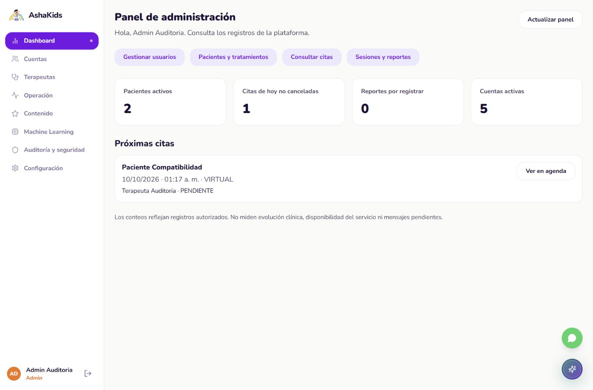
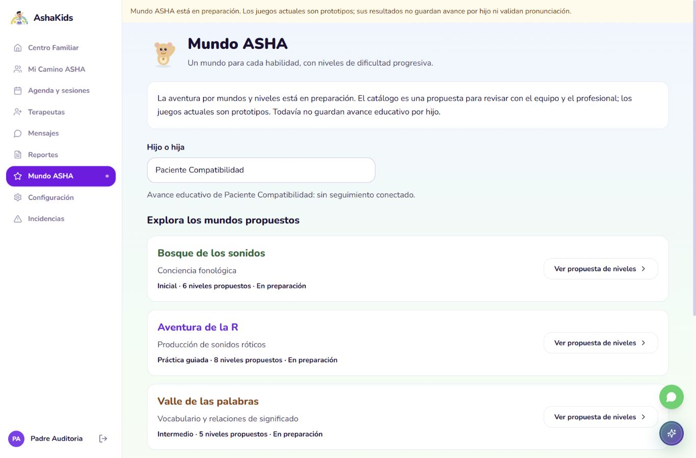

# ASHAKids | Auditoría de fase 3: coherencia del núcleo

AUDIT-2026-10-09-04. Fecha: 09/10/2026, America/Lima. Revisión asistida; revisor humano por asignar.

Repositorio: https://github.com/sromansilva/ashakids-platform . Rama auditada: piero-dev, basada en dev.

SHA de implementación: 9a6b06160c5210ec05bd3273ef516bba6989560d, V01_Fase3. Incluye correcciones previas locales de fases 2/3 que todavía no estaban publicadas. La documentación/evidencia de este corte se añade en un commit posterior; no atribuir a este SHA un PDF que aún no contenía.

Entorno de aceptación: frontend 5174 -> FastAPI 8001 -> PostgreSQL 17.6 local 6544, ashakids_test_compat17. Datos sintéticos existentes de los cortes 02/03. API habitual 8000 y web 5173 separadas; Supabase no se consultó ni modificó en este corte.

Alcance: acceso público, configuración familiar, asignaciones, seguimiento alterno, paneles principales por rol y base de Mundo ASHA. Entrega vigente: 09/10/2026 18:00 Lima. No certifica todas las extensiones, juegos completos, despliegue, carga ni operación clínica real.

## 01. Dictamen ejecutivo

Fase 3 cerrada para el alcance mínimo del núcleo: las entradas de seguimiento reutilizan datos persistentes; paneles ADMIN/TERAPEUTA agregan registros autorizados; familia consulta asignaciones reales y gestiona todos sus hijos sin una restricción de plan. No se simula registro público, correo, aceptación de consentimiento ni cambios de seguridad desde configuración.

Mundo ASHA conserva prototipos separados y presenta 4 mundos con 24 niveles propuestos. El cálculo de progreso secuencial se verifica con entradas sintéticas, pero todavía no hay API educativa ni juegos nuevos terminados. Se abre una etapa propia de revisión/implementación extensa según petición del usuario.

| Indicador de este corte | Resultado | Evidencia |
| --- | --- | --- |
| Componentes/interfaz | 198 aprobados, 0 fallos/omitidos en ejecución final | Vitest, fetch simulado; 33 casos nuevos |
| Rutas | 25 aprobadas, 0 fallos/omitidos | Node test |
| HTTP real local | 35 respuestas verificadas + OpenAPI 200 | 5 cuentas sintéticas; lecturas y login/logout |
| Tipos/estructura/build | Correctos; 312 archivos, máximo 495 líneas | Comandos y salidas preservados |
| Navegador | Escritorio 1366x900 y móvil 390x844 | Capturas/observaciones; revisión manual acotada |

No se ejecutó otra suite backend completa. Las 79 pruebas y 48 respuestas del corte 02 son evidencia histórica, no resultados nuevos. La incidencia compartida del corte 01 y la reproducción del equipo siguen pendientes.

<!-- pagebreak -->

## 02. Arquitectura y cambios realizados

Se conserva React/Vite -> HTTP/JSON -> FastAPI -> SQLAlchemy/asyncpg -> PostgreSQL, autenticación propia y permisos por recurso. No hay tablas, endpoints de aplicación ni migraciones nuevas en este corte. El primer commit también consolida cambios locales ya auditados antes; consultar cortes 01/02 para su origen y verificación.

| Área | Cambio de fase 3 | Contrato/capa |
| --- | --- | --- |
| Seguimiento alterno | PadreRecorrido/PadreSeguimiento reutilizan FamilyTrackingPanel | Pacientes, tratamientos, citas, sesiones y reportes existentes |
| Paneles principales | OperationalDashboard calcula cuentas/pacientes/citas/reportes por rol | useRemote, readAllPages, clinicalService |
| Asignaciones familiares | Profesionales proceden del tratamiento del hijo seleccionado; reserva por BookingDialog | Lecturas por ID y reserva existente |
| Configuración | Identidad consultable, CRUD de hijos; funciones sin contrato explicadas como pendientes | Sin éxito simulado ni cambios de contraseña aparentes |
| Acceso público | AccountAccessInfo sustituye flujos ficticios de alta/correo | Alta y credenciales por administración existente |
| Mundo ASHA | Selección de hijo, catálogo borrador y cálculo puro de progreso | Sin conexión educativa ni premios persistentes |
| Navegación | routeCapabilities identifica demos/teleconsulta prototipo | No equivale a una certificación de cada módulo |

useSelectedFamilyPatient comparte ID por usuario y valida la selección contra los pacientes autorizados. sessionStorage solo guarda el ID, no respuestas, consentimientos ni progreso. Las consultas mantienen identidad en la clave de caché. ADMIN solicita cuentas; TERAPEUTA no invoca /usuarios desde el panel.

Modelo físico: se reutilizan usuarios/perfiles, pacientes, expedientes/tratamientos, reservas, sesiones y reportes. No se volvió a contar el esquema; las 26 tablas/178 columnas/92 restricciones/71 índices corresponden al corte 02. No presentar ese inventario como una lectura compartida nueva.

ADR 0005 documenta las decisiones de experiencia. MUNDO_ASHA_PLAN.md define MA-01 a MA-07 y contenido borrador, con revisión profesional antes de publicar objetivos y validación oral.

<!-- pagebreak -->

## 03. APIs funcionando: identidad y pacientes

Guion nuevo phase3_verify_reads.py: guardas de API local 8001 y BD ashakids_test_*; ninguna operación clínica de escritura. Login/logout sí crean y revocan sesiones locales de autenticación. El guion valida la configuración del cliente, no descubre la BD detrás de un servidor arbitrario.

| Método/ruta | Permiso y estado observado | Evidencia local |
| --- | --- | --- |
| POST /auth/login, /auth/logout | 200 para a90001, p90001, p90002, t90001 y t90002 | Guion HTTP, sin guardar tokens/passwords |
| GET /pacientes | ADMIN: 2; p90001: 2; t90001: 1; cuentas ajenas: 0 | Filtros de autorización, fixtures existentes |
| GET /usuarios | ADMIN: 200; familias/terapeutas: 403 | Rechazo esperado, no una API rota |
| GET /pacientes/1 | p90002 y t90002: 404 | No se revela recurso ajeno |
| GET /pacientes/1/tratamientos | Tratamiento ACTIVO mostrado en navegador familiar | Registro sintético heredado del corte 02 |
| GET /padres/me | Identidad en configuración | Lectura en navegador; sin cambio de cuenta |

Las rutas de registro público, verificación y recuperación ahora explican el flujo disponible sin pedir formularios para una operación inexistente. Las pruebas de interfaz comprueban que no envían solicitudes ni afirman éxito y que llevan al login real.

Los dos hermanos homónimos se distinguen por ID/apellidos. Configuración muestra ambos incluso si el estado visual heredado del plan es exploración. La baja existente es lógica y conserva historial: se corrigió el texto que afirmaba eliminar todo irreversiblemente. No se ejecutó una baja clínica nueva en el navegador de este corte.

El formulario de alta conserva datos y error cuando la API falla, verificado con fetch simulado. Se retiró selección de avatar que no se enviaba por ese contrato. Etiquetas del login e Inp se vinculan a sus controles; no afirmar una auditoría WCAG completa.

<!-- pagebreak -->

## 04. APIs funcionando: citas, sesiones y sistema

| Método/ruta | Observación | Persistencia y límite |
| --- | --- | --- |
| GET /citas | ADMIN/p90001/t90001: 2; ajenos: 0 | Cita COMPLETADA y otra PENDIENTE heredadas, sin creación nueva |
| GET /sesiones | ADMIN/p90001/t90001: 1; ajenos: 0 | Sesión FINALIZADA/ASISTIO existente |
| GET /sesiones/1/reporte | Familia autorizada: 200, marcador del corte 02 | Se volvió a leer; no es un reporte creado ahora |
| GET /sesiones/1/reporte | p90002/t90002: 404 | Recurso ajeno rechazado |
| GET /openapi.json | 200; no contratos de recuperación/consentimiento/mundos localizados | Inspección de rutas, no pentest |

Panel ADMIN en navegador: 2 pacientes activos, 5 cuentas activas, 1 cita de hoy no cancelada, 0 reportes por registrar. Panel TERAPEUTA: 1 paciente asignado activo, 1 cita de hoy y 0 reportes pendientes; conserva registros al recargar. Son datos del momento de captura, no números fijados en código.

Próximas citas excluye CANCELADA/COMPLETADA y fin vencido. Reportes pendientes cuenta solamente sesiones FINALIZADA/ASISTIO sin reporte. Calendario de agregados usa America/Lima. Los casos de error/carga ocultan agregados y ofrecen reintento; se verificaron con mocks, sin cortar la red real.

El reporte y tratamiento se reutilizan para comprobar continuidad de lectura. No se repitió el recorrido completo de escritura ADMIN -> reserva -> cierre de sesión -> reporte: su evidencia está en corte 02. La teleconsulta de /session sigue siendo prototipo rotulado, no una videollamada conectada.

<!-- pagebreak -->

## 05. APIs no operativas y capacidades faltantes

| Capacidad | Estado de este corte | Acción prevista |
| --- | --- | --- |
| Registro público/verificación/correo | No implementado; pantallas de orientación, sin éxito falso | Definir si se requiere; alta disponible por administración |
| Consentimientos | Sin persistencia/autorización desde UI | Definir textos, versión, fecha, representante y contrato |
| Preferencias, 2FA, exportación personal, reactivación | Pendientes; controles ficticios no se renderizan desde configuración | Implementar solo tras selección de alcance |
| Mundo ASHA | Catálogo draft-1; 6/8/5/5 niveles propuestos; progreso desconocido | Etapa independiente MA-01 a MA-07 |
| Juegos existentes | Prototipos, resultados fuera del historial por hijo | Revisar cada interacción antes de reutilizar |
| Progreso educativo persistente | API ausente; cálculo puro probado con fixtures | Autorizar/evaluar/desbloquear en servidor, idempotencia y recarga |
| Mensajes/documentos clínicos | Mínimos de fase 5 por seleccionar | No certificar comunicación o PDF clínico por esta auditoría |
| Pagos | Fuera del desarrollo conforme a observación docente | Sin tareas/commits nuevos de pagos; sin bloqueo del núcleo |
| Hosting | No seleccionado ni ensayado | Recomendar después de estabilidad comprobada |

Mundos propuestos: conciencia fonológica, sonidos róticos, vocabulario y narrativa. Contenido, edades, /r/-/rr/, dificultad y criterios requieren revisión. No se implementaron los 24 juegos ni se validó un método automático de pronunciación.

deriveWorldProgress diferencia null (sin conexión) de historial verificado vacío, filtra niño/mundo/versión, evita inflación por repetición, descarta conflictos de ID y exige los niveles previos. Producción oral requiere revisión profesional en el borrador. Este contrato es de lectura futura: el servidor deberá validar los intentos; no confiar en passed/verifiedBy enviados por el usuario.

<!-- pagebreak -->

## 06. Seguridad y riesgos priorizados

| Prioridad | Hallazgo/estado | Acción y límite |
| --- | --- | --- |
| Alta | Incidencia histórica de pruebas sobre API compartida, corte 01 | Equipo revisa impacto/logs; no cerrar por estos ensayos locales |
| Alta antes de publicar clínicamente | Privilegios compartidos BYPASSRLS/CREATEDB/CREATEROLE observados en corte 02 | No se cambiaron ni inspeccionaron nuevamente aquí |
| Media | Extensiones heredadas siguen siendo demostrativas | routeCapabilities visible; inventario final pendiente |
| Media | Progreso educativo no persistente | No presentar estrellas/racha fijas; servidor y reglas en etapa propia |
| Media | Agregados leen listas autorizadas completas | Volumen grande requiere medición y endpoints de resumen si corresponde |
| Baja | Etiquetas no asociadas y solapamiento de hijos en móvil | Corregidos; regresión y capturas finales |

No se copió .env ni credenciales a evidencia. Escaneo de valores secretos configurados y JWT literales sin coincidencias; PDFs se inspeccionan por extracción separada. No equivale a un escáner exhaustivo ni a un pentest. Contraseñas de fixtures son públicas y exclusivas de la BD local descartable; no usar para usuarios reales.

El acceso HTTP por recurso volvió a rechazar cuentas ajenas. Selección visual y catálogo no conceden permisos. No hubo cambios de RLS, usuarios reales, tablas, permisos compartidos, CORS o autenticación propia en este corte.

<!-- pagebreak -->

## 07. Evidencia de validación y límites

| Comando/caso | Resultado final | Archivo |
| --- | --- | --- |
| npm run test:components | 198 aprobados; 33 casos nuevos en phase3-coherence | frontend-tests.xml |
| npm run test:routing | 25 aprobadas | routing-tests.txt |
| npm run typecheck | Correcto | typecheck.txt |
| npm run check:frontend | 312 archivos, máximo 495 líneas | frontend-check.txt |
| npm run build | Correcto; índice aprox. 292.78 kB antes de gzip | build.txt |
| python -m scripts.phase3_verify_reads --output ... | 35 respuestas + OpenAPI 200 | http-reads.json |
| Graphify refresh/check | 1744 nodos; mapa vigente | knowledge-check.txt |
| Impeccable detect, 4 entradas principales | Sin hallazgos mecánicos en esa ejecución | design-detector.json |
| Navegador local, escritorio/móvil | Datos por rol, selección, recarga, ausencia de asignación y familia vacía | browser-observations.json/capturas |

Primera ejecución: 187 componentes aprobados y 8 fallidos. Siete expusieron etiquetas de login sin asociación; uno usaba Hijos en vez de Mis hijos. Corregidos y ejecución final 198/198. Tipos inicialmente detectó dos props omitidas del modal y una opción exact no admitida por Testing Library; corregidas. Build inicial bloqueado por spawn EPERM en sandbox; repetido con permiso local y aprobado.

La ronda móvil detectó solapamiento de nombre/acciones en configuración: se separaron en filas y se confirmó. Una navegación automatizada supuso un destino distinto tras login y produjo esperas agotadas; se inspeccionó estado y completó el acceso. Hubo un intento de credenciales rechazado durante el cambio de cuenta, seguido de login correcto; no se cambió contraseña. Captura temporal de escritorio recortada tras cambiar viewport fue reemplazada por captura 1366x900 verificada.

| Rúbrica recibida | Evidencia de este corte | Límite |
| --- | --- | --- |
| Arquitectura/backend | Capas existentes, ADR 0005 y 35 respuestas HTTP | No suite backend completa nueva |
| BD física/operaciones | Lecturas reales de fixtures PostgreSQL 17.6 y reporte persistido | Inventario de esquema histórico 02; sin DDL ni clínica nueva |
| Seguridad/validación | 403/404 por rol/recurso, errores y selección por ID | Mocks distinguidos; no carga/hosting/pentest |

Las capturas muestran porciones visibles de un contenedor con scroll. No representan todas las pantallas, todos los niveles ni dispositivos físicos. El cálculo de progreso probado no demuestra escritura educativa: esa API todavía falta.

<!-- pagebreak -->

## 08. Cierre y ruta de entrega

Fase 3 cerrada para coherencia del núcleo mínimo, sin declarar estable toda la plataforma ni completas las extensiones. Fase 4 de pagos está retirada; siguiente paso del núcleo: acordar mínimos F5-01 de comunicación/documentos y preparar aceptación final reproducible. Revisar incidencia 01 y repetir en otro equipo.

Mundo ASHA: próxima tarea MA-01, revisar matriz y criterios con usuario/profesional. No empezar 24 niveles a la vez. Juegos persistentes se desarrollan después con contrato/modelo físico/autorización/idempotencia y auditoría propios, fuera de esta entrega de fase 3.

Publicación: V01_Fase3 identifica la implementación. Este documento y las auditorías previas se añaden en V02_AuditoriaFase3. Usuario autorizó commits obligatorios, descripción breve y publicación en dev por PR. El estado real del PR/merge y la sincronización se consultan en el relevo de publicación; este PDF conserva su corte técnico y no certifica CI remoto.

Se mantienen API habitual 8000/web5173 y demo 8001/web5174. No ejecutar prepare o pytest sobre las fixtures que se desean conservar: reinician datos. El guion de lecturas nuevo no trunca tablas. No se desplegó ni se eligió hosting.

<!-- pagebreak -->

## Evidencia visual - panel administrativo

Identidad ADMIN, próximas citas y accesos al núcleo. La revisión móvil también verificó anchura de documento 390 px, sin desbordamiento horizontal en esa vista. Archivo adicional: admin-mobile.png.

<!-- pagebreak -->

## Evidencia visual - Mundo ASHA

La captura muestra una porción de la portada. El cuarto mundo y los prototipos se consultan al desplazar la pantalla. Niveles de la R y configuración de hermanos revisados en 390 px: r-levels-mobile.png y siblings-mobile.png. No hay juego nuevo ni progreso educativo guardado en esta evidencia.
