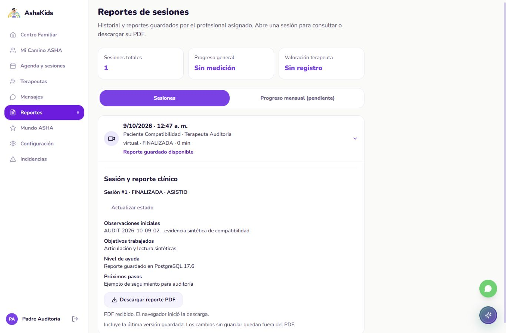

# ASHAKids | Auditoría de exportación de reportes PDF

AUDIT-2026-10-09-05. Fecha: 09/10/2026, America/Lima. Revisión asistida; revisor del equipo por asignar.

Repositorio: https://github.com/sromansilva/ashakids-platform . Rama auditada: dev, desde add1d4f86947a903c6c5001dc2eb6dae39fe58a7.

SHA de implementación: a8df56fc912db76a01092b60caa1efa220dcd85b, V05_Reportes_Exportacion_PDF. Informe/evidencias se añaden después en V06_Auditoria_Reportes_PDF; el SHA de código no contenía este PDF. Destino compartido: dev mediante PR; confirmar publicación por historial remoto, sin presumir un merge antes de ejecutarlo.

Entorno: React18.3.1/Vite6.4.4 web5174 -> FastAPI API8001 -> SQLAlchemy/asyncpg -> PostgreSQL17.6 local6544, ashakids_test_compat17. Python3.13.7, ReportLab4.5.1, tzdata2026.5 y pypdf6.19.0 de desarrollo. Datos sintéticos persistentes de cortes02/03, sin nuevas filas clínicas. Supabase y API habitual8000/web5173 no se auditaron.

Alcance F5-01/PDF: lectura/exportación de reporte compartido autorizado, cliente binario y Reportes familiar. Entrega académica: 09/10/2026 18:00 Lima. No certifica toda la fase5, despliegue, operación clínica o rendimiento bajo carga.

## 01. Dictamen ejecutivo

La exportación descarga el contenido guardado del reporte con los permisos de la sesión. ADMIN, padre propio y terapeuta de la cita reciben PDF; otros usuarios y solicitudes anónimas se rechazan. Los cuatro campos y nombres se compararon contra JSON del servidor y el reporte siguió idéntico tras otra lectura.

La consulta familiar utiliza sesiones persistentes; se retiraron informes mensuales, firma/matrícula y progreso clínico ficticios. La descarga incluye la versión guardada, no cambios locales sin guardar. Mensajes es el siguiente módulo; fase5 permanece abierta.

| Indicador de este corte | Resultado final | Evidencia |
| --- | --- | --- |
| Frontend | 216 aprobadas, 0 fallos/omitidas; 18 nuevas | Vitest con fetch simulado, 11 archivos |
| PDF/backend unitario | 11 aprobadas, 0 fallos/omitidas/advertencias | Pytest sin conexión/limpieza de BD |
| Rutas | 25 aprobadas, 0 fallos/omitidas | Node test |
| HTTP real local | 28 respuestas + OpenAPI200 | Cinco cuentas sintéticas; lectura/login/logout |
| Tipos/estructura/build | Correctos; 314 archivos, máximo495 líneas | Salidas de los comandos |
| Navegador | Descarga física, escritorio/móvil previos | Último ajuste móvil sin recaptura por bloqueo de permiso |

<!-- pagebreak -->

## 02. Arquitectura y cambios realizados

Se conserva la arquitectura y autenticación propia. GET /api/v1/sesiones/{id}/reporte/pdf autoriza antes de leer reporte; reutiliza reporte_visible con la lectura JSON. La representación de cita aporta nombres públicos autorizados. ReportLab ejecuta la construcción en threadpool y entrega bytes en memoria, sin discos clínicos ni enlaces públicos. ADR0006 registra la decisión.

| Área | Cambio | Contrato y límite |
| --- | --- | --- |
| Backend | report_pdf.py y ruta PDF | application/pdf, attachment, no-store, nosniff |
| Contenido | IDs, nombres actuales, cita, estado/asistencia y registro | Cuatro campos compartidos guardados; sin notas privadas |
| Renderizado | Vera incluida, escape de markup, paginación | Español/nulos/texto largo probados; carácter sin cobertura devuelve422 |
| Cliente | apiClient.pdf y clinicalService | Cookies existentes; MIME/firma, identidad/abort y errores JSON |
| UI | ReportDownload y SessionActions | Reutilizados por agendas y Reportes familiar; sin caché binaria |
| Reportes familiar | Sesiones reales e ID estable | Mensuales pendientes; sin firma o porcentajes inventados |
| Dependencias | ReportLab/tzdata runtime; pypdf desarrollo | Instalar desde requirements(-dev).txt |

Modelo físico sin modificaciones: reportes_sesion referencia sesiones; sesiones referencia reservas (citas); reservas relaciona paciente, tratamiento y terapeuta. Se reutiliza el ORM existente. Las 26 tablas,178 columnas y restricciones del corte02 son evidencia heredada; no se repitió una comparación de esquema con Supabase en este corte.

El PDF es copia actual: nombres actuales, contenido guardado y fecha de registro. Fechas conscientes de zona se convierten a Lima; registros sin zona se identifican sin inventarla. No archivo histórico inmutable ni firma digital.

<!-- pagebreak -->

## 03. APIs funcionando: identidad y pacientes

Las cuentas/pacientes/tratamientos proceden de fixtures previas; no se crearon ni actualizaron datos clínicos. La verificación HTTP hace login/logout con las cinco cuentas existentes y lecturas del reporte.

| Método y ruta | Estado | Evidencia real local |
| --- | --- | --- |
| POST /auth/login | 200 | ADMIN, dos PADRE, dos TERAPEUTA sintéticos |
| POST /auth/logout | 200 | Cinco sesiones revocadas tras verificar |
| GET /sesiones/1/reporte/pdf sin sesión | 401 | Sin contenido clínico |
| GET /sesiones/1/reporte/pdf como a90001 | 200 | Administrador autorizado |
| GET /sesiones/1/reporte/pdf como p90001 | 200 | Familia propia |
| GET /sesiones/1/reporte/pdf como t90001 | 200 | Profesional de la cita |
| GET /sesiones/1/reporte/pdf como p90002/t90002 | 404 | Recurso ajeno, sin revelar reporte |

No se ejecutaron altas/bajas de usuarios, cambios de contraseña, pacientes ni reasignaciones de tratamiento en HTTP. Sus comprobaciones anteriores conservan alcance histórico. Estas respuestas no equivalen a una auditoría de todos los roles/pantallas.

<!-- pagebreak -->

## 04. APIs funcionando: citas, sesiones y sistema

| Método y ruta | Estado | Resultado comprobado |
| --- | --- | --- |
| GET /sesiones/1/reporte/pdf | 200 | MIME, attachment, no-store y nosniff para tres identidades autorizadas |
| GET /sesiones/1/reporte | 200 | Los cuatro campos coinciden con texto extraído del PDF |
| GET /sesiones/1 | 200 | Nombres de paciente/profesional coinciden con el documento |
| GET /sesiones/1/reporte repetido por padre | 200 | JSON idéntico después de descargar; lectura sin mutación clínica |
| GET /sesiones/999999/reporte/pdf | 404 | Recurso inexistente para las cinco cuentas |
| GET /openapi.json | 200 | Operación PDF declarada con application/pdf |

Las 28 respuestas incluyen login/logout y lecturas; OpenAPI es una respuesta adicional. No contarlas como 28 pruebas backend completas. No se ejecutaron health/readiness, reserva, inicio/cierre de sesión ni escritura de reporte nuevamente.

La muestra tiene una página, contiene el marcador AUDIT-2026-10-09-02 y conserva los datos anteriores. El navegador creó un archivo físico de descarga cuyo texto coincide con la muestra HTTP; la apariencia final del PDF HTTP se renderizó e inspeccionó. La descarga visual ocurrió antes del último ajuste de fuentes/paginación; no atribuirle la identidad binaria del PDF final.

Los casos de reporte ausente, caída503 y carácter no soportado422 se verifican con dependencias simuladas/pruebas unitarias; no se provocó una caída real de PostgreSQL ni se introdujo texto problemático en la BD de demo.

<!-- pagebreak -->

## 05. APIs no operativas y capacidades faltantes

| Capacidad | Estado | Siguiente acción |
| --- | --- | --- |
| Mensajes familia/profesional | Pendiente de implementación mínima | Contratos/participantes, persistencia, paginación y errores de envío |
| Informe mensual/progreso clínico | Sin registro/criterio de evaluación | Mantener pendiente; no deducir mejoría por sesiones |
| /terapeuta/reportes independiente | Demostración fuera del recorrido conectado | Revisar al aceptar comunicación/documentos |
| Recursos | Catálogo/carga/descarga diferidos | Definir necesidad antes de desarrollar |
| Mundo ASHA completo | Etapa propia MA-01..MA-07 | Revisar habilidades, contenido, niveles y evaluación con usuario |
| Pagos | Fuera del alcance por observación del profesor | Sin desarrollo ni commits dedicados |
| Despliegue gratuito | Selección pendiente de estabilidad demostrada | Comparación oficial vigente después de aceptación del núcleo |

Otros módulos públicos/correo/consentimiento y la incidencia01 siguen documentados en contexto. Este corte no resuelve esas capacidades ni reutiliza pruebas anteriores como ejecución nueva. La reproducción por otro compañero sigue pendiente.

<!-- pagebreak -->

## 06. Seguridad y riesgos priorizados

| Prioridad | Hallazgo/control verificado | Acción y límite |
| --- | --- | --- |
| Alta | Autorización de sesión antes de consultar reporte | HTTP401/404 y unidad de orden de lectura; conservar guardas existentes |
| Media | Cambiar cuenta durante descarga aborta entrega al cliente | Dos pruebas con respuesta/cuerpo demorados; no caché binaria |
| Media | Markup se trata como texto literal | Extracción sin anotaciones/enlaces; no carga de imágenes externas |
| Media | Caracteres sin cobertura reciben422 explícito | Texto web disponible; ampliar fuente solo con cobertura/licencia verificadas |
| Media | Versión actual sin firma/historial inmutable | Rotular como copia guardada; no presentarla como certificación clínica |
| Media | Rendimiento/memoria concurrente no medidos | Ensayo de carga antes de considerar estabilidad de despliegue |
| Seguimiento | Incidencia compartida01 permanece abierta | Equipo debe revisar logs/impacto del corte original |

El cliente valida MIME y firma %PDF-, rechaza HTML/cuerpo inválido y muestra errores sin éxito ficticio. Se comprueban 401/403/404/422/503 simulados; los 403 no fueron una respuesta real de esta operación. La descarga rechaza recurso ajeno con404 según el contrato existente.

Revisión dirigida de secretos: archivos publicables UTF8 y texto PDF comparados con valores sensibles configurados y patrón JWT; resultados sanitizados en evidencia. No es escáner exhaustivo, pentest ni verificación de todas las políticas. Sin credenciales/datos reales en este informe.

<!-- pagebreak -->

## 07. Evidencia de validación y límites

| Comando/caso ejecutado | Resultado final | Evidencia |
| --- | --- | --- |
| .venv313/python -m pytest tests/test_report_pdf.py -q -p no:cacheprovider | 11 correctas | backend-unit-tests.xml |
| npm run test:components (Junit) | 216 correctas; 18 nuevas | frontend-tests.xml |
| npm run test:routing | 25 correctas | routing-tests.txt |
| npm run typecheck / check:frontend / build | Correctos; 314 archivos/máximo495 líneas | typecheck.txt/frontend-check.txt/build.txt |
| python -m scripts.verify_report_pdf --output carpeta05 | 28 respuestas + OpenAPI200 | http-pdf.json y PDF sintético |
| Descargar desde navegador familiar | Archivo de una página; texto coincidente | browser-download.json/captura escritorio |
| Poppler/PyPDF | Muestra final1 página; ejemplo largo4 páginas | pdf-qa.json; visualización inspeccionada |
| knowledge/manage.py refresh/check | Mapa vigente, AST local | knowledge-check.txt; fallback Windows registrado |

El comando HTTP requiere ASHAKIDS_ALLOW_ISOLATED_LIVE_TESTS=1 y DATABASE_URL=ASHAKIDS_TEST_DATABASE_URL del mismo destino local ashakids_test_*, API loopback8001. No ejecutar prepare ni pruebas heredadas que reinicien esta demo. Las sesiones de autenticación sintéticas son las únicas escrituras de HTTP; no DDL ni Supabase.

Intentos iniciales preservados: backend7 correctas/4 fallidas por tzdata ausente y2 advertencias de caché; frontend208 correctas/8 fallidas por Blob.text y espera lazy. También advertencia React de claves duplicadas, restricción EPERM de routing y guarda de reinicio de API. Corregidos/repetidos con resultados finales arriba; no esconder intentos fallidos.

Navegador: escritorio1366x900/móvil390x844 inspeccionados y descarga realizada. En móvil el texto junto a controles flotantes se ajustó con margen después de la captura; la recaptura fue bloqueada por preferencia guardada del navegador incluso tras autorización del usuario. No declarar validación visual del último margen. La captura móvil corresponde al estado anterior.

<!-- pagebreak -->

## 07. Evidencia visual y rúbrica (continuación)

| Criterio visible de rúbrica | Evidencia de este corte | Límite |
| --- | --- | --- |
| Arquitectura/backend | Ruta/servicio PDF, ADR0006, OpenAPI y ejecución local | No nueva arquitectura de despliegue |
| BD/modelo físico/operaciones | Lecturas de reporte persistente, cotejo y lectura posterior | Esquema equivalente del corte02 es histórico; sin CRUD nuevo |
| Seguridad/validación | Permisos propios/ajenos, abort, markup y errores; unidad/API/navegador | No pentest ni carga; recaptura móvil final pendiente |

Las 79 pruebas backend/48 respuestas del corte02 y la auditoría04 se conservan como antecedentes, no se suman a este corte. Tipos/build no certifican todas las pantallas, dispositivos o condiciones de producción.

<!-- pagebreak -->

## 08. Cierre y ruta de entrega

F5-01/PDF aceptado localmente para registros autorizados; mensajes y aceptación de conjunto pendientes. El equipo debe confirmar el último margen móvil cuando habilite el acceso del navegador y reproducir el recorrido en otro clon.

1. Instalar dependencias de requirements-dev.txt en el entorno Python de desarrollo (o requirements.txt para runtime); npm install según README si es un clon nuevo. Mantener variables locales sin versionar.

2. Usar los servicios8001/5174 y fixtures existentes para demostrar: familia abre Reportes, despliega sesión, lee campos guardados y descarga PDF. Verificar los mismos campos/IDs; recursos ajenos devuelven404. No usar datos reales para pruebas de escritura.

3. Revisar contratos/tablas existentes para mensajes; definir participantes vinculados y paginación antes de UI/envío. Autorización del servidor, envío persistente y errores reales. Mundo ASHA continúa en su etapa propia; pagos excluidos.

4. Revisar incidencia01 y preparar aceptación reproducible del alcance seleccionado. Comparar hosting gratuito solo cuando la plataforma haya pasado las pruebas acordadas; sin despliegue en este corte.

Código local comprometido en V05_Reportes_Exportacion_PDF (SHA inicial de este informe). Documento/contexto/evidencia se prepara en V06_Auditoria_Reportes_PDF y se integra/publica en dev por PR con V07_Integracion_Reportes_PDF; consultar historial para el SHA de publicación efectivamente realizado. No se declara un push/merge futuro como concluido al generar el informe.

Repositorio para entrega y continuidad: https://github.com/sromansilva/ashakids-platform . Contexto, plan, relevo e índice de auditorías se actualizan en este mismo conjunto documental; conservar cortes anteriores.
