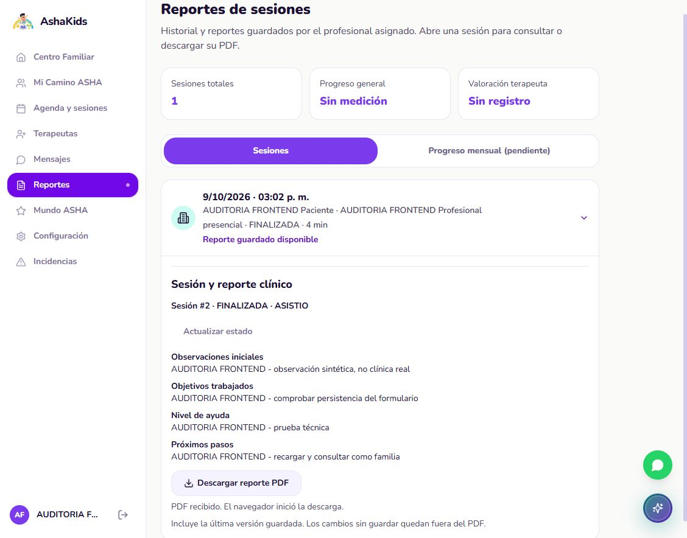
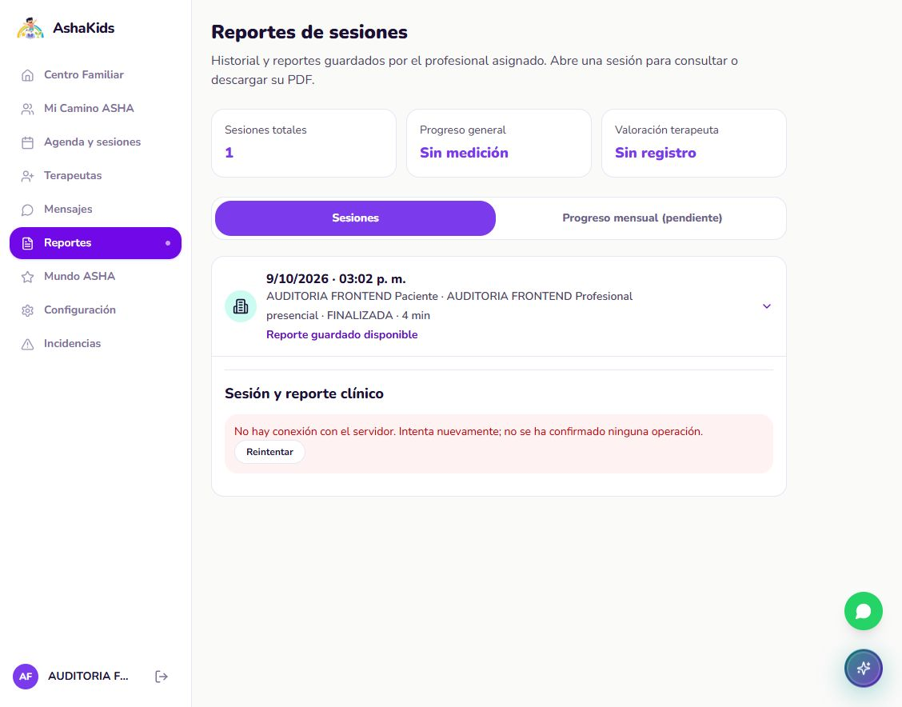
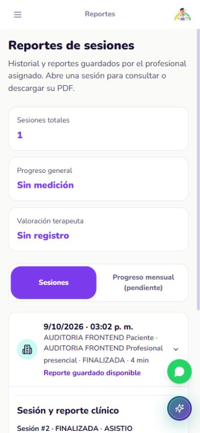

# AshaKids | Auditoría del frontend

**Corte 2026-10-09-12 - correcciones y comprobación con Supabase real.** Fecha: 9 de octubre de 2026, America/Lima. Evaluación técnica asistida; no constituye certificación de producción ni evaluación clínica.

Repositorio: https://github.com/sromansilva/ashakids-platform . Rama auditada: feat/sroman. SHA funcional: a60d671a8523a016a41b50395a7db92b05698f18 (V18_Correccion_Frontend_Reportes_Sesiones). Base anterior: a397c0f30d143662c3b5299bb61ddf19163ec213. Este informe y evidencias se incorporan después del commit funcional; los informes anteriores se conservan.

Entorno: Windows; React/TypeScript, Vite 6.4.4, Vitest 4.1.11; web 127.0.0.1:5174, proxy /api hacia FastAPI 127.0.0.1:8000 y PostgreSQL configurado en backend/.env, alojado en Supabase. No se usó PostgreSQL local para el recorrido persistente de este corte. Entrega académica: 2026-10-09 18:00 Lima.

## 01. Dictamen ejecutivo

**Puntuación actual: 94/100, frente a 76/100 del informe anterior.** Se corrigieron los seis hallazgos iniciales del frontend y dos brechas adicionales de integración clínica: historial profesional y sesiones administrativas todavía simulados. Se mantuvieron estructura, tarjetas, colores, formularios y navegación; no se reemplazaron pantallas por páginas genéricas.

La puntuación es una valoración técnica por criterios, no una cobertura automática ni la nota del profesor. El cierre de los hallazgos identificados no significa que todos los dispositivos, rutas y condiciones de producción hayan sido certificados. Los seis puntos restantes corresponden a evidencia de aceptación y despliegue aún no obtenida.

| Criterio / máximo | Anterior | Actual | Fundamento del cambio o límite |
| --- | --- | --- | --- |
| Funcionalidad / 30 | 22 | 29 | Recorrido clínico real completo; faltan todas las variantes en navegador. |
| Interfaz y usabilidad / 20 | 15 | 19 | Diseño conservado y móvil comprobado; accesibilidad integral pendiente. |
| Sesión y coherencia / 15 | 11 | 14 | Proxy, identidad, logout y aislamiento verificados; expiración natural pendiente. |
| Arquitectura / 15 | 14 | 15 | Cliente único, consultas por cuenta, carga diferida y límite de líneas. |
| Pruebas / 10 | 8 | 10 | Regresión completa del frontend y lectura real independiente del recorrido. |
| Preparación de publicación / 10 | 6 | 7 | Build y configuración reproducibles; hosting HTTPS no ensayado. |
| Total / 100 | 76 | 94 | No equivale a 94% de endpoints cubiertos. |

Resultado nuevo: **257 pruebas de componentes + 25 de rutas**, sin fallos; 28 respuestas HTTP esperadas en lectura posterior real; 11 pruebas backend seleccionadas de configuración y seguridad, sin escrituras clínicas. No se suman cifras históricas como ejecuciones nuevas.

<!-- pagebreak -->

## 02. Arquitectura y cambios realizados

Flujo conservado: vistas/hooks React -> servicios -> cliente HTTP -> FastAPI -> SQLAlchemy/asyncpg -> PostgreSQL en Supabase. React no contiene claves de Supabase ni se conecta directamente a la BD. Context conserva sesión; TanStack Query conserva consultas por identidad y maneja invalidación.

| Hallazgo | Corrección aplicada | Comprobación |
| --- | --- | --- |
| F01: reportes profesionales ficticios | Formularios y tarjetas existentes leen sesiones autorizadas y guardan cuatro campos; PDF proviene del servidor. Firma y correo no aparentan ejecutarse. | Navegador, recarga, familia, PDF y pruebas de conflictos/doble envío. |
| F02: sexo inconsistente | Normalización M/F/OTRO al vocabulario Masculino/Femenino/Otro; desconocido exige selección, no asigna un sexo distinto. | Paciente AUDITORIA guardado como Otro, edición y pruebas. |
| F03: ASHI con contexto ficticio | Saludo de la cuenta real; ejemplos y alcance demostrativo explícitos; panel reiniciado por identidad. | Cambio de cuenta y panel visible; prueba de componente. |
| F04: API/cookies entre entornos | /api/v1 mismo origen; proxy por defecto a 8000; 8001 exige override explícito. Errores de red legibles y login con bloqueo de envío. | Login, recarga, logout, permisos y desconexión controlada. |
| F05: aviso administrativo contradictorio | Se explica el permiso clínico real de admin sin atribuir acceso al chat privado. | Código y formulario administrativo; permisos de API. |
| F06: cuentas/configuración con identidad demo | Cuentas no muestra aviso genérico; perfil profesional obtiene identidad, especialidad y experiencia del servidor. | Perfil real en navegador y prueba de componente. |
| B01: expediente profesional con respaldo falso | Sin asignaciones se muestra vacío. Sesiones y reportes consultan ID real del paciente; contadores y próxima cita proceden de consultas. | Paciente 86 visible solo al profesional asignado; historial y pruebas. |
| B02: sesiones administrativas simuladas | Lista, detalle y estados reales en la vista original; accesos clínicos desde Operación. No se inventa latencia o calidad técnica. | Navegador: Operación -> Sesiones, sesión 2 y cuatro campos guardados; pruebas de componentes. |

Se incorporaron ClinicalReportEditor, ReportWorkspace, PatientClinicalHistory y patientSex, reutilizando servicios existentes. No se crearon endpoints, tablas ni migraciones. El ajuste CORS local de 5174 ya existía al empezar; se preservó y versionó con la corrección, no se atribuye a una nueva regla clínica.

Eliminaciones comprobadas: terapeutaPatients.tsx (respaldo de pacientes falsos), TerapeutaPacientesSesiones.tsx y TerapeutaPacientesReportes.tsx (historiales simulados reemplazados). Los tres estaban bajo pages/terapeuta/TerapeutaPacientes; sin consumidores después de la integración. Recuperables mediante Git. No se borraron juegos, assets ni áreas demostrativas sin API.

<!-- pagebreak -->

## 03. APIs funcionando: identidad y pacientes

Prefijo común: /api/v1. La columna de evidencia separa formularios del navegador de la lectura HTTP posterior. No representa una reauditoría de todos los métodos del backend.

| Método / ruta | Pantalla y acción | Evidencia de este corte |
| --- | --- | --- |
| POST /auth/login; GET /auth/me | Login, recuperación tras recarga e identidad del layout. | Tres roles en navegador; familia/profesional 200 en lectura HTTP; sesión también encontrada en la BD configurada. |
| POST /auth/logout | Cerrar sesión y cambiar de cuenta. | Navegador y lectura HTTP: logout 200, me posterior 401. |
| GET /padres/me; GET /terapeutas/me | Perfil familiar/profesional; configuración profesional. | Ambos 200; nombre y correo del profesional comprobados en pantalla, sin identidad de plantilla. |
| POST /usuarios | Administración: crear familia y profesional sintéticos. | Formulario original; usuarios 50/51 persistidos. Un email no admitido produjo 422 sin perder el formulario. |
| GET /usuarios | Gestión administrativa de cuentas y selección de participantes. | Flujo administrativo de creación/asignación. Familia y profesional reciben 403 en lectura independiente. |
| POST /pacientes; GET /pacientes | Administración registra paciente; familia y profesional consultan autorizados. | Paciente 86 persistido, sexo Otro. Ambas cuentas nuevas solo consultan ese paciente. |
| PUT /pacientes/{id} | Formulario administrativo de edición, vocabulario coherente. | Prueba de componente de precarga/PUT y edición del registro sintético durante el recorrido. No se alteraron pacientes reales existentes. |
| POST /pacientes/{id}/tratamientos; GET de la misma ruta | Administración asigna profesional real; familia reserva desde tratamiento activo. | Tratamiento 6 creado por UI y leído después por API. |
| GET /pacientes/{id} | Acceso al recurso autorizado. | Consulta de paciente ajeno 85 rechazada con 404; no se exportó su información. |

La autorización sigue siendo del servidor. Ocultar botones no concede permisos ni sustituye filtros de acceso. El profesional no necesita consultar /usuarios para reportes o expedientes.

Registros sintéticos retenidos por autorización: familia y profesional 50/51, paciente 86, tratamiento 6, cita 3, sesión 2 y su reporte. Están identificados como AUDITORIA FRONTEND; no deben contarse como actividad clínica real. No se realizó limpieza destructiva en Supabase.

<!-- pagebreak -->

## 04. APIs funcionando: citas, sesiones y sistema

| Método / ruta | Pantalla y acción | Evidencia de este corte |
| --- | --- | --- |
| POST /citas; GET /citas | Agenda familiar: reserva con tratamiento y horario explícito Lima. | Cita 3 creada en pantalla; recarga conservó PENDIENTE y lectura final confirmó COMPLETADA. |
| PUT /citas/{id} | Agenda profesional: aceptar/confirmar cita. | Confirmación en navegador; cita asignada consultable por profesional en GET /citas/3. |
| POST /sesiones | Agenda: registrar sesión de la cita confirmada. | Sesión 2 creada en navegador, inicialmente PROGRAMADA. |
| POST /sesiones/{id}/iniciar | Agenda/expediente: inicio clínico. | Botón bloqueado antes del horario; habilitado al llegar la hora real, transición EN_CURSO comprobada. |
| PUT /sesiones/{id}/reporte | Reportes profesionales: guardar cuatro campos. | Mensaje de éxito después del servidor; recarga conserva contenido; SQL/API lo confirman. |
| POST /sesiones/{id}/cerrar | Agenda profesional: finalizar con asistencia. | Usuario aceptó diálogo nativo; pantalla y lectura posterior confirmaron FINALIZADA/ASISTIO. |
| GET /sesiones; GET /sesiones/{id} | Historial por paciente; sesiones administrativas; familia consulta estado. | Lectura real de sesión 2; recursos ajenos rechazados 404. Componentes consultan IDs, no índices. |
| GET /sesiones/{id}/reporte | Familia y profesional consultan reporte autorizado. | Cuatro campos AUDITORIA coinciden tras recarga y lectura SQL. Familia no obtiene editor. |
| GET /sesiones/{id}/reporte/pdf | Descarga desde los controles existentes. | API entrega PDF a ambas cuentas; contenido extraído correcto. Familia descargó archivo desde navegador. |

Sistema: el destino FastAPI 8000 quedó comprobado a través del proxy y la sesión encontrada en Supabase. Este corte no reejecutó una matriz de /health, /health/ready y OpenAPI como parte de cada pantalla; tampoco añade sondeos de salud al runtime. Salud del proceso no equivale a usabilidad de todos los módulos.

Desconexión controlada: se bloqueó temporalmente /api solo en la pestaña de prueba. La pantalla mostró error legible, ocultó controles clínicos cacheados y no sustituyó registros por mocks. Tras retirar el bloqueo, Reintentar recuperó el reporte. El bloqueo y el override móvil se retiraron al terminar.

<!-- pagebreak -->

## 05. APIs no operativas y capacidades faltantes

No se observaron fallos finales en las operaciones del recorrido clínico probado. Los 401/403/404 esperados son rechazos correctos; el 422 del email sintético fue una validación, no una caída de la API.

| Capacidad | Estado actual | Decisión dentro del alcance |
| --- | --- | --- |
| Firma digital y correo del reporte | No hay API disponible para esas acciones. | Controles originales visibles, no prometen firma/envío. Plantillas descargables son documentos en blanco, no registros guardados. |
| Perfil profesional: datos complementarios, avatar y preferencias | Identidad/perfil consultados; controles sin persistencia siguen como prototipo, con aviso específico. | No inventar un endpoint de edición de perfil ni presentar cambios locales como BD. |
| Notas privadas, evolución, objetivos y actividades adicionales | Maquetas del expediente permanecen, separadas del historial clínico real. | Diseño e interacción originales conservados; aviso de demostración. No se presentan como medición clínica validada. |
| Mundo ASHA, voz, IA, videollamada nativa e incidencias | Conservan alcance ilustrativo/parcial previamente documentado. | No se implementan nuevas capacidades ni se retiran pantallas. |
| Mensajería persistente | Existe en la base del proyecto; este corte no escribió nuevos mensajes reales. | Regresión de componentes aprobada. Su aceptación HTTP histórica no cuenta como prueba nueva aquí. |
| Pagos | Excluidos por observación docente. | Sin implementación de cobros; maqueta existente no es requisito clínico. |

Para alcanzar una valoración sustentada de 100/100 faltan pruebas de aceptación, no reemplazar otra vez la interfaz:

| Brecha / puntos | Evidencia de cierre requerida | Responsable siguiente |
| --- | --- | --- |
| Variantes funcionales / 1 | Navegador: reprogramar/cancelar, inasistencia, edición/desactivación y chat, con registros sintéticos autorizados. | QA frontend y backend. |
| Accesibilidad / 1 | Auditoría completa de teclado, foco de modales, lector de pantalla y contraste; corregir hallazgos concretos. | Frontend y QA. |
| Sesión / 1 | Expiración natural con TTL controlado en entorno de prueba; aceptación cruzada de navegadores/dispositivos. | QA y backend. |
| Publicación / 3 | URL HTTPS real, proxy y cookies seguros, recarga de rutas, errores y aceptación por roles en el hosting final. | Responsable de despliegue. |

No se concede 100/100 solo porque todas las pruebas actuales pasen: no cubren automáticamente toda la experiencia ni el despliegue.

<!-- pagebreak -->

## 06. Seguridad y riesgos priorizados

| Prioridad | Hallazgo / estado | Impacto y acción |
| --- | --- | --- |
| Alta, heredado | Validación del certificado TLS de BD y privilegios amplios del usuario PostgreSQL señalados en la auditoría real anterior. No se reauditaron ni cambiaron aquí. | Revisar con responsable de infraestructura antes de producción. No afirmar que corregir frontend resuelve seguridad de BD. |
| Alta, pendiente | Entorno ejecutado es desarrollo local conectado a Supabase, no hosting HTTPS de producción. | Configurar despliegue, orígenes y atributos seguros de cookies. Probar la URL pública final. |
| Media, controlada | Mezcla de identidades/datos de maqueta. | Se corrigieron las fuentes clínicas y se etiquetaron ejemplos. Logout/cambio de rol y rechazo de recursos ajenos comprobados. |
| Media, controlada | Respuesta lenta/doble envío y estado clínico no actualizado. | Bloqueo de escritura, sin reintento automático; conflicto conserva borrador. Error de actualización oculta controles dependientes. |
| Media, retenida | Registros sintéticos en BD compartida. | Identificados AUDITORIA; excluirlos de métricas. No borrarlos ni alterar registros existentes sin una instrucción concreta. |
| Informativa | Auditoría de dependencias de producción: 0 vulnerabilidades conocidas. | Es una consulta del registro npm a la fecha; no certifica ausencia de vulnerabilidades ni equivale a pentest. |

Se comprobaron respuestas 403 a /usuarios para familia y profesional; 404 para paciente/sesión ajenos; 403 a /admin/me para familia; 401 tras logout. En navegador /admin/sesiones mostró Acceso restringido desde familia. No se exportan hashes, tokens, claves ni contraseñas en este informe.

El build no contiene coincidencias del banner de accesos de desarrollo, host Supabase o claves de BD en el escaneo específico realizado. Los .env reales continúan ignorados por Git. El escaneo no sustituye un detector universal de secretos ni una revisión de todo el historial.

No se realizaron pentest, pruebas de carga, evaluación de cumplimiento normativo ni validación de resultados terapéuticos. No se cambió la contraseña de cuentas existentes ni se habilitó una API nueva.

<!-- pagebreak -->

## 07. Evidencia de validación y límites

| Comando / caso | Entorno | Resultado nuevo |
| --- | --- | --- |
| npm test | Componentes con HTTP interceptado; rutas Node | 257 componentes en 13 archivos y 25 rutas; 0 fallos, 0 omitidas. |
| npm run typecheck | Fuentes frontend | Sin errores. |
| npm run check:frontend | Fuentes, estilos, configuración y pruebas | 320 archivos; máximo 495 líneas. Imports, fronteras entre roles, cliente HTTP, destinos y conflictos correctos. |
| npm run build | Producción Vite | 1887 módulos; 140 chunks JS; sin advertencia de chunk excesivo. |
| npm audit --omit=dev --json | Dependencias productivas | 0 vulnerabilidades conocidas; no incluye diagnóstico integral de herramientas de desarrollo. |
| pytest: test_config_isolation y test_auth_security | Pruebas seleccionadas sin fixture clínico | 11 aprobadas; no se ejecutó suite completa backend contra Supabase. |
| verify_frontend_supabase_review.py | Proxy 5174 -> API 8000 -> Supabase | 28/28 respuestas esperadas; sesión/paciente/estado/reporte encontrados mediante SQL READ ONLY. |
| Navegador por roles | Chromium IAB, BD real, datos AUDITORIA | Creación/asignación/reserva/confirmación/sesión/reporte/familia/PDF; recargas y logout. Finalización asistida por usuario en diálogo nativo. |
| Móvil y desconexión | Viewport emulado 390x844, bloqueo temporal de /api | Sin desborde en reportes revisados; menú funcional; error y reintento recuperados. |
| Graphify refresh/check; git diff --check | Herramientas locales de desarrollo | Mapa vigente: 1888 nodos, 6211 relaciones, 103 comunidades. 12 archivos sin símbolos AST; avisos CRLF sin errores de diff. |

Bundles: entrada principal 293.79 kB (92.91 kB gzip); CSS 84.49 kB (15.16 kB gzip); TerapeutaPacientes 40.99 kB (10.44 kB gzip). La mayor página diferida medida fue EvaluacionInicial, 42.19 kB. Son tamaños de archivos, no tiempos de carga ni Core Web Vitals medidos.

Evidencia reproducible: docs/evidence/audit-2026-10-09-12/validation.json, live-readback.json, README y capturas sanitizadas. Fuente editable: este Markdown. No se incluyen las contraseñas necesarias para repetir el login.

Advertencias: un fixture antiguo esperaba pacientes de respaldo y se corrigió a una respuesta API asignada. Un timeout de la suite completa en Windows motivó aumentar la espera asíncrona a 5 segundos, sin retirar assertions. Las ejecuciones finales completas pasaron. No se ocultan esos fallos iniciales.

Límites: no hubo matriz exhaustiva de todas las rutas en todos los navegadores; móvil emulado no es dispositivo físico; no se ensayó la expiración natural ni hosting HTTPS. La auditoría anterior 76/73 y sus 103 respuestas/47 contratos, tablas y pruebas backend son evidencia histórica, no nueva de este corte.

<!-- pagebreak -->

## 08. Cierre y ruta de entrega

Los seis hallazgos iniciales y las dos brechas adicionales identificadas quedaron corregidos en el frontend. El núcleo clínico probado guarda y consulta datos reales con controles de acceso, conserva diseño y muestra errores sin éxitos ficticios. Se cierra esta corrección y su auditoría; no se marca cerrada la aceptación de producción.

Configuración de la web: VITE_API_BASE_URL=/api/v1; VITE_DEV_API_TARGET=http://127.0.0.1:8000. Postman manual debe usar la misma API 8000, respetando las cuentas y BD del entorno. No importar escrituras sintéticas de 8001 sin comprobar destino. Para pruebas aisladas, el puerto 8001 se selecciona explícitamente con su BD descartable, nunca como fallback silencioso.

Producción requiere proxy /api hacia FastAPI, fallback SPA para rutas sin interceptar API/assets, HTTPS y configuración segura del backend. No desplegar Vite de desarrollo como servidor productivo. No se realizó un despliegue público en este trabajo.

| Siguiente paso | Criterio de aceptación | Orden |
| --- | --- | --- |
| Publicación segura | URL final HTTPS con login/logout, cookies, recarga y PDF por roles. | Primero; responsable de despliegue. |
| Variantes y accesibilidad | Casos pendientes de sección 05 con evidencia y correcciones específicas. | Segundo; QA y frontend. |
| Riesgos del backend | Validación TLS, usuario BD de menor privilegio y nueva evaluación backend. | En paralelo con infraestructura; no ocultar riesgos heredados. |

Entrega: fuente Markdown, PDF y evidencias sanitizadas. El commit funcional auditado es V18/a60d671; la documentación se cierra en un commit posterior. La integración en dev y sincronización se comprueban al publicar; el estado final se registra en contexto y relevo, no se confunde con hosting desplegado.

Repositorio del equipo: https://github.com/sromansilva/ashakids-platform . La puntuación 94/100 es del frontend dentro del alcance y evidencia descritos. No se recalcula la puntuación del backend en este informe.

<!-- pagebreak -->

**Evidencia visual: reporte familiar persistido.** Datos exclusivamente sintéticos AUDITORIA; consulta de solo lectura y confirmación de descarga desde la interfaz original.

<!-- pagebreak -->

**Evidencia visual: desconexión y recuperación.** Prueba controlada solo en la pestaña; no se apagó el backend ni se alteró su seguridad. Reintentar recuperó el reporte al retirar el bloqueo.

<!-- pagebreak -->

**Evidencia visual: viewport móvil, 390x844.** Tarjetas, sesión guardada y navegación originales conservadas. Documento, body y viewport midieron 390 píxeles de ancho en esta vista; no equivale a una certificación de dispositivos físicos.

