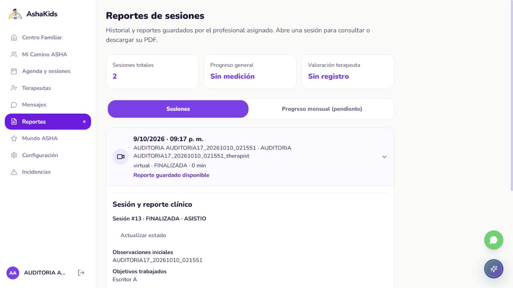

# Auditoría final del frontend AshaKids

**Corte 2026-10-09-16. Sitio HTTPS y revisión previa a UX/UI.** Ejecución: 9 de octubre de 2026, 21:14 a 21:33, America/Lima. Evaluación técnica asistida para el equipo AshaKids; valoración propia, no calificación del profesor ni certificación de accesibilidad.

Repositorio: https://github.com/sromansilva/ashakids-platform . Rama local piero-dev, SHA auditado 7fb36680e0c5856036bcf1de69263366247e9126, V25. Árbol funcional limpio al comenzar. El sitio https://ashakids.onrender.com ejecuta la imagen V24, SHA 62905fc0480fffd21fb6b2d969592700608d64bb; V25 no cambia el frontend. Este corte añade informes y evidencias, sin correcciones funcionales.

## 01 Dictamen ejecutivo

**Puntaje técnico 91 sobre 100.** La navegación por roles, la consulta clínica, los mensajes y el hosting HTTPS funcionan en los casos ensayados. Se encontró un fallo de edición de reportes existentes: la interfaz envía tres campos de lectura que el backend rechaza con 422. Debe corregirse antes del rediseño. El reporte guardado no se pierde y el formulario conserva la edición fallida.

| Criterio / máximo | Corte 12 | Actual | Fundamento y límite |
| --- | --- | --- | --- |
| Funcionalidad / 30 | 29 | 27 | Mensaje persistente entre roles; edición de reporte existente falla. |
| Interfaz y usabilidad / 20 | 19 | 16 | Contraste insuficiente y controles de login sin semántica; móvil no recapturado. |
| Sesión y coherencia / 15 | 14 | 14 | Tres roles, logout y recarga; expiración natural pendiente. |
| Arquitectura / 15 | 15 | 15 | Capas y cliente único, consultas por identidad y carga diferida. |
| Pruebas / 10 | 10 | 9 | 282 casos pasan; sus mocks no detectan el reporte con metadatos reales. |
| Preparación de publicación / 10 | 7 | 10 | Sitio HTTPS y rutas SPA con Accept HTML verificados. No acredita alta disponibilidad. |
| Total / 100 | 94 | 91 | Más evidencia descubre defectos; no indica una regresión introducida en este corte. |

El puntaje anterior se cita como antecedente, no como una nueva ejecución. La nota mide los criterios de esta tabla; no significa que el diseño visual tenga 91% de calidad ni que todas las pantallas estén certificadas.

<!-- pagebreak -->

## 02 Arquitectura y cambios realizados

React/TypeScript y Vite sirven la interfaz; los servicios usan /api/v1 del mismo origen. FastAPI valida identidad y pertenencia antes de SQLAlchemy/PostgreSQL en Supabase. No se conecta React directamente a PostgreSQL ni se usa Supabase Auth. La sesión viaja en cookie HttpOnly; las consultas se separan por identidad.

Se revisó el código y se ejecutaron pruebas sobre V25; se observó la interfaz V24 desplegada. No hubo cambios de fuentes ni migraciones durante la auditoría. El diseño se conserva para que los hallazgos describan la versión examinada. El análisis Graphify estaba vigente y los símbolos encontrados se confirmaron leyendo archivos reales.

El build genera carga diferida por módulos. Su archivo JS principal mide 293.81 kB, 92.95 kB gzip. Esto es tamaño de compilación, no una medición de experiencia de carga o de Core Web Vitals.

## 03 Identidad y pacientes desde la interfaz

| Rol y pantalla | Resultado nuevo | Alcance |
| --- | --- | --- |
| Familia / Centro Familiar | Identidad AUDITORIA, dos hijos sintéticos y seguimiento del hijo seleccionado. | Conteos de registros; no porcentajes clínicos inventados. |
| Familia / Reportes | Sesión 13 expandida; cuatro campos y acción PDF visibles. | Lectura real. El PDF se validó por HTTP, no su descarga física en este navegador. |
| Terapeuta / Inicio | Un paciente asignado activo y ningún reporte pendiente. | Solo cuenta y paciente de esta cohorte. |
| Admin / Cuentas | Dos familias AUDITORIA encontradas con filtro del corte. | Filtro aplicado antes de capturar; no se exportó la lista de personas anteriores. |
| Acceso y cierre | Tres roles entraron y cerraron su sesión. | La sesión familiar previa se cerró con autorización expresa; no se cambió su cuenta. |

Las creaciones de cuentas, pacientes y tratamientos de este corte se probaron por API en el informe backend 17. No se atribuyen a formularios del navegador. La interfaz no sustituye la autorización por recurso del servidor.

<!-- pagebreak -->

## 04 Citas sesiones reportes y mensajes

| Caso | Estado observado | Evidencia |
| --- | --- | --- |
| Reporte existente / lectura | Cuatro campos recuperados y visibles en familia y profesional. | Captura de familia y editor. |
| Reporte existente / edición | Dos intentos fallan; mensaje Extra inputs are not permitted. Recarga conserva versión anterior. | Reproducción API: tres extras, 422; payload de cuatro campos sí obtiene 200. |
| Mensaje familiar / envío | Tercer mensaje de conversación 7 guardado desde la UI. | Confirmación de guardado y lectura por el profesional después del cambio de rol. |
| Persistencia independiente | 3 mensajes, 1 reporte completo y 0 sesiones auth nuevas sin revocar. | SQL READ ONLY del corte 17. |
| Mundo ASHA / catálogo | Cuatro mundos y prototipos visibles; preparación y ausencia de avance educativo explícitas. | Captura y estructura DOM; no se validó pronunciación. |

El recorrido clínico HTTP del backend incluye citas y sesiones nuevas, concurrencia y PDF. No equivale a haber ejecutado todas esas acciones desde sus formularios de frontend. Los 144 casos HTTP finales del corte 17 se comparten como evidencia de integración, sin sumarlos dos veces como pruebas independientes.

## 05 Funciones faltantes y alcance del diseño

Mundo ASHA sigue siendo una demostración educativa. Progreso mensual, pronunciación automática, firma digital, correo real, adjuntos, llamadas e incidencias persistentes no se certifican. Recuperación de contraseña requiere un procedimiento administrativo; no se afirma que el botón envíe un correo operativo. ASHI conserva alcance demostrativo.

Pagos está fuera del alcance por observación del profesor. No se propone una pasarela ni se convierte la maqueta en requisito de reserva. La revisión no abre módulos nuevos.

El sitio conserva tarjetas repetidas, gradientes amplios, navegación extensa y mensajes de preparación repetidos en Mundo ASHA. Son observaciones de diseño para una propuesta posterior, no pruebas de que el núcleo carezca de persistencia. No existe todavía un contrato local PRODUCT.md/DESIGN.md que acuerde dirección visual y prioridades del usuario.

<!-- pagebreak -->

## 06 Seguridad accesibilidad y riesgos priorizados

**F16 01 Prioridad alta. Guardado de reportes existentes.** ReportWorkspace.tsx:14 y SessionActions.tsx:32 pasan el objeto de lectura completo a ClinicalReportEditor.tsx:18. El estado conserva id_reporte_sesion, id_sesion y fecha_creacion; clinicalService.ts:37 lo envía completo. Pydantic rechaza esos extras. Separar los cuatro campos editables al iniciar y al serializar; añadir una regresión con metadatos reales. No relajar el contrato del backend.

**F16 02 Prioridad media. Contraste del editor.** ReportWorkspace.tsx:20 muestra Paciente, Fecha y Estado a 12 px con #9E95B7 sobre #F5F3FF. El estilo computado confirma relación 2.575:1, inferior a 4.5:1 para texto normal. Corregir tokens y comprobar estados. Esta medición puntual no certifica conformidad integral WCAG.

**F16 03 Prioridad media. Controles de login.** LoginPage.tsx:183 tiene un botón de contraseña sin nombre accesible y tamaño15x15 px. Recordarme, desde 195, es un div clicable sin input semántico; el estado remember no se utiliza en la petición. Usar botón nombrado y control nativo, o retirar la promesa de recordar si no existe contrato. El foco visible de los inputs sí se observó.

**F16 04 Prioridad media. Verificación móvil incompleta.** Se solicitó390x844, pero el navegador mantuvo1280x720 aun tras recarga; el override se restableció. No es un fallo responsive confirmado. Recapturar login, reportes y mensajes en un entorno que permita medir el tamaño efectivo antes de aprobar el rediseño.

**F16 05 Prioridad baja. Jerarquía y tematización.** Acordar tokens de tipografía, contraste, espaciado y estados; reducir repeticiones y establecer una acción principal por pantalla. Mantener identidad morada de la marca salvo decisión validada. El detector produjo 21 avisos heurísticos:10 de paleta, 9 de rebote, 1 de texto gris y 1 de pestaña lateral; no se convierten automáticamente en 21 defectos.

Valoración focal de interfaz 11/20: accesibilidad1/4, rendimiento3/4, tematización2/4, adaptación2/4 e integridad3/4. Es una pauta de preparación para UX/UI, con aceptación móvil y accesibilidad parcial; no se mezcla con la matriz técnica de 100 puntos.

<!-- pagebreak -->

## 07 Evidencia de validación y límites

| Comando o caso | Resultado nuevo | Evidencia sanitizada |
| --- | --- | --- |
| npm test | 257 componentes y 25 rutas aprobados. | frontend-tests.txt |
| npm run typecheck | Sin errores de tipos. | typecheck.txt |
| npm run check:frontend | 320 archivos; máximo495 líneas; límites de capas aprobados. | check-frontend.txt |
| npm run build | Éxito en 6.78s; chunks por módulo. | build.txt |
| npm audit --omit=dev --json | 0 vulnerabilidades reportadas para dependencias productivas. | npm-audit.json |
| Navegador IAB / tres roles | Lecturas y mensaje correctos; dos guardados de reporte fallidos. | observations.json y capturas |
| Supabase / READ ONLY | Mensaje UI encontrado; reporte preservado; 0 sesiones auth nuevas. | Corte 17/persistence.json y extra.json |

Archivos: docs/evidence/audit-2026-10-09-16/. Fuente editable en docs/audits/; Word separado en output/auditoria-final-2026-10-09/ y PDF académico en output/pdf/. Referencia visual Word: informes de output/auditoria-real-2026-10-09/, conservados.

| Rúbrica recibida | Evidencia | Límite |
| --- | --- | --- |
| Arquitectura y backend | Cliente HTTP, API y sitio desplegado. | No se inventan criterios no visibles de la rúbrica. |
| Modelo y operaciones BD | Núcleo y mensaje persistentes, corte 17. | Datos sintéticos; no validación clínica. |
| Seguridad y pruebas | Roles, sesión, regresión y hallazgos UI. | Sin pentest, Lighthouse, lector de pantalla ni dispositivos físicos. |

Los primeros comandos de pruebas/build fallaron por spawn EPERM y se repitieron correctamente con permisos del entorno. El intento móvil quedó sin resultado válido y se registra como omitido. Las pruebas unitarias usan mocks: que pasen no reemplaza el caso del reporte real que falló.

<!-- pagebreak -->

## 08 Cierre y ruta de entrega

La auditoría concluye con el núcleo publicado y un defecto funcional prioritario pendiente. No modifica interfaces ni declara cerrado el rediseño. Las cuentas 78 a 83, pacientes97/98, tratamientos 17/18, citas 14/15, sesiones 13/14 y conversación 7 son nuevos y sintéticos, identificados como AUDITORIA17_20261010_021551. Se retienen sin borrar y deben excluirse de métricas reales. La contraseña y los tokens no se publican.

Orden acordado con el responsable: entregar ambas auditorías; corregir guardado y accesibilidad; verificar esos casos; preparar una propuesta visual; validarla antes de implementar; aplicar por módulos y comprobar desktop/móvil y regresión. La aceptación de la propuesta visual no se sustituye por este informe.

Commit de cierre documental previsto V26_Auditoria_Frontend_Backend_HTTPS. El estado efectivo de publicación se verifica en IMPLEMENTATION_PROGRESS.md y Git; el SHA auditado de este informe sigue siendo V25/V24. Auto Deploy Off conserva la imagen del sitio hasta una actualización manual posterior. Entrega académica vigente18:00 Lima; la fecha real de este corte aparece al inicio.
