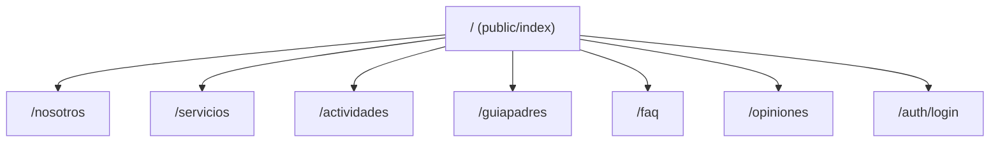
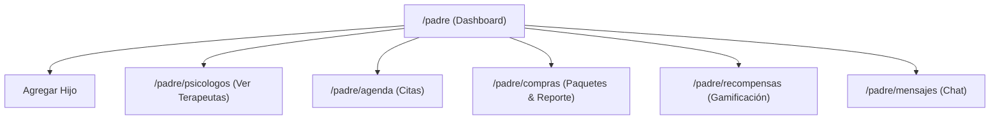
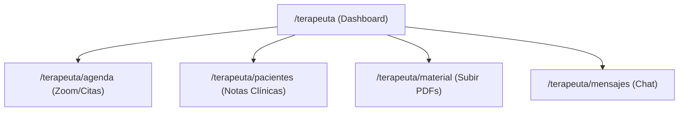
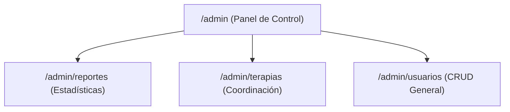

# 🧸 Guía Completa de Flujo de Vistas — AshaKids

Esta guía detalla exhaustivamente el recorrido del usuario, el flujo de navegación paso a paso, las rutas (endpoints) asociadas, los archivos HTML involucrados y las opciones disponibles para cada uno de los roles dentro de la plataforma.

---

## 🌐 1. Vistas Públicas (Landing & Acceso)

Cualquier visitante de la plataforma puede acceder a esta sección sin necesidad de iniciar sesión.

### Paso a Paso del Flujo Público

1. **Página de Inicio (Landing Page)** 
   * **Ruta:** `/` o `/public/index`
   * **Archivo:** [index.html](file:///C:/Users/WinterOS/Desktop/new-ashakids/backend-spring/src/main/resources/templates/public/index.html)
   * **Funcionalidades clave:**
     * **Newsletter (Boletín):** Sección final para ingresar el correo y suscribirse de forma asíncrona mediante `/api/mail/newsletter`.
     * **Contacto:** Botón de contacto que redirige al pie de página.
2. **Sobre Nosotros**
   * **Ruta:** `/nosotros`
   * **Archivo:** [nosotros.html](file:///C:/Users/WinterOS/Desktop/new-ashakids/backend-spring/src/main/resources/templates/public/nosotros.html)
   * **Contenido:** Visión, misión, valores institucionales y un carrusel descriptivo del equipo.
3. **Servicios**
   * **Ruta:** `/servicios`
   * **Archivo:** [servicios.html](file:///C:/Users/WinterOS/Desktop/new-ashakids/backend-spring/src/main/resources/templates/public/servicios.html)
   * **Contenido:** Tipos de terapias lingüísticas y pedagógicas ofrecidas por la plataforma.
4. **Actividades**
   * **Ruta:** `/actividades`
   * **Archivo:** [actividades.html](file:///C:/Users/WinterOS/Desktop/new-ashakids/backend-spring/src/main/resources/templates/public/actividades.html)
   * **Contenido:** Muestra fotos de talleres interactivos de lenguaje.
5. **Recursos dropdown:**
   * **Guía para Padres (`/guiapadres`):** Artículos y pautas de estimulación del lenguaje en casa.
   * **FAQs (`/faq`):** Preguntas frecuentes estructuradas en acordeones Bootstrap.
6. **Inicio de Sesión (Login)**
   * **Ruta:** `/auth/login`
   * **Archivo:** [login.html](file:///C:/Users/WinterOS/Desktop/new-ashakids/backend-spring/src/main/resources/templates/auth/login.html)
   * **Comportamiento:**
     * Entrada: Código ASHA y Contraseña.
     * Enrutamiento exitoso: Llama a `/redireccionar`, el cual asigna los datos del usuario en la sesión (`HttpSession`) y redirige según su rol (`admin`, `padre`, `terapeuta`).

---

## 👨‍👩- 2. Panel del Rol: PADRE (`/padre`)

Orientado a la gestión de citas de los niños, comunicación con terapeutas y consumo de materiales de gamificación.

### Recorrido y Opciones del Padre

1. **Dashboard Principal**
   * **Ruta:** `/padre`
   * **Archivo:** [padreInicio.html](file:///C:/Users/WinterOS/Desktop/new-ashakids/backend-spring/src/main/resources/templates/padre/padreInicio.html)
   * **Opciones:**
     * **Agregar Niño:** Formulario flotante para ingresar nombre y fecha de nacimiento. Los niños registrados aparecen en una lista de avatares con animaciones.
2. **Psicólogos y Terapeutas**
   * **Ruta:** `/padre/psicologos`
   * **Archivo:** [psicologos.html](file:///C:/Users/WinterOS/Desktop/new-ashakids/backend-spring/src/main/resources/templates/padre/psicologos.html)
   * **Acción:** Muestra las tarjetas de los terapeutas activos, sus especialidades y permite agendar citas directamente llamando a la API de Node.js.
3. **Agenda y Citas**
   * **Ruta:** `/padre/agenda`
   * **Archivo:** [agenda.html](file:///C:/Users/WinterOS/Desktop/new-ashakids/backend-spring/src/main/resources/templates/padre/agenda.html)
   * **Acción:**
     * Permite visualizar las citas programadas (tanto presenciales como virtuales).
     * Enlace de Zoom: Si la cita es virtual y tiene enlace, muestra un botón directo para conectarse.
4. **Compra de Horas y Facturación**
   * **Ruta:** `/padre/compras`
   * **Archivo:** [compras.html](file:///C:/Users/WinterOS/Desktop/new-ashakids/backend-spring/src/main/resources/templates/padre/compras.html)
   * **Acción:**
     * Permite comprar paquetes de horas (2, 6, 10 horas) para un terapeuta en específico.
     * **Generar Factura (PDF):** Llama a `/reporte/factura?idCompra=...` para descargar la boleta en PDF generada dinámicamente con OpenPDF.
5. **Rincón Divertido & Gamificación**
   * **Ruta:** `/padre/recompensas`
   * **Archivo:** [recompensas.html](file:///C:/Users/WinterOS/Desktop/new-ashakids/backend-spring/src/main/resources/templates/padre/recompensas.html)
   * **Acciones:** Juegos didácticos (Adivinanzas, Cuentos clásicos/inventados, Trabalenguas) para que el niño practique mientras acumula estrellas y canjea medallas visuales.
6. **Chat de Mensajes**
   * **Ruta:** `/padre/mensajes`
   * **Archivo:** [mensajesPadre.html](file:///C:/Users/WinterOS/Desktop/new-ashakids/backend-spring/src/main/resources/templates/padre/mensajesPadre.html)
   * **Acción:** Chat interactivo en tiempo real para coordinar la evolución del niño con su terapeuta asignado.

---

## 🩺 3. Panel del Rol: TERAPEUTA (`/terapeuta`)

Enfocado en el seguimiento de las citas, redacción de notas clínicas y subida de recursos didácticos de estimulación.

### Recorrido y Opciones del Terapeuta

1. **Dashboard Principal**
   * **Ruta:** `/terapeuta`
   * **Archivo:** [inicioTerapeuta.html](file:///C:/Users/WinterOS/Desktop/new-ashakids/backend-spring/src/main/resources/templates/terapeuta/inicioTerapeuta.html)
   * **Opciones:** Resumen estadístico de las próximas citas del día y solicitudes de compras de paquetes de horas pendientes de confirmación.
2. **Gestión de Agenda**
   * **Ruta:** `/terapeuta/agenda`
   * **Archivo:** [agendaTerapeuta.html](file:///C:/Users/WinterOS/Desktop/new-ashakids/backend-spring/src/main/resources/templates/terapeuta/agendaTerapeuta.html)
   * **Acción:**
     * Listado del calendario de citas.
     * **Generar Enlace de Zoom:** Botón interactivo que realiza una llamada `POST` a la API de Node/Express (`/zoom/meetings`), crea la sala virtual de Zoom de forma automática y asocia el enlace a la cita en la base de datos.
3. **Historial y Pacientes**
   * **Ruta:** `/terapeuta/pacientes`
   * **Archivo:** [pacientesTerapeuta.html](file:///C:/Users/WinterOS/Desktop/new-ashakids/backend-spring/src/main/resources/templates/terapeuta/pacientesTerapeuta.html)
   * **Acción:**
     * Visualización de fichas de niños atendidos.
     * **Notas Clínicas:** Redacción de observaciones y recomendaciones para que el padre pueda revisarlas en su perfil.
4. **Materiales**
   * **Ruta:** `/terapeuta/material`
   * **Archivo:** [materialTerapeuta.html](file:///C:/Users/WinterOS/Desktop/new-ashakids/backend-spring/src/main/resources/templates/terapeuta/materialTerapeuta.html)
   * **Acción:** Formulario para cargar materiales interactivos en formato **PDF** (subida física del archivo al directorio `/uploads/materiales/` con guardado del registro en base de datos).
5. **Mensajes**
   * **Ruta:** `/terapeuta/mensajes`
   * **Archivo:** [mensajesTerapeuta.html](file:///C:/Users/WinterOS/Desktop/new-ashakids/backend-spring/src/main/resources/templates/terapeuta/mensajesTerapeuta.html)
   * **Acción:** Bandeja de entrada para responder consultas y coordinar sesiones con los padres de familia.

---

## 🔑 4. Panel del Rol: ADMINISTRADOR (`/admin`)

Orientado a la auditoría del sistema, gestión de usuarios, asignación de roles y control financiero.

### Recorrido y Opciones del Administrador

1. **Panel de Control**
   * **Ruta:** `/admin` o `/admin/panel`
   * **Archivo:** [panelDeControl.html](file:///C:/Users/WinterOS/Desktop/new-ashakids/backend-spring/src/main/resources/templates/admin/panelDeControl.html)
   * **Opciones:** Resumen analítico del número total de usuarios registrados, ingresos de caja por venta de paquetes y citas agendadas en el mes.
2. **Auditoría e Reportes**
   * **Ruta:** `/admin/reportes`
   * **Archivo:** [adminReportes.html](file:///C:/Users/WinterOS/Desktop/new-ashakids/backend-spring/src/main/resources/templates/admin/adminReportes.html)
   * **Acción:** Gráficos estadísticos interactivos sobre la afluencia de citas, terapeutas más solicitados e informe de ingresos detallados.
3. **Gestión de Terapias**
   * **Ruta:** `/admin/terapias`
   * **Archivo:** [adminTerapias.html](file:///C:/Users/WinterOS/Desktop/new-ashakids/backend-spring/src/main/resources/templates/admin/adminTerapias.html)
   * **Acción:** Vinculación directa entre terapeutas y niños, asignación de horarios de atención y coordinación de sesiones excepcionales.
4. **CRUD de Usuarios**
   * **Ruta:** `/admin/usuarios`
   * **Archivo:** [adminUsuarios.html](file:///C:/Users/WinterOS/Desktop/new-ashakids/backend-spring/src/main/resources/templates/admin/adminUsuarios.html)
   * **Acciones:**
     * **Búsqueda interactiva:** Filtrado rápido por nombre, código o rol.
     * **Crear / Editar:** Formulario dinámico para registrar nuevos padres, terapeutas o administradores.
     * **Cambio de Contraseña:** Restablecimiento forzado de contraseñas mediante el decodificador de contraseñas de Spring Security.
     * **Bajas:** Inactivación lógica de cuentas en el sistema.
